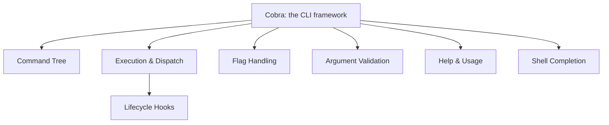
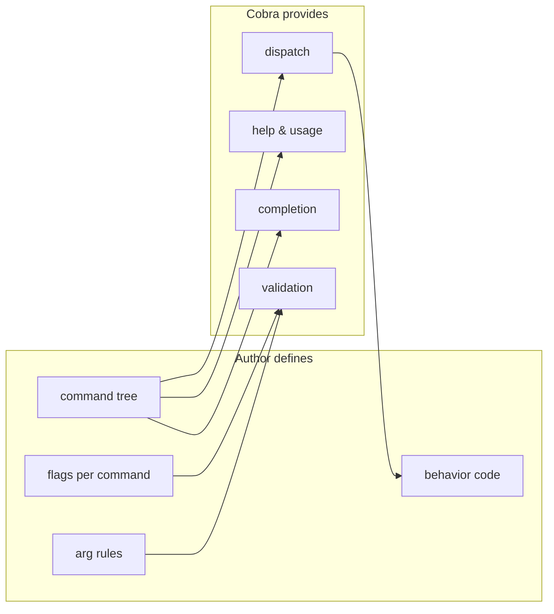

```
 ██████╗ ██████╗ ██████╗ ██████╗  █████╗
██╔════╝██╔═══██╗██╔══██╗██╔══██╗██╔══██╗
██║     ██║   ██║██████╔╝██████╔╝███████║
██║     ██║   ██║██╔══██╗██╔══██╗██╔══██║
╚██████╗╚██████╔╝██████╔╝██║  ██║██║  ██║
 ╚═════╝ ╚═════╝ ╚═════╝ ╚═╝  ╚═╝╚═╝  ╚═╝
   a framework for modern CLI programs
```



## Abstract

Cobra is a framework for building modern command-line programs, the kind where a single executable hosts many named subcommands. It gives an application a way to describe its commands, the options they accept, and the work they perform, and in return it handles the mechanical parts of a CLI: reading the raw arguments a user typed, deciding which command they meant, validating their input, running the right code, and printing help when something is unclear. This paper is the map of the whole framework; each capability below has its own paper.

## Introduction

Every command-line program faces the same chores. It must interpret a flat list of words typed at a shell, separate options from operands, choose the correct action, complain helpfully when the user makes a mistake, and offer documentation on demand. Rebuilding this machinery for each program is repetitive and error-prone, and the results tend to feel inconsistent from one tool to the next.

Cobra exists to make one well-worn shape of CLI easy and uniform: the *command tree*, where a program is organized as a root command with nested subcommands, each with its own options and help. Tools built this way behave predictably, so users can transfer their instincts from one to the next. Cobra supplies the tree, the dispatcher that walks it, the option and argument checking, the auto-generated help, and the shell tab-completion, leaving the author to write only the actual behavior of each command.

## Related Work

This root paper is the parent of the whole set. Its capabilities are documented in the following children:

- [Command Tree](./command-tree/README.md) — how a program is modeled as nested commands.
- [Execution & Dispatch](./execution-and-dispatch/README.md) — how a typed line becomes a running command.
- [Flag Handling](./flag-handling/README.md) — options, their scope, and their constraints.
- [Argument Validation](./argument-validation/README.md) — rules for the leftover positional operands.
- [Help & Usage](./help-and-usage/README.md) — the documentation the framework writes for you.
- [Shell Completion](./shell-completion/README.md) — tab-completion across the major shells.

## Description

The framework has a single organizing idea and several services built around it. The organizing idea is the command tree. Everything else is a service that operates on that tree.



A program's structure is a tree of commands. The root represents the program itself; below it, each named command may host further subcommands, forming branches as deep as the design requires. This is covered in [Command Tree](./command-tree/README.md).

When the program runs, the framework takes the words the user typed and walks the tree to find the deepest command that matches, then hands the remaining words to that command. If nothing matches closely, it offers a "did you mean" suggestion. This dispatch, and the ordered run cycle that follows it, is the subject of [Execution & Dispatch](./execution-and-dispatch/README.md), and the ordered pipeline of author-supplied hooks that fire around the real work is detailed in its child, [Lifecycle Hooks](./execution-and-dispatch/lifecycle-hooks/README.md).

Options are called flags. A flag can be *local* to one command or *persistent*, meaning it is inherited by every command beneath it. The framework parses flags, enforces which are required, and lets related flags be grouped so that they must appear together, or exclude one another, or require at least one of the set. See [Flag Handling](./flag-handling/README.md).

After flags are removed, the words that remain are positional arguments. A command can attach a rule describing how many operands it accepts and which values are legal, and the framework rejects invalid input before any work runs. See [Argument Validation](./argument-validation/README.md).

Because every command carries its own description, usage line, and option list, the framework can compose help text and a usage summary automatically, and can answer a built-in help command or help flag anywhere in the tree. See [Help & Usage](./help-and-usage/README.md).

Finally, the same self-description powers tab-completion. The framework can emit a completion script for the common shells and answer live completion requests as the user types, including context-sensitive hints. See [Shell Completion](./shell-completion/README.md).

## Conclusion

Cobra turns one recurring design — a tree of subcommands with flags, arguments, help, and completion — into a reusable framework. The author describes the tree and writes the behavior; the framework supplies the dispatch and every supporting service. To understand the whole, start with the [Command Tree](./command-tree/README.md), then follow [Execution & Dispatch](./execution-and-dispatch/README.md) to see how a typed line comes alive.
