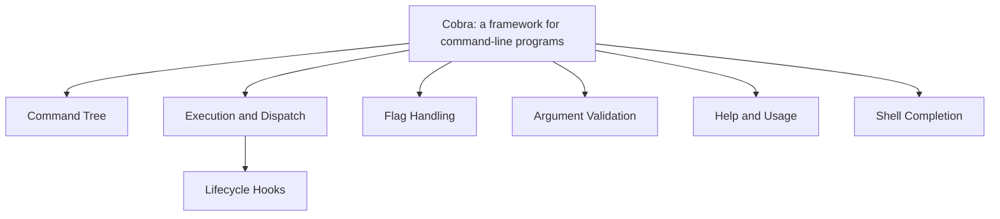
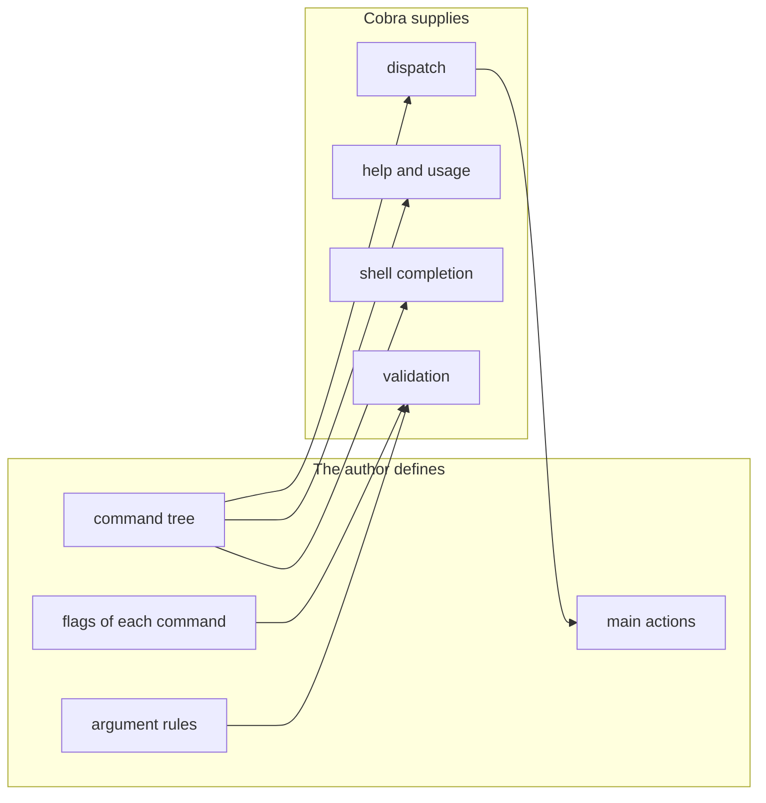

```mermaid
flowchart TD
    ROOT["Cobra: a framework for command-line programs"]
    ROOT --> TREE["Command Tree"]
    ROOT --> EXEC["Execution and Dispatch"]
    ROOT --> FLAGS["Flag Handling"]
    ROOT --> ARGS["Argument Validation"]
    ROOT --> HELP["Help and Usage"]
    ROOT --> COMP["Shell Completion"]
    EXEC --> HOOKS["Lifecycle Hooks"]
```

## Abstract

Cobra is a framework for command-line programs that have many named commands. The author of a program describes the commands, their flags, and the work that each command does. Then Cobra does the common tasks of a command-line program. It reads the words that the user types, finds the correct command, and checks the input. It also runs the command and shows help when the input is not correct. This paper is the map of the framework, and each capability has its own paper.

## Introduction

All command-line programs must do the same basic tasks. A program gets a flat list of words from the shell. It must separate the flags from the positional arguments and select the correct action. If the user makes a mistake, the program must show a clear message. The program must also show documentation when the user asks for it.

If each program does these tasks with its own code, the work is repeated and errors are frequent. Also, the programs operate in different ways, and the user must learn each program again. Cobra gives one standard shape for this type of program: the *command tree*. In a command tree, the program is a root command, and each command can have subcommands. Cobra supplies the dispatcher, the checks, the help, and the shell completion. The author writes only the main action of each command.

## Related Work

This root paper is the parent of all the other papers. The papers that follow describe its capabilities:

- [Command Tree](./command-tree/README.md) shows how a program is a tree of commands.
- [Execution & Dispatch](./execution-and-dispatch/README.md) shows how a line of words becomes a command that runs.
- [Lifecycle Hooks](./execution-and-dispatch/lifecycle-hooks/README.md) shows the hooks that run before and after the main action.
- [Flag Handling](./flag-handling/README.md) shows how flags get their scope and their constraints.
- [Argument Validation](./argument-validation/README.md) shows the rules for positional arguments.
- [Help & Usage](./help-and-usage/README.md) shows the documentation that the framework makes.
- [Shell Completion](./shell-completion/README.md) shows how the shell completes words when the user pushes the tab key.

## Description

The framework has one central structure and a set of services. The central structure is the command tree. Each service reads or walks this tree. The diagram shows which parts the author defines and which parts Cobra supplies.

```mermaid
flowchart LR
    subgraph AUTHOR ["The author defines"]
    A["command tree"]
    B["flags of each command"]
    C["argument rules"]
    D["main actions"]
    end
    subgraph COBRA ["Cobra supplies"]
    E["dispatch"]
    F["validation"]
    G["help and usage"]
    H["shell completion"]
    end
    A --> E --> D
    B --> F
    C --> F
    A --> G
    A --> H
```

**The command tree.** The structure of a program is a tree of commands. The root command is the program. Each command below the root can have subcommands, to the depth that the design needs. [Command Tree](./command-tree/README.md) describes this structure.

**Dispatch.** When the program starts, the dispatcher walks the tree with the words that the user typed. It finds the deepest command that matches the words. This command is the *target command*, and the other words go to it. If a word is almost the name of a command, the framework shows a "did you mean" suggestion. [Execution & Dispatch](./execution-and-dispatch/README.md) describes dispatch. Its child paper, [Lifecycle Hooks](./execution-and-dispatch/lifecycle-hooks/README.md), describes the *run sequence* around the main action.

**Flags.** A flag is a named option, for example a switch for more output. A *local flag* belongs to one command. A *persistent flag* applies to its command and to all the commands below it. The framework parses the flags and checks the required flags. It also checks *flag groups*, which are rules about which flags can occur together. [Flag Handling](./flag-handling/README.md) describes flags.

**Positional arguments.** After the framework removes the flags, the words that remain are the positional arguments. A command can have an *argument rule* that sets the number of arguments and the permitted values. If the arguments do not obey the rule, the framework stops before the main action. [Argument Validation](./argument-validation/README.md) describes these rules.

**Help and usage.** Each command has a name, descriptions, and a list of flags. Thus, the framework can make help text and usage text automatically. A help flag and a help command make this text available at all levels of the tree. [Help & Usage](./help-and-usage/README.md) describes this documentation.

**Shell completion.** The same data about the tree also gives shell completion. The framework makes a completion script for each of four shells. Then the program itself answers each completion request from the script. [Shell Completion](./shell-completion/README.md) describes this capability.

## Conclusion

Cobra changes one frequent design into a framework that the author can use again. That design is a tree of commands with flags, positional arguments, help, and shell completion. The author describes the tree and writes the main actions. The framework supplies dispatch and all the other services. To learn the framework, start with [Command Tree](./command-tree/README.md). Then read [Execution & Dispatch](./execution-and-dispatch/README.md) to see how a line of words becomes a command that runs.
