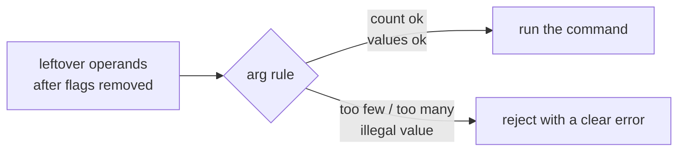
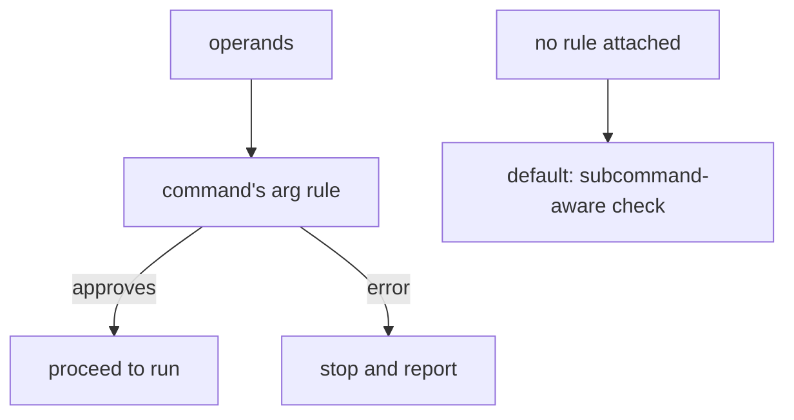
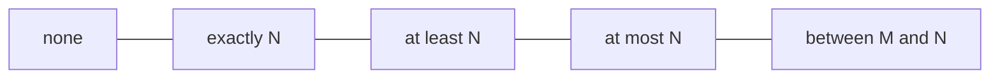
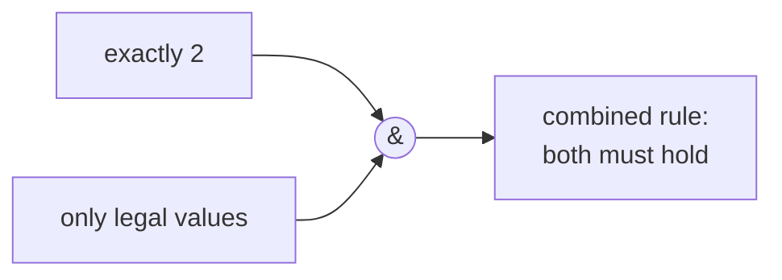

```
 █████╗ ██████╗  ██████╗ ███████╗
██╔══██╗██╔══██╗██╔════╝ ██╔════╝
███████║██████╔╝██║  ███╗███████╗
██╔══██║██╔══██╗██║   ██║╚════██║
██║  ██║██║  ██║╚██████╔╝███████║
╚═╝  ╚═╝╚═╝  ╚═╝ ╚═════╝ ╚══════╝
```



## Abstract

After flags are stripped away, the words that remain are a command's positional arguments — its operands. A command can attach a rule that describes how many operands it accepts and, optionally, which values are allowed. Before any work runs, the framework applies that rule and rejects invalid input with a specific message. Cobra ships a family of ready-made rules for the common cases and a way to combine them, so authors seldom write argument-counting logic themselves.

## Introduction

Most commands care about their operands. A "copy" command needs exactly a source and a destination; a "delete" command needs at least one target; a "status" command needs none at all. Without a framework, each command re-implements the same tedious checks — counting operands, comparing against a limit, producing a readable error — and the resulting messages vary in wording and quality.

Cobra factors this out. An argument rule is simply a check that receives the operands and either approves them or returns an error explaining what is wrong. The framework runs this check at a fixed point, just before the command's work, so no command ever begins its real task with the wrong number or kind of arguments. Because the rules are values an author selects and composes, validation becomes a declaration rather than a block of hand-written code.

## Related Work

- Parent: [Cobra](../README.md) — the framework overview.
- [Execution & Dispatch](../execution-and-dispatch/README.md) — produces the leftover operands that this validation inspects.
- [Flag Handling](../flag-handling/README.md) — flags are separated from operands before this check.
- [Shell Completion](../shell-completion/README.md) — the set of legal argument values also drives suggestions.

## Description

An argument rule looks at the list of operands and returns either approval or an error. The framework invokes the target command's rule after flags are parsed and before the work begins; if the rule objects, the command is aborted and the message is shown.



**Count-based rules.** The most common rules constrain how many operands are allowed. The ready-made family covers the natural cases: accept none, accept exactly a given number, accept at least a minimum, accept at most a maximum, or accept a count within a range. Each produces a clear message stating what was expected and what was received, so the wording is consistent across every tool built on the framework.



**Value-based rules.** A command can also declare a set of legal argument values and require that every operand be one of them. This turns a free-form operand into a small enumeration, catching typos immediately. A separate rule rejects repeated operands when duplicates would be meaningless.

**Composition.** Because a rule is just a check, several can be combined so that operands must satisfy all of them. That lets an author express compound requirements — for instance, "exactly two operands, and both drawn from the legal set" — by joining a count rule and a value rule rather than writing a bespoke check.



**The default when no rule is set.** If a command attaches no rule, the framework applies a sensible default tied to the tree's shape. A command with no subcommands accepts arbitrary operands. A command that has subcommands, however, treats an unrecognized leading operand as a mistyped subcommand and reports an unknown-command error — reaching, at that moment, for the same near-miss suggestions that dispatch uses. This default is why a branch node naturally complains about a bad subcommand name without the author writing any check at all.

## Conclusion

Argument validation reduces a repetitive chore to a single declaration: choose a rule for how many operands are allowed and which values are legal, combine rules when requirements are compound, and let the framework enforce the choice before any work runs. When nothing is declared, a tree-aware default still guards against mistyped subcommands. Read [Flag Handling](../flag-handling/README.md) for the options that are separated out before these operands are counted, or [Help & Usage](../help-and-usage/README.md) to see how a command advertises what it expects.
