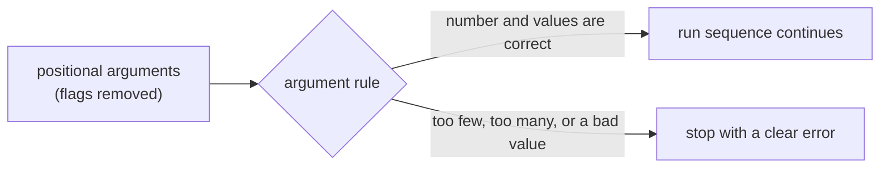
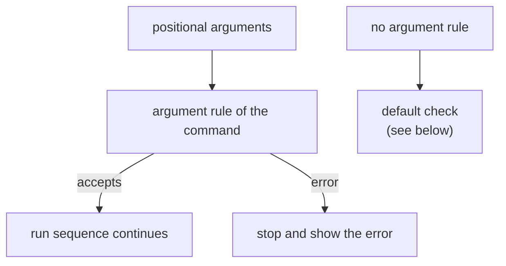
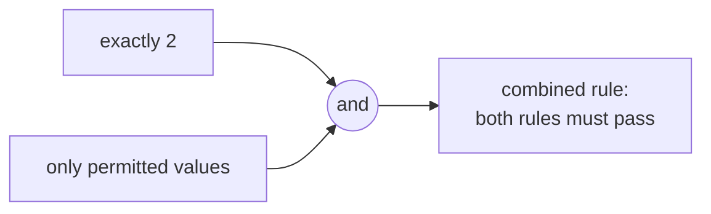
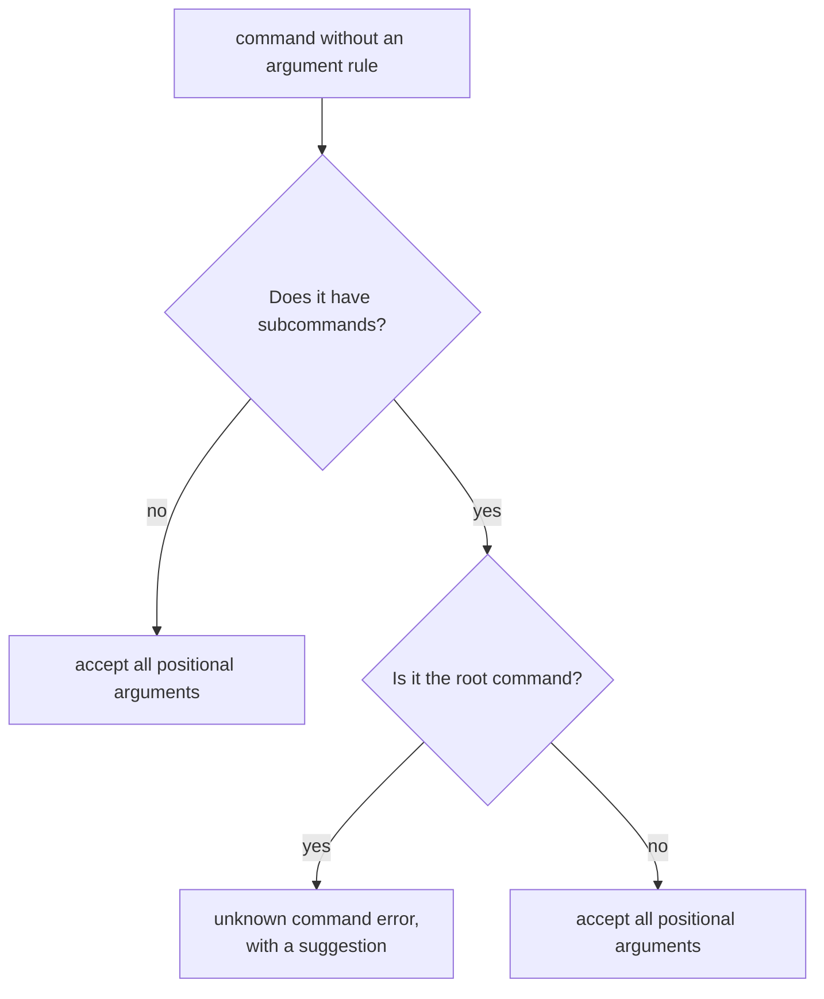

```mermaid
flowchart LR
    IN["positional arguments
    (flags removed)"] --> RULE{"argument rule"}
    RULE -->|"number and values are correct"| PASS["run sequence continues"]
    RULE -->|"too few, too many, or a bad value"| FAIL["stop with a clear error"]
```

## Abstract

After the framework removes the flags, the words that remain are the *positional arguments* of the command. A command can have an *argument rule*, which sets how many positional arguments the command accepts and which values are permitted. Before the hooks and the main action run, the framework applies the rule. If the positional arguments do not obey the rule, the framework stops with a specific message. Cobra supplies a set of standard rules and a way to combine them. Thus, the author seldom writes code that counts arguments.

## Introduction

Most commands have expectations about their positional arguments. A "copy" command needs exactly two arguments: a source and a destination. A "delete" command needs one or more targets, and a "status" command needs no arguments. Without a framework, each command must do the same checks again. It must count the arguments, compare the count with a limit, and write an error message. The messages are then different from one command to the next.

Cobra does these checks for the author. An argument rule is a check that gets the command and its positional arguments. The rule accepts the arguments or returns an error that tells what is wrong. The framework applies the rule at a fixed point in the run sequence, before the first hook. Thus, the main action never starts with the wrong number of arguments. The author selects and combines standard rules, and thus the check is a declaration, not a block of code.

## Related Work

- Parent: [Cobra](../README.md) gives the overview of the framework.
- [Execution & Dispatch](../execution-and-dispatch/README.md) shows how dispatch gives the words that this check examines.
- [Lifecycle Hooks](../execution-and-dispatch/lifecycle-hooks/README.md) shows where this check occurs in the run sequence.
- [Flag Handling](../flag-handling/README.md) shows how the parser removes the flags before this check.
- [Shell Completion](../shell-completion/README.md) shows how the list of permitted values also gives suggestions in the shell.

## Description

**When the check occurs.** The framework applies the argument rule of the target command after the parse of the flags. The check occurs before the persistent pre-run hook. If the rule returns an error, the command stops, and the framework shows the message. If the command turns off flag parsing, the rule gets all the words, flags included.

```mermaid
flowchart TD
    A["positional arguments"] --> B["argument rule of the command"]
    B -->|"accepts"| C["run sequence continues"]
    B -->|"error"| D["stop and show the error"]
    E["no argument rule"] --> F["default check
    (see below)"]
```

**Rules for the number of arguments.** Most rules set how many positional arguments the command accepts. The standard rules are in the table that follows. Each rule gives a clear message that tells the expected number and the received number. Thus, all programs that use the framework show the same type of message.

| Rule | The command accepts |
|---|---|
| No arguments | zero positional arguments |
| Arbitrary arguments | any number of positional arguments |
| Minimum number | the given number of positional arguments or more |
| Maximum number | the given number of positional arguments or fewer |
| Exact number | exactly the given number of positional arguments |
| Range | a number of positional arguments between two limits |

If the user gives arguments to a command with the "no arguments" rule, the error message tells that the first word is an unknown command.

**Rules for the values of arguments.** A command can declare a list of *permitted values*. The "only permitted values" rule makes sure that each positional argument is in this list. Thus, a free argument becomes a small set of choices, and the framework finds wrong values immediately. If a value is not in the list, the error message can also suggest a near command name. A different rule rejects a positional argument that occurs two times.

**Combined rules.** Each rule is a check, so the author can combine many rules into one rule. The combined rule applies each rule in order and stops at the first error. Thus, the author can express a compound rule without new code. For example, the rule "exactly two arguments, and both from the list of permitted values" combines two standard rules.

```mermaid
flowchart LR
    R1["exactly 2"] --> AND(("and"))
    R2["only permitted values"] --> AND
    AND --> RES["combined rule:
    both rules must pass"]
```

**The default when a command has no rule.** If a command has no argument rule, the framework applies a default check that uses the shape of the tree. This check occurs during dispatch, not in the run sequence. If the root command uses the traverse children strategy, the framework does not apply this check. The rules of the default check are as follows:

- If the command has no subcommands, it accepts all positional arguments.
- If the command is the root command and has subcommands, it rejects positional arguments. It reads the first word as a wrong command name. The error message tells that the command is unknown and can give a suggestion.
- If the command is below the root and has subcommands, it accepts all positional arguments.

```mermaid
flowchart TD
    S["command without an argument rule"] --> Q1{"Does it have subcommands?"}
    Q1 -->|"no"| OK1["accept all positional arguments"]
    Q1 -->|"yes"| Q2{"Is it the root command?"}
    Q2 -->|"yes"| ERR["unknown command error,
    with a suggestion"]
    Q2 -->|"no"| OK2["accept all positional arguments"]
```

Because of this default, a program shows a clear error when the user types a wrong command name after the program name. The author does not write a check for this case.

## Conclusion

Argument validation changes a repeated task into one declaration. The author selects a rule for the number of arguments and a rule for the permitted values. The author can combine rules for compound expectations. Then the framework applies the rule before the hooks and the main action run. If the author declares no rule, a default check still finds wrong command names at the root.

To see how the parser removes the flags first, read [Flag Handling](../flag-handling/README.md). To see how a command shows what it expects, read [Help & Usage](../help-and-usage/README.md).
