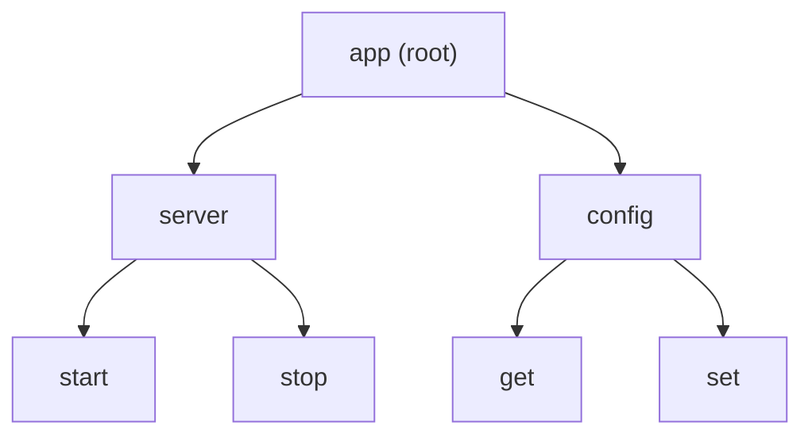
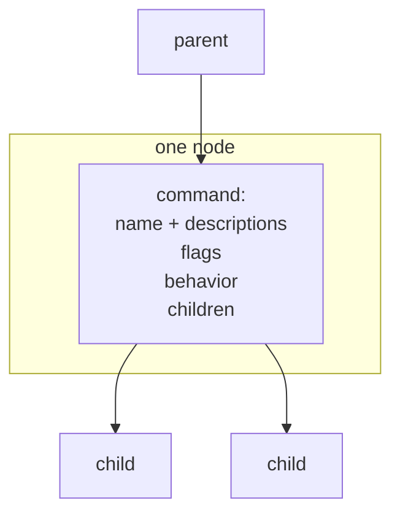
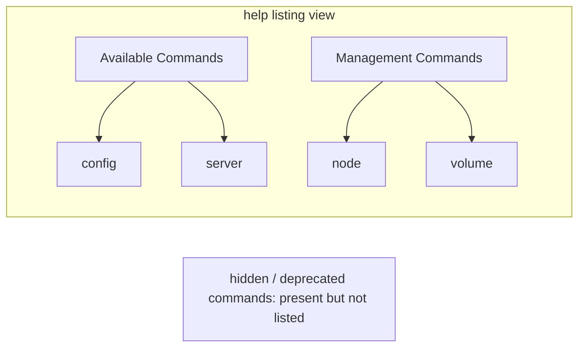

```
 ██████╗ ██████╗ ███╗   ███╗███╗   ███╗ █████╗ ███╗   ██╗██████╗
██╔════╝██╔═══██╗████╗ ████║████╗ ████║██╔══██╗████╗  ██║██╔══██╗
██║     ██║   ██║██╔████╔██║██╔████╔██║███████║██╔██╗ ██║██║  ██║
██║     ██║   ██║██║╚██╔╝██║██║╚██╔╝██║██╔══██║██║╚██╗██║██║  ██║
╚██████╗╚██████╔╝██║ ╚═╝ ██║██║ ╚═╝ ██║██║  ██║██║ ╚████║██████╔╝
 ╚═════╝ ╚═════╝ ╚═╝     ╚═╝╚═╝     ╚═╝╚═╝  ╚═╝╚═╝  ╚═══╝╚═════╝
                    ░ T R E E ░
```



## Abstract

The command tree is the backbone of every Cobra program. A program is modeled as a single root command with subcommands nested beneath it, each of which may have subcommands of its own. Every node in this tree is the same kind of thing — a command that carries its name, its descriptions, its options, and the code that runs when it is invoked. This uniform, recursive structure is what lets the rest of the framework treat a one-command tool and a deeply nested one identically.

## Introduction

Modern command-line tools rarely do a single thing. A version-control tool clones, commits, and pushes; a container tool builds, runs, and inspects. Users navigate these tools by typing a path of words — the program name, then a command, then perhaps a subcommand — much like walking a menu. The natural way to represent this is a tree, where following a branch corresponds to typing another word.

Cobra makes that tree the primary object an author works with. Rather than a flat registry of command names, the author builds a hierarchy: create commands, then attach them to parents. Because a command and the whole program are the same type of node, the design scales smoothly from a tool with one action to one with hundreds, and every service in the framework — dispatch, help, completion — simply walks this shared structure.

## Related Work

- Parent: [Cobra](../README.md) — the framework overview.
- [Execution & Dispatch](../execution-and-dispatch/README.md) — how the tree is walked to find the command a user meant.
- [Help & Usage](../help-and-usage/README.md) — how the tree's shape becomes the command listing in help.
- [Flag Handling](../flag-handling/README.md) — how options attach to nodes and flow down branches.

## Description

Each node in the tree is a command. A command knows its parent and its children, so from any node the framework can climb to the root or descend to a leaf. Attaching a child to a parent is the single act that builds the structure, and doing so also records bookkeeping the parent needs, such as the widest child name, so help can be aligned into neat columns later.



**Identity and naming.** A command's name is the first word of its usage line. Beyond its primary name, a command may declare aliases — alternative words that invoke the same node — and it may declare that it should be *suggested* when the user types a similar but different word. Command names can be matched case-insensitively when the program opts in, and an abbreviated word can resolve to a command when prefix matching is enabled and the prefix is unambiguous.

**Visibility and grouping.** Not every node is meant to appear in the listing. A command can be *hidden*, so it still works but is omitted from help, or marked *deprecated*, so using it prints a warning. To keep large listings readable, sibling commands can be assigned to named groups, and the help listing then presents them under group headings rather than one long alphabetical run. By default siblings are sorted by name, though an author can turn that off to preserve insertion order.



**Runnable versus organizational nodes.** A node may carry behavior, or it may exist only to hold children. A branch node that groups subcommands but has no behavior of its own is not "runnable"; invoking it directly simply shows its help and the list of things underneath. Leaf nodes typically carry the real work. This distinction lets a tool offer intermediate words purely as organizing categories.

**Shared context and streams.** The tree is also a channel for shared resources. Input, output, and error streams set on an ancestor are inherited by descendants unless a descendant overrides them, and a request-scoped context set at the top flows down to whichever command ultimately runs. Because these travel along parent links, an author configures them once near the root and every command below sees them.

## Conclusion

The command tree is deliberately simple: one recursive kind of node, linked parent-to-child, carrying identity, visibility, behavior, and shared resources. That simplicity is what makes the rest of Cobra uniform, since every service just traverses the same structure. Read next how that structure is walked at run time in [Execution & Dispatch](../execution-and-dispatch/README.md), or how its shape is rendered for users in [Help & Usage](../help-and-usage/README.md).
