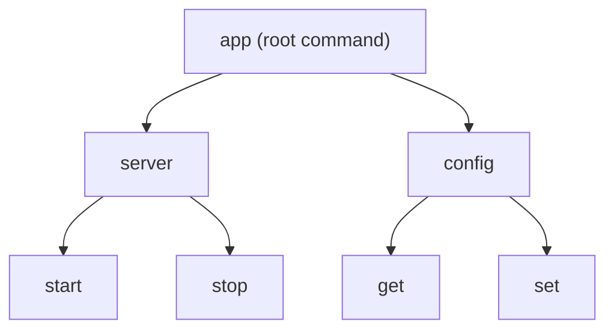
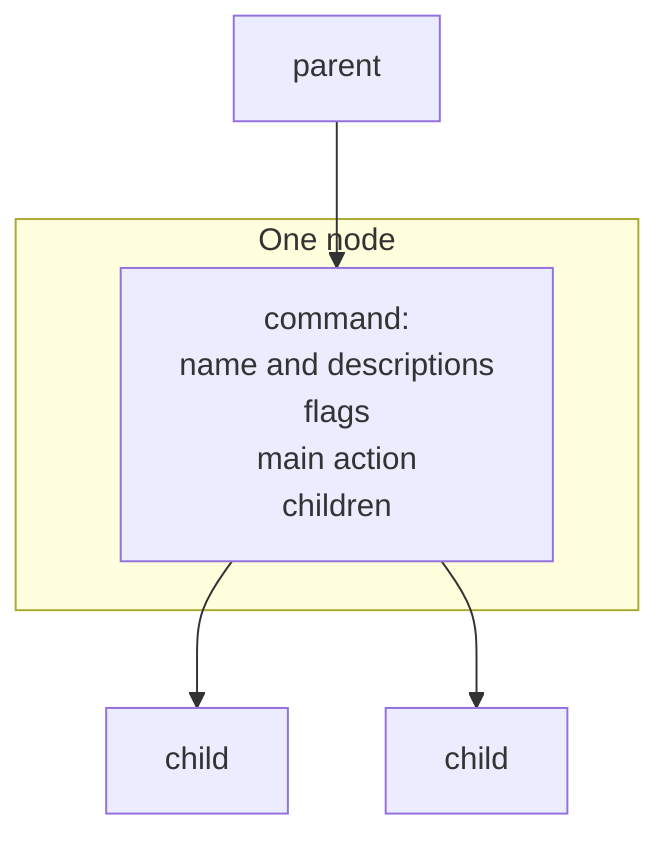
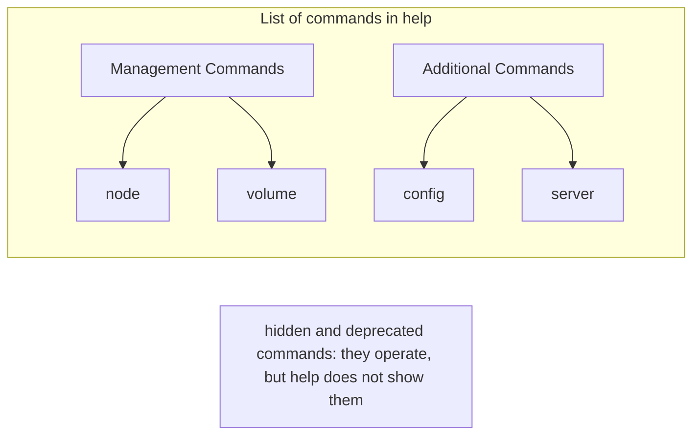
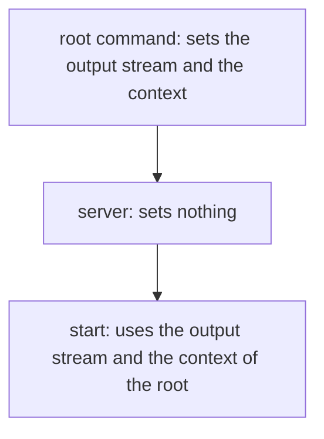

```mermaid
flowchart TD
    R["app (root command)"]
    R --> A["server"]
    R --> B["config"]
    A --> A1["start"]
    A --> A2["stop"]
    B --> B1["get"]
    B --> B2["set"]
```

## Abstract

The command tree is the central structure of each Cobra program. A program is one root command, and subcommands are below it, to any depth. Each node in the tree is the same type of object: a command. A command has a name, descriptions, flags, and the main action that it runs. All nodes are the same type. Thus, the framework treats a small program and a program with a deep tree in the same way.

## Introduction

Most modern command-line tools do many different tasks. For example, a version-control tool can clone, commit, and push. To use these tools, the user types a path of words: the program name, a command, and possibly a subcommand. This path is like a path through a menu. A tree is the natural model for this path, because each word selects one branch.

Cobra makes this tree the main object that the author builds. The author does not make a flat list of command names. Instead, the author makes commands and attaches each command to a parent. The root command and the other commands are the same type of node. Thus, the design is the same for a tool with one action and for a tool with hundreds of actions. All services of the framework, such as dispatch, help, and shell completion, walk this one structure.

## Related Work

- Parent: [Cobra](../README.md) gives the overview of the framework.
- [Execution & Dispatch](../execution-and-dispatch/README.md) shows how the dispatcher walks the tree to find the target command.
- [Help & Usage](../help-and-usage/README.md) shows how the shape of the tree becomes the list of commands in help.
- [Flag Handling](../flag-handling/README.md) shows how flags attach to commands and go down the branches.

## Description

**Parent and child links.** Each node in the tree is a command. A command knows its parent and its children. Thus, from each node, the framework can go up to the root or down to a leaf. When the author attaches a child to a parent, the parent also records the width of the longest child name. Help uses these widths to align the list of commands in columns. A command cannot be a child of itself.

```mermaid
flowchart TD
    subgraph NODE ["One node"]
    N["command:
    name and descriptions
    flags
    main action
    children"]
    end
    P["parent"] --> N
    N --> C1["child"]
    N --> C2["child"]
```

**Names and aliases.** The name of a command is the first word of its usage line. A command can also have *aliases*, which are other words for the same command. A command can also give a list of wrong words for which the framework suggests it. A command can show a *display name* in help that is different from its name. The program can make these features of name matching active:

- *Case-insensitive matching*: the dispatcher ignores the difference between upper case and lower case letters.
- *Prefix matching*: the dispatcher accepts the start of a name or alias, but only if one command starts with it.

These two features are off by default, and they apply to the full program.

**Visibility.** Some commands do not show in the list of commands. A *hidden* command operates, but help does not show it. A *deprecated* command also does not show in help, and when the user runs it, the framework shows a warning. The framework sorts the children of each command by name. The author can turn off this sort for the full program, and then the children stay in the order that the author added them.

**Command groups.** A parent can define *command groups*, and each group has an identifier and a title. A child can refer to one group by its identifier. Then help shows the children under the group titles, in the order of the groups. Help shows the children that have no group under the title "Additional Commands". If a child refers to a group that its parent does not define, the program stops with an error when it starts.

```mermaid
flowchart LR
    subgraph LIST ["List of commands in help"]
    G1["Management Commands"]
    G1 --> s1["node"]
    G1 --> s2["volume"]
    G2["Additional Commands"]
    G2 --> s3["config"]
    G2 --> s4["server"]
    end
    H["hidden and deprecated commands: they operate, but help does not show them"]
```

**Commands with and without a main action.** A command can have a main action, or it can only hold children. A command without a main action is not *runnable*. If the user runs it, the framework shows its help and the list of its children. Usually, the leaf commands do the work. Thus, the middle levels of the tree can be categories only.

**Help topics.** If a command is not runnable and no command below it is runnable, it is a *help topic*. Such a command holds only documentation. Help shows help topics in a separate list.

**Shared streams and context.** The tree also carries shared resources from parent to child. The input, output, and error streams of a command come from its nearest ancestor that sets them. The framework also gives the context of the root command to the target command, if the target command has no context. Thus, the author sets these resources one time near the root, and all commands below use them.

```mermaid
flowchart TD
    ROOT["root command: sets the output stream and the context"] --> MID["server: sets nothing"]
    MID --> LEAF["start: uses the output stream and the context of the root"]
```

## Conclusion

The command tree is a simple structure. It has one type of node, with links from parent to child. Each node has a name, a visibility, a main action, and shared resources. Because the structure is simple, all the services of Cobra operate in the same way: they walk the same tree. To see how the framework walks the tree when the program runs, read [Execution & Dispatch](../execution-and-dispatch/README.md). To see how help shows the tree to the user, read [Help & Usage](../help-and-usage/README.md).
