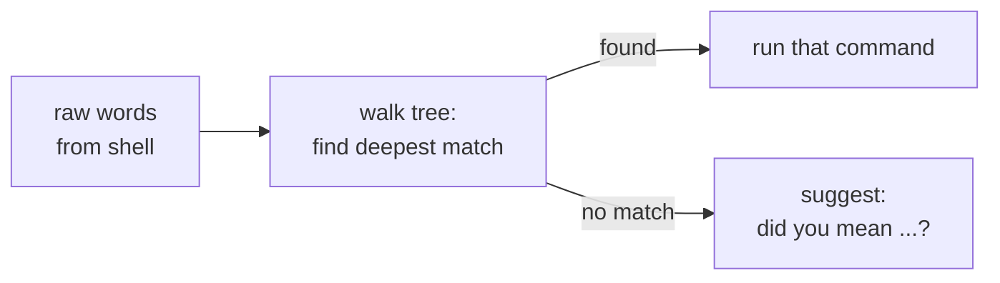
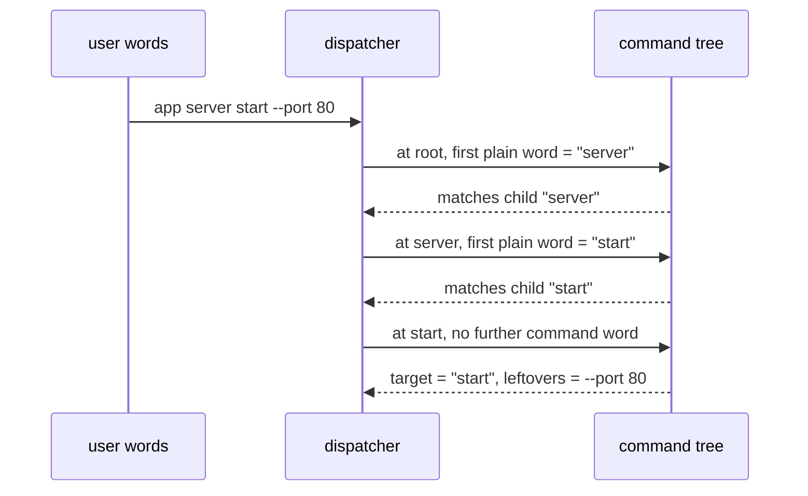
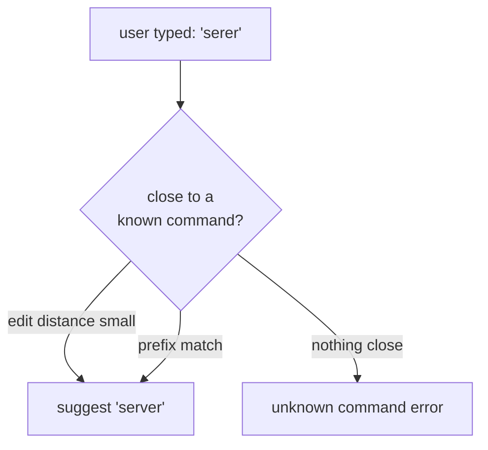
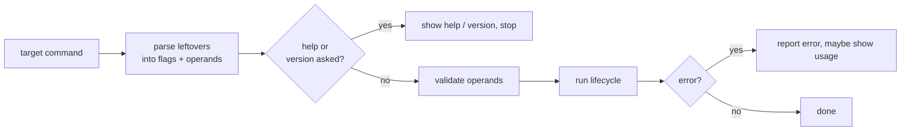

## Abstract

Execution is the moment a flat list of typed words becomes a running command. Starting from the root, the dispatcher walks the command tree one word at a time, descending into whichever child matches the next word, until the words run out or the next word is not a command. Whatever node it lands on is the target; the leftover words become that command's arguments. If a word looks like it was meant to be a command but matches nothing, the dispatcher offers a close alternative instead of failing silently. This paper covers how the target is found and the sequence that runs once it is.

## Introduction

A shell hands a program nothing but a list of strings. Somewhere in that list is the path to a command — one or more words naming a branch of the tree — mixed together with options and operands in whatever order the user chose. The framework's first job is to disentangle them: to figure out how far down the tree the user intended to go, and to treat everything past that point as input to the chosen command.

This is harder than scanning for the first non-option word, because options themselves can consume the word after them as a value, and that value must not be mistaken for a command name. Getting this wrong would route the user to the wrong command or swallow a legitimate argument. Dispatch therefore has to reason about options and command names together, and it must do so from the top of the tree downward so that each level's options are understood before the next word is judged.

## Related Work

- Parent: [Cobra](../README.md) — the framework overview.
- Child: [Lifecycle Hooks](./lifecycle-hooks/README.md) — the ordered stages that fire around a command's real work.
- [Command Tree](../command-tree/README.md) — the structure being walked.
- [Flag Handling](../flag-handling/README.md) — the options that dispatch must see through while searching.
- [Argument Validation](../argument-validation/README.md) — the check applied to the leftover words before the command runs.

## Description

Dispatch always begins at the root, no matter which node was asked to execute. From there it repeatedly asks: of the remaining words, ignoring anything that looks like an option or an option's value, what is the first plain word? If a child matches that word — by name or by alias — the search descends into that child and removes the matched word from the list. When no child matches, the search stops and the current node becomes the target.

**Seeing through options.** To find "the first plain word," the dispatcher must skip options and, crucially, the values that follow them. An option written as a single word carries its own value; an option written as two words takes the following word as its value, and that following word must not be treated as a command. A bare double-dash marks the end of options entirely, so everything after it is operands. Only after filtering these out does a remaining word count as a possible command name.

**Two walking strategies.** The default strategy locates the target first and parses that command's options afterward. An alternative strategy parses each level's options as it descends, which is necessary when a persistent option on a parent should influence how the rest of the line is interpreted before the child is reached. The two differ in when parsing happens relative to descent, but both end at the same kind of result: a target node and its leftover words.

**Suggestions for near-misses.** When the user types a word that matches no command, the framework does not merely report the failure. It compares the typo against the available command names using an edit-distance measure and by prefix, and if something is close enough it prints a "did you mean" hint listing the likely intended commands. A command can also declare that it should be suggested for particular mistaken words. This turns a dead end into a gentle correction.

**From target to running.** Once the target and its leftover words are known, control passes to that command. It finalizes its options, parses the leftovers into flags and operands, and — unless help or a version request short-circuits things — validates the operands and then runs. The full ordered sequence of author-supplied stages that surrounds the actual work is the subject of the child paper, [Lifecycle Hooks](./lifecycle-hooks/README.md). Errors raised anywhere in this sequence flow back to the top, where the framework decides whether to print the error, show usage, or, in the special case of a help request, display help instead.

## Conclusion

Dispatch is the bridge between a shell's flat word list and Cobra's structured tree: descend by matching plain words, see through options and their values while doing so, and turn near-misses into suggestions. When the target is found, its leftover words are validated and it runs. To follow what "runs" means in detail, continue to [Lifecycle Hooks](./lifecycle-hooks/README.md); to understand the option-parsing that dispatch must see through, read [Flag Handling](../flag-handling/README.md).
