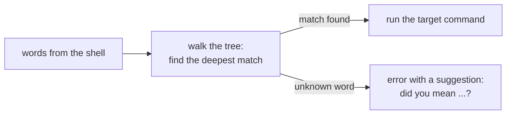
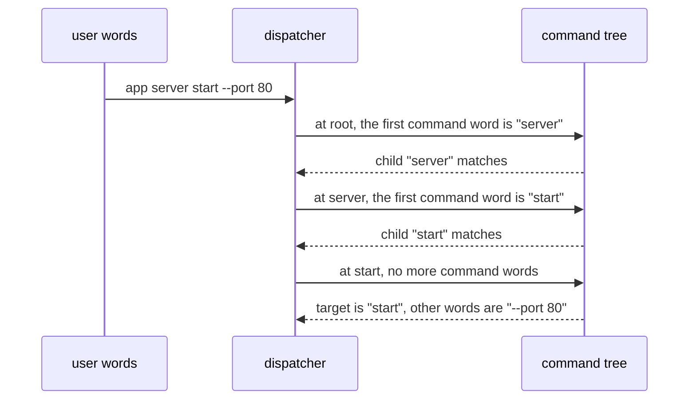
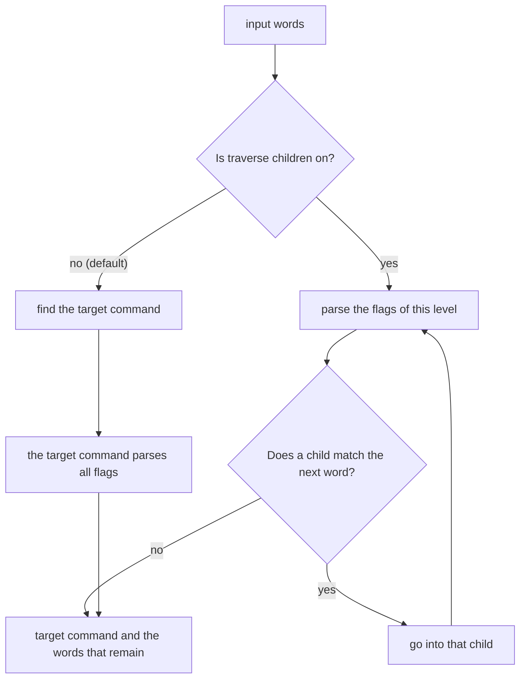
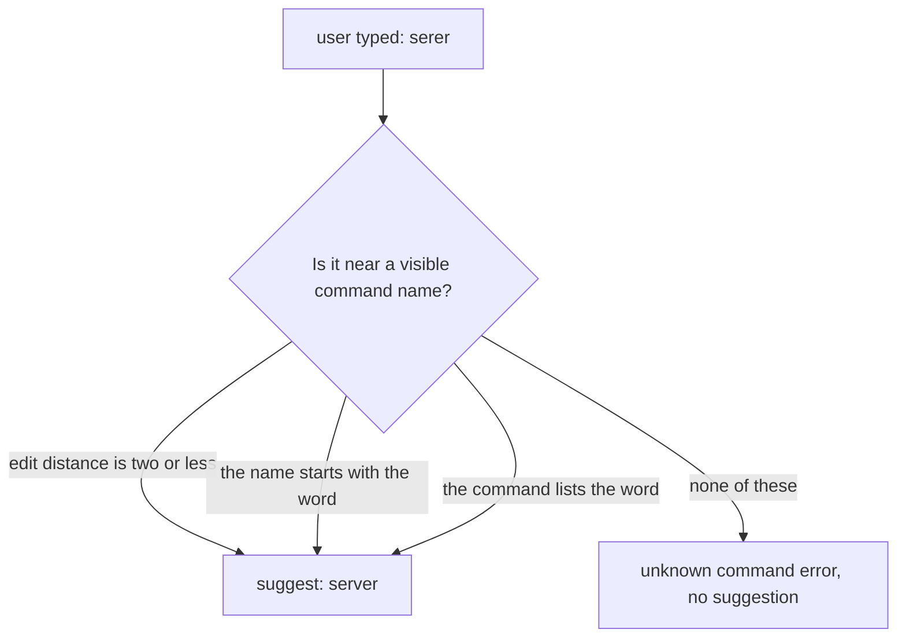
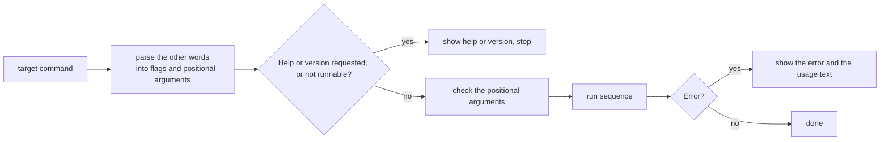

```mermaid
flowchart LR
    IN["words from the shell"] --> FIND["walk the tree:
    find the deepest match"]
    FIND -->|"match found"| RUN["run the target command"]
    FIND -->|"unknown word"| SUG["error with a suggestion:
    did you mean ...?"]
```

## Abstract

Execution changes a flat list of typed words into a command that runs. The dispatcher starts at the root command and walks the command tree one word at a time. At each level, it goes into the child whose name matches the next command word. When no child matches, the command where the dispatcher stops is the *target command*, and the other words go to it. If a word is almost the name of a command, the framework shows a suggestion. This paper describes how the dispatcher finds the target command and what occurs after that.

## Introduction

The shell gives a program only a list of words. Some of these words are command words, which name a path in the tree. The other words are flags, flag values, and positional arguments, in the order that the user typed them. The first task of the framework is to separate these words. It must find how deep in the tree the user wants to go. Then it must give all other words to the target command.

This task is more difficult than a search for the first word that is not a flag. Some flags take the next word as their value. The dispatcher must not read that value as a command word. If the dispatcher makes this mistake, it selects the wrong command or loses a positional argument. Thus, the dispatcher examines flags and command words together, from the top of the tree to the bottom.

## Related Work

- Parent: [Cobra](../README.md) gives the overview of the framework.
- Child: [Lifecycle Hooks](./lifecycle-hooks/README.md) shows the ordered hooks around the main action of the target command.
- [Command Tree](../command-tree/README.md) shows the structure that the dispatcher walks.
- [Flag Handling](../flag-handling/README.md) shows the flags that the dispatcher must skip.
- [Argument Validation](../argument-validation/README.md) shows the check on the other words before the main action.

## Description

**Start at the root.** Dispatch always starts at the root command, also when the author tells a different command to execute. Before the walk, the framework adds the commands that it supplies:

1. It adds the help command, if the root command has subcommands.
2. It adds the hidden command for completion requests, but only when the shell calls it.
3. It adds the completion command, which writes completion scripts.

The framework also makes sure that each command group that a child refers to exists. By default, the input words are the words of the process after the program name. The author can set different words, for example in a test.

**The walk.** At each level, the dispatcher removes the flags and the flag values from the words that remain. Then it takes the first word that is left. If the name or an alias of a child matches that word, the dispatcher goes into that child. It also removes only that word from the list. If no child matches, the walk stops, and the current command is the target command.

```mermaid
sequenceDiagram
    participant U as user words
    participant D as dispatcher
    participant T as command tree
    U->>D: app server start --port 80
    D->>T: at root, the first command word is "server"
    T-->>D: child "server" matches
    D->>T: at server, the first command word is "start"
    T-->>D: child "start" matches
    D->>T: at start, no more command words
    T-->>D: target is "start", other words are "--port 80"
```

**Flag values are not command words.** To find the next command word, the dispatcher skips each flag and each flag value. The rules are as follows:

- If a flag and its value are one word with an equals sign, the dispatcher skips only that word.
- If a flag needs a value and has no equals sign, the dispatcher also skips the next word.
- If a flag does not need a value, such as a true-or-false switch, the dispatcher does not skip the next word.
- A double dash stops the search, and all words after it are positional arguments.

**Two walk strategies.** The default strategy finds the target command first. Then the target command parses all the flags. The other strategy is *traverse children*, and the author turns it on at the root command. With this strategy, the dispatcher parses the flags of each level before it goes down to the next level. Thus, a parent can accept its own local flags before a child word. Both strategies give the same result: a target command and the words that remain.

```mermaid
flowchart TD
    W["input words"] --> Q{"Is traverse children on?"}
    Q -->|"no (default)"| F1["find the target command"]
    F1 --> F2["the target command parses all flags"]
    Q -->|"yes"| T1["parse the flags of this level"]
    T1 --> T2{"Does a child match the next word?"}
    T2 -->|"yes"| T3["go into that child"]
    T3 --> T1
    T2 -->|"no"| R
    F2 --> R["target command and the words that remain"]
```

**Suggestions for wrong words.** Assume that the root command has subcommands and no argument rule. If the first command word matches no child, dispatch fails. Then the framework compares the wrong word with the names of the visible children. It suggests a name in these conditions:

- The edit distance between the two words is small. The default limit is two changes, and upper case and lower case are the same.
- The name starts with the wrong word.
- The command lists the wrong word as a word for which the framework suggests it.

The author can change the limit of the edit distance or turn off suggestions. This check applies only at the root command. A deeper command that has no argument rule accepts an unknown word as a positional argument.

```mermaid
flowchart TD
    T["user typed: serer"] --> C{"Is it near a visible command name?"}
    C -->|"edit distance is two or less"| Y["suggest: server"]
    C -->|"the name starts with the word"| Y
    C -->|"the command lists the word"| Y
    C -->|"none of these"| N["unknown command error, no suggestion"]
```

**From the target command to the main action.** When dispatch finds the target command, the target command starts its own steps. If the command is deprecated, it shows a warning first. Then it adds the help flag and the version flag, and parses the other words. If the user asks for help or for the version, the command shows that text and stops. If the command is not runnable, it shows its help and stops. Otherwise, it checks the positional arguments and starts the run sequence, which [Lifecycle Hooks](./lifecycle-hooks/README.md) describes.

```mermaid
flowchart LR
    TGT["target command"] --> P["parse the other words
    into flags and positional arguments"]
    P --> H{"Help or version requested, or not runnable?"}
    H -->|"yes"| SHOW["show help or version, stop"]
    H -->|"no"| V["check the positional arguments"]
    V --> RUN["run sequence"]
    RUN --> ERR{"Error?"}
    ERR -->|"yes"| REPORT["show the error and the usage text"]
    ERR -->|"no"| DONE["done"]
```

**Errors.** All errors go back to the top of the execution. If an error comes from a help request, the framework shows the help and reports no error. For other errors, the framework shows the error message with a prefix, and then it shows the usage text. The author can silence the error message, the usage text, or both. If the author silences them on the root command, the silence applies to all commands.

## Conclusion

Dispatch connects the flat list of words from the shell to the structured tree of Cobra. The dispatcher goes down the tree when a child name matches, and it skips flags and flag values. When a word is wrong, the framework suggests a near name. When the dispatcher finds the target command, the framework checks the positional arguments and runs the command. To see the steps of the run, read [Lifecycle Hooks](./lifecycle-hooks/README.md). To see the flags that the dispatcher must skip, read [Flag Handling](../flag-handling/README.md).
