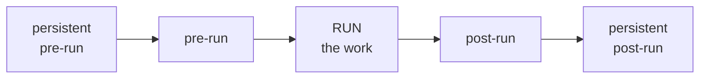
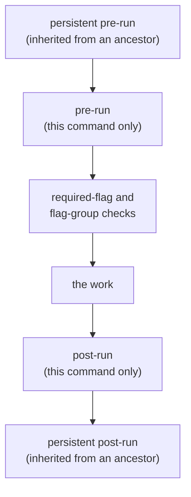
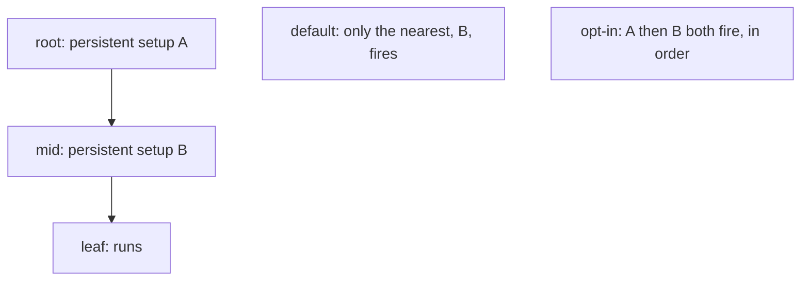

## Abstract

When a command runs, its real work is only the middle of a fixed, ordered sequence. Around that work, Cobra invokes optional author-supplied stages: persistent setup inherited from ancestors, then setup local to the command, then the work itself, then local teardown, then inherited teardown. This predictable ordering gives an author well-defined places to open resources, check preconditions, and clean up, without threading that logic through every command by hand.

## Introduction

Real commands rarely consist only of their core action. Before the action, a program often needs to establish a database connection, read configuration, or verify authentication; after it, to flush buffers or close handles. Much of this setup is shared across a whole branch of commands — everything under a given parent needs the same connection — while some is specific to a single command.

Cobra answers this with a lifecycle: a set of named stages that run in a guaranteed order around the core work. Some stages are *persistent*, meaning a definition on an ancestor applies to every command beneath it; others are local to one command. Because the order is fixed and documented, an author always knows exactly when their setup and teardown will fire relative to the work and to one another.

## Related Work

- Parent: [Execution & Dispatch](../README.md) — how the target command is found before this sequence begins.
- [Cobra](../../README.md) — the framework overview.
- [Flag Handling](../../flag-handling/README.md) — required-flag and flag-group checks happen between the setup stages and the work.

## Description

The sequence has five ordered stages surrounding the core work. Reading top to bottom, they are: inherited (persistent) setup, local setup, the work, local teardown, and inherited (persistent) teardown. Each stage is optional; a command that defines none simply runs its work directly.

**Persistent versus local.** A local stage belongs to exactly one command and fires only when that command runs. A persistent stage is meant to be inherited: define it once on a parent and it covers the whole branch below. By default, when a command runs, the framework uses the *nearest* defined persistent stage found by climbing toward the root — one inherited setup and one inherited teardown — rather than every ancestor's. An author who wants every ancestor's persistent stages to fire, outermost-in for setup and innermost-out for teardown, can opt into that traversing behavior.

**Error-returning variants.** Each stage comes in two forms: one that simply runs, and one that can report a failure. When a failing form returns an error, the sequence stops immediately and the error propagates back to dispatch, so later stages — including the core work — do not run. This makes the setup stages a natural place to guard preconditions: fail there and the work is never attempted.

**Where validation sits.** The framework's own checks are woven into this order. Argument validation runs just before the sequence begins; the required-flag and flag-group checks run after the local setup stage but before the work. The effect is that an author's setup can run first, but the work is still protected by the framework's guarantees about which options must be present.

**Program-wide initialization.** Separate from per-command stages, an author can register functions to run once as any command begins and once as it ends. These are global bookkeeping hooks — for example, to initialize shared configuration — and they are not tied to a particular node in the tree.

## Conclusion

The lifecycle turns a command from a single function into a predictable pipeline: inherited setup, local setup, framework checks, the work, local teardown, inherited teardown — with an early exit the moment any stage reports failure. Understanding this order lets an author place shared preparation on a parent and command-specific logic on a leaf with confidence about when each will run. Return to [Execution & Dispatch](../README.md) to see how the target command arrives at this pipeline, or read [Flag Handling](../../flag-handling/README.md) for the checks embedded within it.
