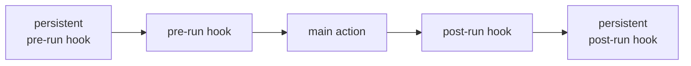
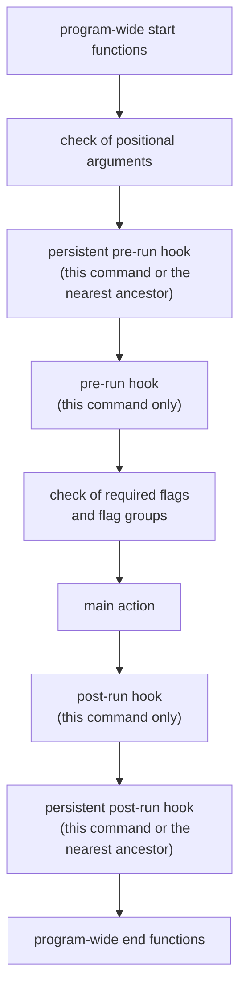
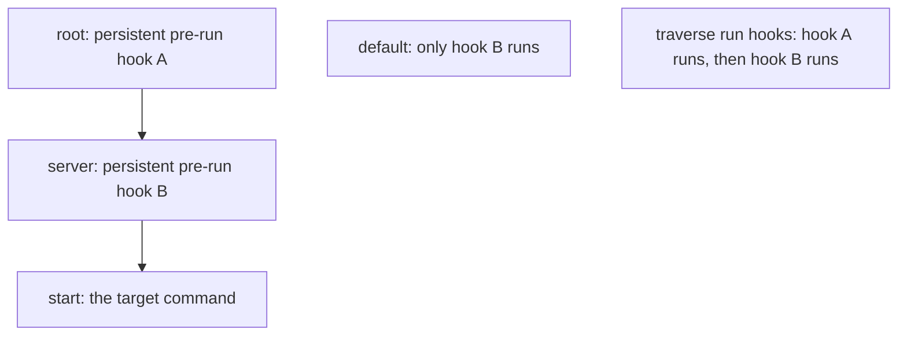
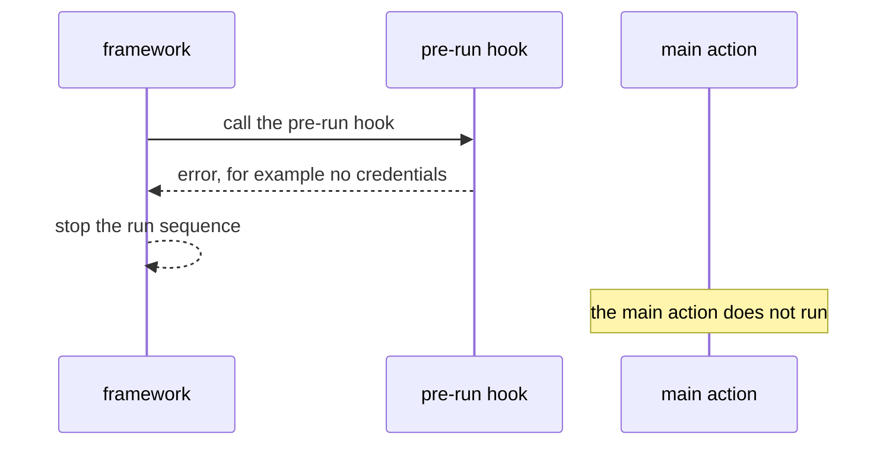

```mermaid
flowchart LR
    A["persistent
    pre-run hook"] --> B["pre-run hook"] --> C["main action"] --> D["post-run hook"] --> E["persistent
    post-run hook"]
```

## Abstract

When a command runs, its main action is only the middle part of a fixed sequence, the *run sequence*. Before and after the main action, Cobra calls optional *hooks* that the author writes. First, a persistent pre-run hook and a pre-run hook run. Then the main action runs. Last, a post-run hook and a persistent post-run hook run. Because the order is fixed, the author knows where to open resources, check conditions, and clean up.

## Introduction

A real command usually does more than its main action. Before the main action, a program can connect to a database, read a configuration, or check credentials. After the main action, it can write buffered data or close files. Many commands of one branch need the same preparation. For example, all the commands below one parent can need the same connection. Other preparation is necessary for only one command.

Cobra gives a set of named hooks that run in a fixed order around the main action. Some hooks are *persistent*: when the author defines a persistent hook on an ancestor, it applies to all commands below it. Other hooks are *local*: they apply to one command only. The order does not change, and the documentation of the framework states it. Thus, the author always knows when each hook runs.

## Related Work

- Parent: [Execution & Dispatch](../README.md) shows how the dispatcher finds the target command before the run sequence starts.
- [Cobra](../../README.md) gives the overview of the framework.
- [Flag Handling](../../flag-handling/README.md) shows the checks of required flags and flag groups, which occur between the hooks and the main action.
- [Argument Validation](../../argument-validation/README.md) shows the check of positional arguments, which occurs before the first hook.

## Description

**The full order.** The run sequence has four hooks around the main action. The framework also adds its own checks between them. The list that follows gives the full order:

1. The framework calls the *program-wide start functions*.
2. The framework checks the positional arguments.
3. The persistent pre-run hook runs.
4. The pre-run hook runs.
5. The framework checks the required flags and the flag groups.
6. The main action runs.
7. The post-run hook runs.
8. The persistent post-run hook runs.
9. The framework calls the *program-wide end functions*.

All hooks get the same data: the target command and its positional arguments. Each hook is optional. If a command has no hooks, only the main action runs. The run sequence starts only for a runnable command. If the command has no main action, the framework shows its help instead.

```mermaid
flowchart TD
    I["program-wide start functions"] --> V["check of positional arguments"]
    V --> S1["persistent pre-run hook
    (this command or the nearest ancestor)"]
    S1 --> S2["pre-run hook
    (this command only)"]
    S2 --> CHK["check of required flags
    and flag groups"]
    CHK --> W["main action"]
    W --> S3["post-run hook
    (this command only)"]
    S3 --> S4["persistent post-run hook
    (this command or the nearest ancestor)"]
    S4 --> F["program-wide end functions"]
```

**Persistent hooks and local hooks.** A local hook belongs to one command, and it runs only when that command is the target command. A persistent hook applies to the full branch below the command that defines it. By default, the framework starts at the target command and goes up to the root. It uses the first persistent pre-run hook that it finds. It does the same for the persistent post-run hook. Thus, by default, only one persistent hook of each type runs, also when many ancestors define one.

**Traverse run hooks.** The author can turn on *traverse run hooks* for the full program. Then all persistent hooks on the path run, not only the nearest one. The persistent pre-run hooks run from the root down to the target command. The persistent post-run hooks run from the target command up to the root.

```mermaid
flowchart TD
    R["root: persistent pre-run hook A"] --> M["server: persistent pre-run hook B"]
    M --> L["start: the target command"]
    D1["default: only hook B runs"]
    D2["traverse run hooks: hook A runs, then hook B runs"]
```

**Hooks that can fail.** Each hook, and also the main action, has two forms. One form only runs. The other form can return an error. If the author defines both forms, the framework uses the form that can return an error. When a hook returns an error, the run sequence stops immediately. The error goes back to dispatch, and the later hooks and the main action do not run.

```mermaid
sequenceDiagram
    participant F as framework
    participant P as pre-run hook
    participant M as main action
    F->>P: call the pre-run hook
    P-->>F: error, for example no credentials
    F-->>F: stop the run sequence
    Note over M: the main action does not run
```

**Where the framework checks occur.** The check of positional arguments occurs before the first hook. The checks of required flags and flag groups occur after the pre-run hook and before the main action. Thus, a pre-run hook can run first, but the framework still protects the main action. If the user did not set a required flag, the main action does not start.

**Program-wide functions.** The author can also register functions for the full program. These functions do not belong to a node of the tree. The start functions run when any command starts its run, before the check of positional arguments. The end functions run when the run of that command ends. The end functions run also when a check or a hook fails. An author can use a start function, for example, to read a shared configuration.

## Conclusion

The run sequence changes a command from one function into a sequence that the author can predict. The order is: start functions, argument check, persistent pre-run hook, pre-run hook, flag checks, and the main action. Then the post-run hook, the persistent post-run hook, and the end functions follow. If a hook returns an error, the sequence stops. With this order, the author can put shared preparation on a parent and specific work on a leaf.

To see how the target command gets to this sequence, read [Execution & Dispatch](../README.md). To see the flag checks in the sequence, read [Flag Handling](../../flag-handling/README.md).
