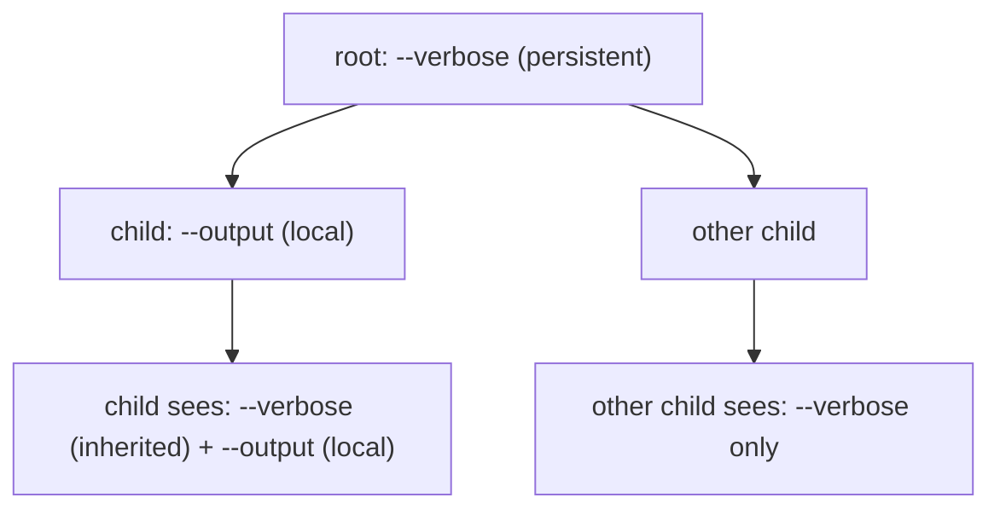
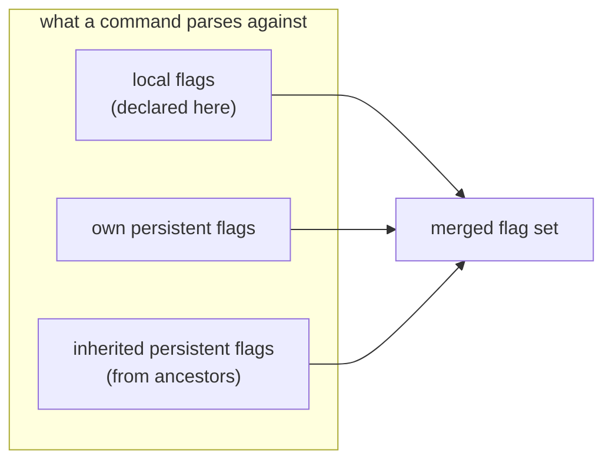
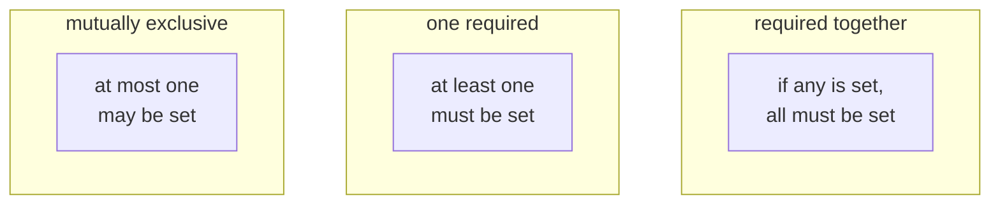
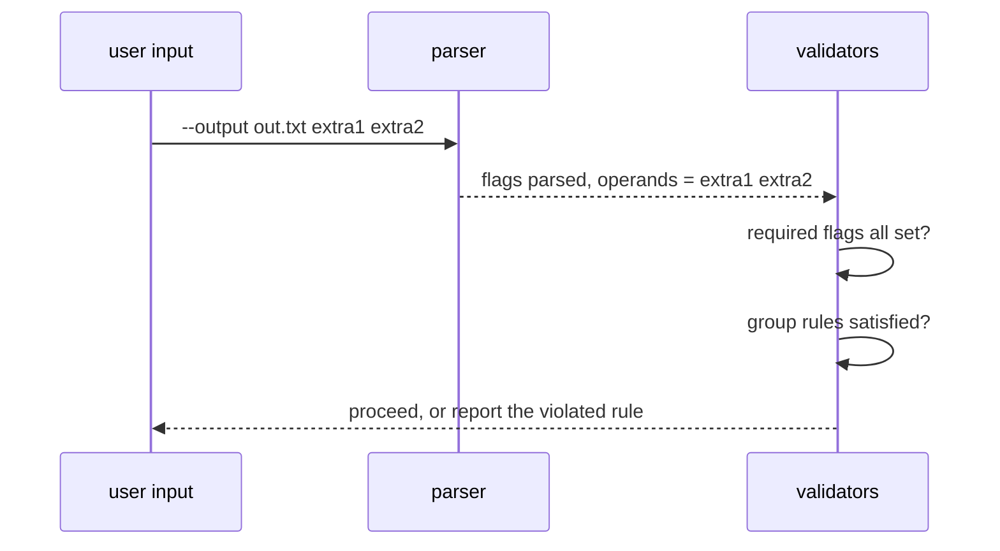

## Abstract

Flags are the named options a user sets on a command, such as a verbosity switch or an output path. Cobra organizes flags by scope: a *local* flag belongs to a single command, while a *persistent* flag is inherited by every command beneath the one that declares it. On top of parsing, the framework enforces constraints — individual flags can be required, and sets of flags can be linked so they must appear together, must not appear together, or must include at least one of the set. This paper describes how flags are scoped, merged, and validated.

## Introduction

Command-line options come in two natural scopes. Some belong to one specific action: an output filename means something only to the command that writes a file. Others are cross-cutting: a "verbose" or "config file" switch should work identically no matter which subcommand the user eventually reaches. A CLI framework that offered only per-command options would force authors to redeclare the cross-cutting ones on every command; one that offered only global options could not express command-specific choices.

Cobra provides both. Each command has a set of local flags and, separately, a set of persistent flags. When a command executes, the framework merges its own local and persistent flags with the persistent flags inherited from all of its ancestors, producing the complete set of options that command understands. Beyond scope, real tools also have rules about combinations of options, and the framework can enforce those rules so the author does not have to check them by hand.

## Related Work

- Parent: [Cobra](../README.md) — the framework overview.
- [Execution & Dispatch](../execution-and-dispatch/README.md) — dispatch must see through flags while locating the target command.
- [Lifecycle Hooks](../execution-and-dispatch/lifecycle-hooks/README.md) — the required-flag and flag-group checks run inside the run sequence.
- [Help & Usage](../help-and-usage/README.md) — the flag lists shown in help are drawn from these scopes.
- [Shell Completion](../shell-completion/README.md) — flags and their values can be completed as the user types.

## Description

**The three views of a command's flags.** From any command, flags can be seen three ways. *Local* flags are those declared on the command itself. *Inherited* flags are the persistent flags contributed by ancestors. Together with the command's own persistent flags they form the full, merged set that parsing actually uses. The framework computes this merge on demand and caches it, so a command always parses against exactly the options that are in scope for it.

**Parsing and leftovers.** When a command runs, it hands the leftover words from dispatch to its merged flag set. Parsing pulls out recognized options and their values and leaves the remaining words as positional operands. A dedicated marker word can turn off flag parsing for everything after it, and a command can even disable flag parsing entirely, in which case every word is passed through untouched — useful when a command wraps another program. An author can also choose to tolerate unknown-flag errors rather than abort.

**Required flags.** Any single flag can be marked as required. After the setup stages of the run sequence, the framework checks that every required flag was actually set, and if one is missing it reports the omission and stops before the work runs. This shifts a common precondition check out of the author's code and into the framework.

**Flag groups.** Beyond single flags, related flags can be constrained as a set. There are three kinds of group constraint, and a flag may belong to several groups at once:

The framework validates these group rules at the same point it checks required flags: it inspects which members of each group were set and rejects any combination that violates the rule, naming the offending flags in the error. The same group knowledge also feeds completion — when one member of a "required together" group is present, the others are suggested; when a member of a mutually exclusive group is present, its rivals are hidden from suggestions.

**Naming refinements.** Flags can carry a single-letter shorthand alongside their full name, and a program can install a name-normalization rule so that variant spellings collapse to one canonical flag. Because normalization can be set globally, it applies consistently across the whole tree.

## Conclusion

Flag handling rests on scope and constraint. Scope decides which options a command sees — its own local flags plus every persistent flag inherited down the branch — and constraint decides which combinations are legal, from single required flags to grouped rules validated automatically before the work runs. Continue to [Argument Validation](../argument-validation/README.md) for the rules applied to the non-flag operands, or to [Shell Completion](../shell-completion/README.md) to see how flags and their values are completed interactively.
