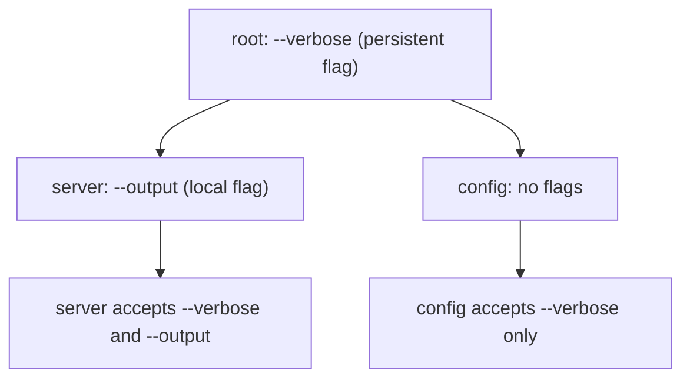
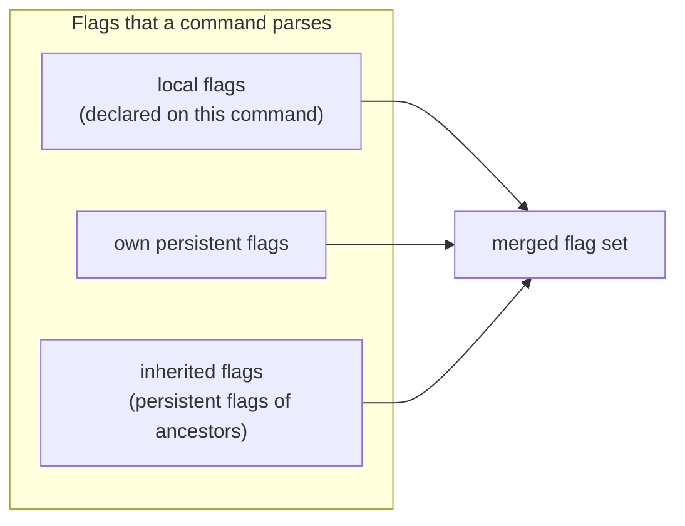
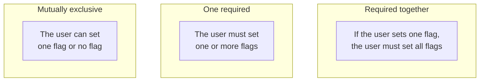
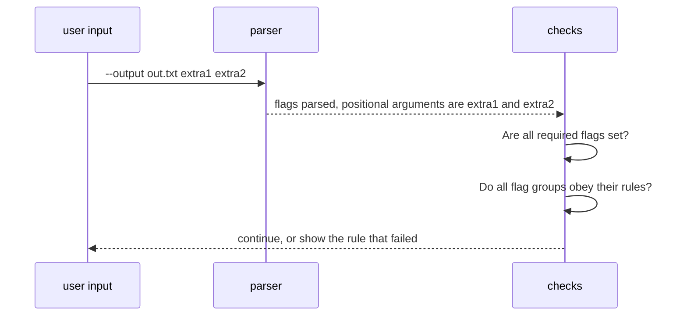

```mermaid
flowchart TD
    R["root: --verbose (persistent flag)"] --> C["server: --output (local flag)"]
    R --> C2["config: no flags"]
    C --> V1["server accepts --verbose and --output"]
    C2 --> V2["config accepts --verbose only"]
```

## Abstract

A flag is a named option that the user sets on a command. Examples are a switch for more output and the path of an output file. Cobra puts each flag in a scope.

A *local flag* belongs to one command. A *persistent flag* applies to the command that declares it and to all commands below that command. The framework also checks constraints on flags. A flag can be a *required flag*, and a *flag group* can link a set of flags with a rule. This paper describes how the framework puts flags in scopes, merges them, and checks them.

## Introduction

Flags have two natural scopes. Some flags are for one action only, for example the name of an output file. Other flags are for all actions, for example a switch for more output. If a framework has only flags for one command, the author must declare the general flags again on each command. If a framework has only global flags, the author cannot give a flag to one command only.

Cobra gives both scopes. Each command has a set of local flags and a separate set of persistent flags. When a command runs, the framework merges three sets of flags. These sets are the local flags of the command, its own persistent flags, and the persistent flags of all its ancestors. Real programs also have rules about which flags can occur together. The framework can check these rules, and thus the author does not write the checks.

## Related Work

- Parent: [Cobra](../README.md) gives the overview of the framework.
- [Execution & Dispatch](../execution-and-dispatch/README.md) shows how the dispatcher skips flags while it finds the target command.
- [Lifecycle Hooks](../execution-and-dispatch/lifecycle-hooks/README.md) shows where the checks of required flags and flag groups occur in the run sequence.
- [Argument Validation](../argument-validation/README.md) shows the rules for the positional arguments that remain after the flags.
- [Help & Usage](../help-and-usage/README.md) shows how help lists the flags of each scope.
- [Shell Completion](../shell-completion/README.md) shows how the shell completes flag names and flag values.

## Description

**Three views of the flags of a command.** The framework can show the flags of a command in three views:

- The *local flags* are the flags that the command declares. This view contains the persistent flags that the command declares.
- The *inherited flags* are the persistent flags that come from the ancestors of the command.
- The *merged flag set* contains the local flags and the inherited flags. The parser uses this set.

If a local flag has the same name as an inherited flag, the local flag hides the inherited flag. The framework makes the merged flag set when it needs it, and it keeps the result for later use.

```mermaid
flowchart LR
    subgraph SCOPE ["Flags that a command parses"]
    L["local flags
    (declared on this command)"]
    P["own persistent flags"]
    I["inherited flags
    (persistent flags of ancestors)"]
    end
    L --> M["merged flag set"]
    P --> M
    I --> M
```

**Flag parsing.** When a command runs, it gives the words from dispatch to its merged flag set. The parser takes out the flags that it knows and their values. The words that are left are the positional arguments. The list that follows shows the parse options:

- A double dash stops the parse, and all words after it are positional arguments.
- A command can turn off flag parsing. Then all words go to the command as positional arguments, and the framework does not check the flag constraints. This option is useful when a command wraps a different program.
- A command can ignore errors about unknown flags.
- A command can set an error function that changes the error when the parse fails. Its children use the same function, if they do not set their own function.

If the user sets a deprecated flag, the parser shows a warning but continues.

**Required flags.** The author can mark a local flag or a persistent flag as a required flag. After the pre-run hook, the framework checks that the user set all required flags. If the user did not set one or more required flags, the framework stops before the main action. The error message gives the names of all these flags.

**Flag groups.** A flag group links a set of flags of one command with a rule. There are three types of rule. One flag can be a member of many groups.

```mermaid
flowchart TD
    subgraph RT ["Required together"]
    A1["If the user sets one flag,
    the user must set all flags"]
    end
    subgraph OR ["One required"]
    A2["The user must set
    one or more flags"]
    end
    subgraph ME ["Mutually exclusive"]
    A3["The user can set
    one flag or no flag"]
    end
```

The author must declare all flags of a group before the group itself. If a flag name in a group is unknown, the program stops with an error. The framework checks flag groups immediately after the required flags. First it checks the "required together" groups, then the "one required" groups, and then the "mutually exclusive" groups. The framework stops at the first group that fails. The error message gives the names of the flags in that group.

```mermaid
sequenceDiagram
    participant U as user input
    participant P as parser
    participant V as checks
    U->>P: --output out.txt extra1 extra2
    P-->>V: flags parsed, positional arguments are extra1 and extra2
    V->>V: Are all required flags set?
    V->>V: Do all flag groups obey their rules?
    V-->>U: continue, or show the rule that failed
```

**Flag groups in shell completion.** Shell completion also uses the flag groups. The framework changes the suggestions as follows:

- If the user sets one flag of a "required together" group, the shell suggests the other flags of the group first.
- If the user sets no flag of a "one required" group, the shell suggests all flags of the group first.
- If the user sets one flag of a "mutually exclusive" group, the shell does not suggest the other flags of the group.

**Names of flags.** A flag can have a short name of one letter in addition to its full name. A program can also set a *normalization function*, which changes different spellings of a flag name into one name. When the author sets this function on a command, it applies to that command and to all commands below it.

## Conclusion

Flag Handling has two parts: scope and constraint. The scope sets which flags a command accepts. These flags are its local flags and all the persistent flags that come down its branch. The constraints set which combinations of flags are correct. The framework checks required flags and flag groups before the main action.

To see the rules for the positional arguments, read [Argument Validation](../argument-validation/README.md). To see how the shell completes flags, read [Shell Completion](../shell-completion/README.md).
