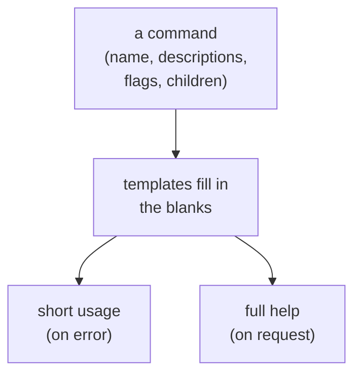
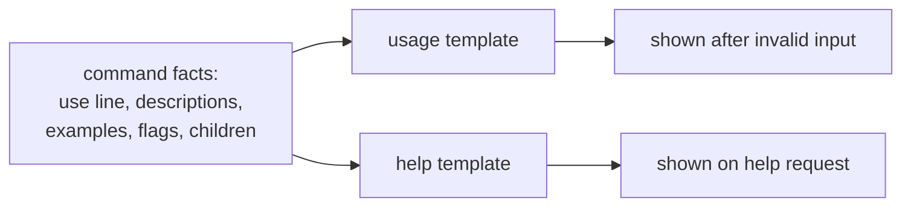
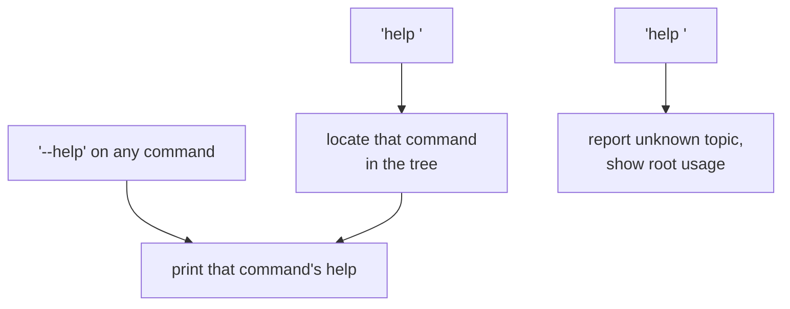
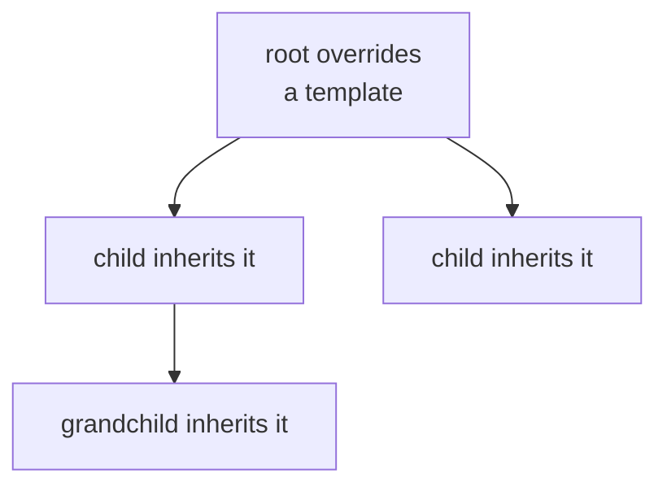

```
██╗  ██╗███████╗██╗     ██████╗
██║  ██║██╔════╝██║     ██╔══██╗
███████║█████╗  ██║     ██████╔╝
██╔══██║██╔══╝  ██║     ██╔═══╝
██║  ██║███████╗███████╗██║
╚═╝  ╚═╝╚══════╝╚══════╝╚═╝
```



## Abstract

Because every command already carries its own name, descriptions, option list, and children, Cobra can compose that material into documentation automatically. It produces two related outputs: a compact usage summary, shown when a user's input is invalid, and a fuller help page, shown on demand. A built-in help command and help flag make that page reachable anywhere in the tree, and a version flag reports the program's version. All of it is generated from templates that an author can override.

## Introduction

Help text is where users learn a tool, yet it is tedious to write and quick to fall out of date. When an author adds a flag or a subcommand, any hand-written help must be updated in lockstep, and in practice it drifts. The information the help should contain, though, already exists in the command definitions: the name, the one-line and long descriptions, the examples, the flags in scope, and the list of child commands.

Cobra treats this existing material as the source of truth and renders it through templates. Whenever help or usage is needed, the framework gathers the command's own facts, merges in the flags inherited from ancestors, and fills a template to produce the text. Because the text is generated each time from the live definitions, it cannot drift from the actual structure. Authors get consistent, always-current documentation for free, and can still customize the presentation when they want to.

## Related Work

- Parent: [Cobra](../README.md) — the framework overview.
- [Command Tree](../command-tree/README.md) — supplies the child listing and grouping shown in help.
- [Flag Handling](../flag-handling/README.md) — supplies the local and inherited flag lists shown in help.
- [Execution & Dispatch](../execution-and-dispatch/README.md) — decides when usage is shown after an error and routes help requests.

## Description

**Two outputs, one source.** The framework distinguishes a *usage* summary from a *help* page. The usage summary is terse — the usage line and the essentials — and appears when the user makes a mistake, as a nudge toward correct syntax. The help page is complete: the long description, examples, the available subcommands, and the flags in scope. Both are built from the same command facts, differing only in the template applied.



**Reaching help anywhere.** Help is reachable two ways, and the framework adds both automatically. A help flag is attached to every command, so requesting help on any node prints that node's page. Separately, when a command has children, a help command is added so a user can ask for help *about* another command by naming it. Both are created late, just before execution, so that an author who defines their own help flag or command is never overridden.



**Assembly and inheritance.** Rendering a page is not a matter of reading one command in isolation. The framework first merges in the persistent flags inherited from ancestors, so the help correctly shows every option in scope, not just the locally declared ones. It also uses the child listing — including the group headings described in the [Command Tree](../command-tree/README.md) — and pads names into aligned columns using width measurements the tree recorded as commands were attached. Hidden and deprecated commands are omitted from the listing even though they still function.

**Version reporting.** When a program declares a version, the framework adds a version flag automatically, and requesting it prints the version through its own small template and stops before any work runs. Like help, this is generated so the author need not wire it up.

**Where output goes and customization.** Help is written to the standard output stream while error-driven usage goes to the error stream, so that piping a help request behaves as users expect. Every piece of this — the usage template, the help template, the version template, the error prefix, and even the functions that produce help and usage — can be replaced by the author. Overrides set on an ancestor are inherited by descendants, so a program can restyle its documentation once at the root and have the whole tree follow.



## Conclusion

Help and usage are generated, not authored: the framework reads a command's own facts, folds in inherited flags and the child listing, and renders them through templates into a terse usage summary and a full help page, both always in step with the real structure. A help flag, a help command, and a version flag are added automatically, and every template can be overridden and inherited down the tree. See [Command Tree](../command-tree/README.md) for the grouping that shapes the listing, or [Shell Completion](../shell-completion/README.md) for documentation delivered interactively as the user types.
