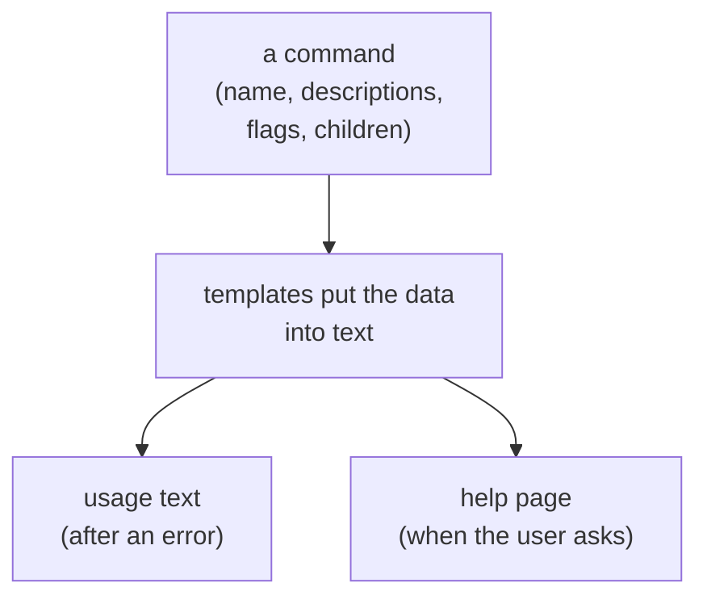
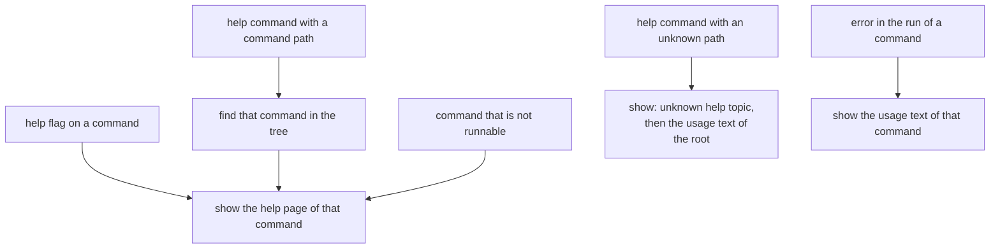
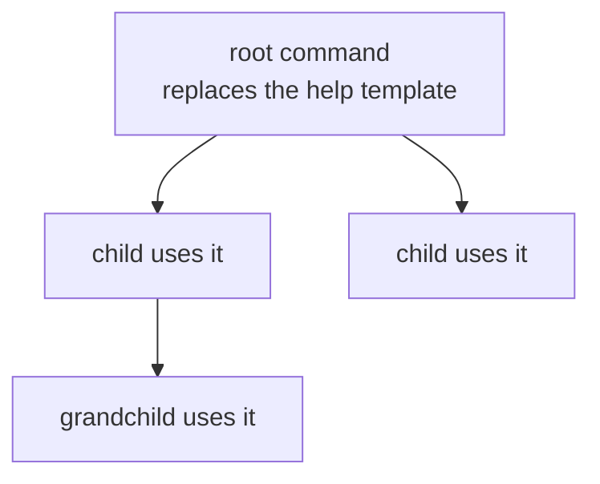

```mermaid
flowchart TD
    CMD["a command
    (name, descriptions,
    flags, children)"] --> TMPL["templates put the data
    into text"]
    TMPL --> USAGE["usage text
    (after an error)"]
    TMPL --> HELP["help page
    (when the user asks)"]
```

## Abstract

Each command already has a name, descriptions, a list of flags, and a list of children. Thus, Cobra can make documentation from this data automatically.

Cobra makes two related texts. The *usage text* is a summary that the framework shows after an input error. The *help page* is a longer text that the framework shows when the user asks for help. A help flag and a help command make the help page available at all levels of the tree. A version flag shows the version of the program. The framework makes all these texts from *templates*, and the author can replace each template.

## Introduction

Help text is the place where users learn a tool. But help text takes time to write, and it quickly becomes incorrect. When the author adds a flag or a subcommand, the author must also change the help text. In practice, the author often forgets this change. But the command definitions already contain the necessary data. This data is the name, the short and long descriptions, the examples, the flags, and the list of children.

Cobra uses this data as the only source of the help text. When the framework needs help or usage text, it collects the data of the command. It adds the flags that the command gets from its ancestors. Then it puts the data into a template to make the text. The framework makes the text again each time from the current definitions. Thus, the text always agrees with the real structure of the program.

## Related Work

- Parent: [Cobra](../README.md) gives the overview of the framework.
- [Command Tree](../command-tree/README.md) supplies the list of children, the command groups, and the hidden commands.
- [Flag Handling](../flag-handling/README.md) supplies the local flags and the inherited flags that help shows.
- [Execution & Dispatch](../execution-and-dispatch/README.md) decides when to show the usage text after an error and when to show the help page.

## Description

**Two texts from one source.** The usage text and the help page come from the same data. The help page contains the long description of the command and then the full usage text. If the command has no long description, the help page uses the short description. The usage text contains the sections in the diagram that follows. The usage text shows each section only when it has content.

```
Usage:
  app server [flags]             <- usage line, if the command is runnable
  app server [command]           <- if the command has visible children

Aliases:                         <- name and aliases
Examples:                        <- examples from the author

Available Commands:              <- visible children, with short descriptions
  start       Start the server      (or one section for each command group,
  stop        Stop the server        then "Additional Commands")

Flags:                           <- local flags
Global Flags:                    <- inherited flags
Additional help topics:          <- help topics

Use "app server [command] --help" for more information about a command.
```

**When the framework shows each text.** The framework shows the help page in three conditions:

- The user sets the help flag on a command.
- The user runs the help command with the path to a command.
- The user runs a command that is not runnable.

The framework shows the usage text after an error in the run of a command. The author can silence the usage text.


```mermaid
flowchart TD
    A["help flag on a command"] --> P["show the help page of that command"]
    B["help command with a command path"] --> FIND["find that command in the tree"] --> P
    C["command that is not runnable"] --> P
    B2["help command with an unknown path"] --> MISS["show: unknown help topic,
    then the usage text of the root"]
    E["error in the run of a command"] --> U["show the usage text of that command"]
```

**The help flag and the help command.** The framework adds these two items automatically. Before a command runs, the framework adds a help flag to it, with the short name "h". The framework adds the help command to the root command before dispatch, but only if the root command has subcommands. With the help command, the user can ask for help about a different command by its path. The framework adds these items as late as possible. Thus, if the author defines a help flag or a help command, the framework uses the definition of the author.

**How the framework fills the template.** The framework does not read only one command. First, it merges the persistent flags of the ancestors into the flags of the command. Thus, help shows all flags that the command accepts. Then it uses the list of children and the command groups from the [Command Tree](../command-tree/README.md). It aligns the names in columns with the widths that the tree recorded. Help does not show hidden commands and deprecated commands, but these commands still operate.

**The version flag.** If a command has a version, the framework adds a version flag to it. If the short name "v" is free, the version flag also gets that short name. When the user sets the version flag, the framework shows the program name and the version. Then it stops, and the main action does not run. The version text comes from its own template.

**Output streams.** The framework writes the help page to the output stream. The usage text goes to the output stream if the author sets one. If not, the usage text goes to the error stream. Error messages go to the error stream. Thus, the user can send a help page to a different program through a pipe.

**Customization.** The author can replace these items:

- the usage template and the usage function
- the help template and the help function
- the version template
- the prefix of error messages
- the function that changes flag errors

The author can also add new functions for use in all templates. A command uses the replacement of its nearest ancestor that sets one. Thus, a program can change the style of its documentation one time at the root, and the full tree uses the new style.


```mermaid
flowchart TD
    ROOT["root command
    replaces the help template"] --> C1["child uses it"]
    ROOT --> C2["child uses it"]
    C1 --> G1["grandchild uses it"]
```

## Conclusion

The framework makes help and usage text from data, and the author does not write this text. The framework reads the data of a command, adds the inherited flags and the list of children, and puts all of it into templates. The result is a usage text and a help page that always agree with the real structure. The framework adds a help flag, a help command, and a version flag automatically. The author can replace each template, and the replacement applies to the full branch below.

To see how the command groups change the list of commands, read [Command Tree](../command-tree/README.md). To see documentation that the shell gives while the user types, read [Shell Completion](../shell-completion/README.md).
