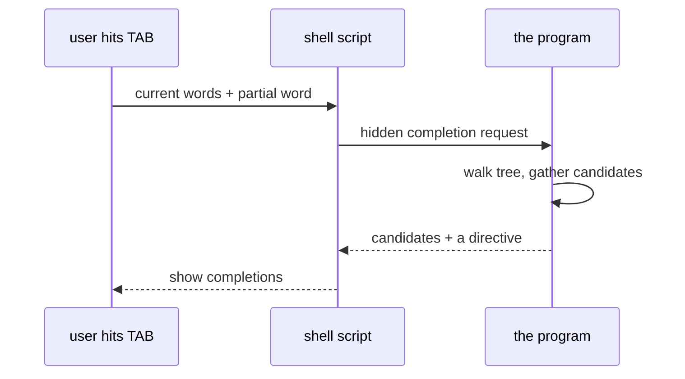
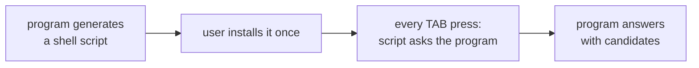
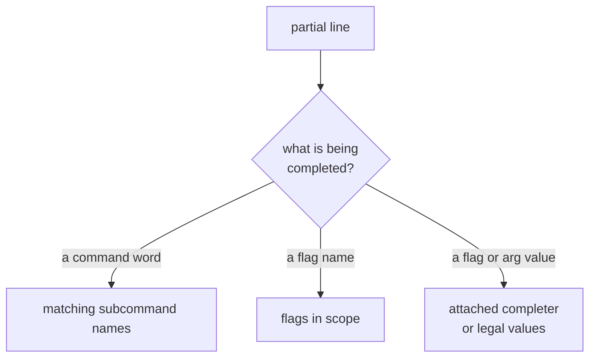
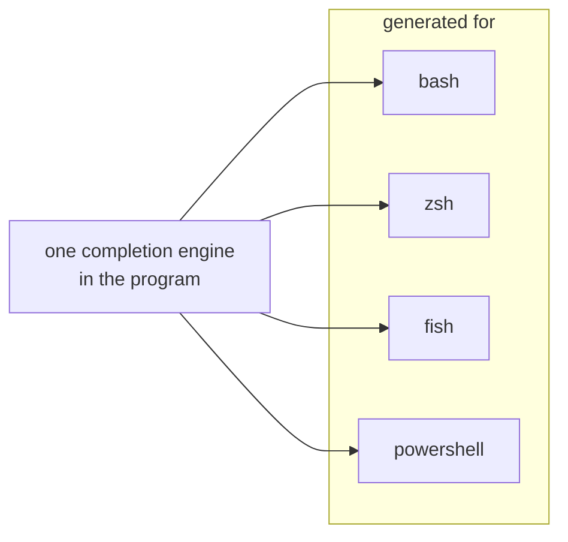

```
 ██████╗ ██████╗ ███╗   ███╗██████╗ ██╗     ███████╗████████╗███████╗
██╔════╝██╔═══██╗████╗ ████║██╔══██╗██║     ██╔════╝╚══██╔══╝██╔════╝
██║     ██║   ██║██╔████╔██║██████╔╝██║     █████╗     ██║   █████╗
██║     ██║   ██║██║╚██╔╝██║██╔═══╝ ██║     ██╔══╝     ██║   ██╔══╝
╚██████╗╚██████╔╝██║ ╚═╝ ██║██║     ███████╗███████╗   ██║   ███████╗
 ╚═════╝ ╚═════╝ ╚═╝     ╚═╝╚═╝     ╚══════╝╚══════╝   ╚═╝   ╚══════╝
```



## Abstract

Shell completion lets a user press the tab key and have the shell fill in command names, flag names, and even flag or argument values. Cobra powers this two ways at once: it emits a small startup script for each major shell, and it answers the live completion queries that script sends back to the program. Because the program itself computes the candidates by walking its own command tree, completions always match what the tool can actually do — including values that can only be known at run time.

## Introduction

Tab-completion is one of the strongest usability features a command-line tool can offer, but it is awkward to build. The traditional approach writes a completion script by hand in each shell's arcane scripting language, duplicating the tool's structure; that script then rots as the tool changes. Worse, a static script cannot complete values that depend on live state, such as the names of currently running jobs.

Cobra removes both problems by making the program its own completion engine. A generated startup script is deliberately thin: when the user presses tab, it simply asks the program what the completions should be, passing along the words typed so far. The program walks the same command tree it uses for everything else, produces the candidates, and returns them together with a directive telling the shell how to treat them. One engine serves every supported shell, and because the program computes results at the moment of the keypress, completions can reflect the real, current state of the system.

## Related Work

- Parent: [Cobra](../README.md) — the framework overview.
- [Command Tree](../command-tree/README.md) — the structure walked to find command-name candidates.
- [Flag Handling](../flag-handling/README.md) — flag names and grouping shape which flags are suggested.
- [Argument Validation](../argument-validation/README.md) — a command's legal argument values become candidates.
- [Help & Usage](../help-and-usage/README.md) — the descriptions attached to candidates come from the same command facts.

## Description

**The split between script and engine.** Completion has two halves. The static half is a startup script the framework can generate for each supported shell; the user installs it once. The dynamic half is a hidden request the program answers every time the user presses tab. The script's only real job is to relay the current words to the program and display whatever comes back, so the intelligence lives in the program, not the script.



**Deciding what to suggest.** When a completion request arrives, the program figures out where in the tree the partial line points and what the user is completing. If they are partway through a command word, it offers matching subcommand names. If they are completing a flag name, it offers the flags in scope. If they are completing a value, it looks for a completer attached to that flag or, for a positional argument, the command's declared legal values — which may be a fixed list or a function that computes candidates on the spot, giving access to live state.



**Directives.** Alongside the candidates, the program returns a directive — a small set of instructions telling the shell how to behave: whether to add a trailing space, whether to fall back to file-name completion when nothing matches, whether to restrict results to files of a certain extension or to directories, and whether to preserve the given order rather than re-sort. This lets the same mechanism produce anything from a closed list of choices to filesystem-aware completion.

**Descriptions and active help.** Shells that can show an annotation beside each candidate receive the command or flag's short description, so completion doubles as inline documentation. Going further, the program can inject *active help* — short guidance messages surfaced during completion to coach the user through a complex invocation. Active help can be toggled off through the environment when it would be noise.

**Coverage and the built-in command.** The framework can generate scripts for the widely used shells, each with an option to omit descriptions for shells or users that prefer terseness. A completion command is added to the program automatically so users can obtain the right script without the author wiring anything up, though this can be disabled or hidden. Flag groups also influence suggestions: members of a "required together" group pull their companions into the suggestions, while a chosen member of a mutually exclusive group suppresses its rivals — the connection to [Flag Handling](../flag-handling/README.md).



## Conclusion

Shell completion is Cobra's self-description turned interactive. A thin generated script relays each tab press to the program, which walks its own tree to produce candidates — command names, flags, and values that may be computed live — and returns them with a directive and, optionally, descriptions and coaching hints. One engine covers every supported shell and stays correct as the tool evolves. This closes the loop opened by the [Command Tree](../command-tree/README.md): the same structure that organizes a program also teaches users how to drive it.
