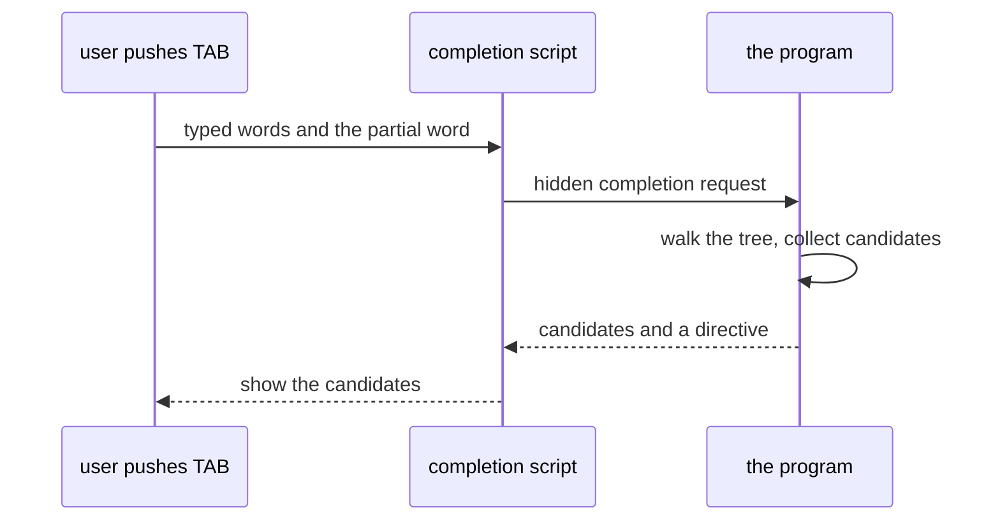
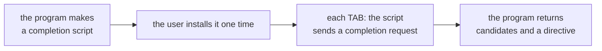
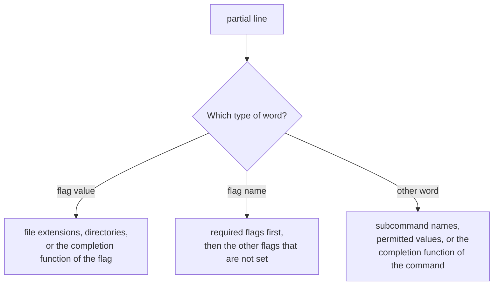
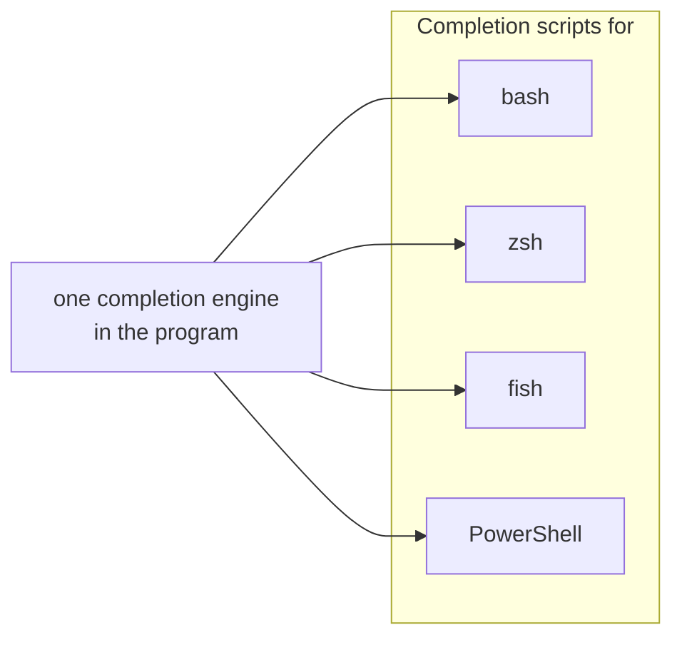

```mermaid
sequenceDiagram
    participant U as user pushes TAB
    participant S as completion script
    participant P as the program
    U->>S: typed words and the partial word
    S->>P: hidden completion request
    P->>P: walk the tree, collect candidates
    P-->>S: candidates and a directive
    S-->>U: show the candidates
```

## Abstract

With shell completion, the user pushes the tab key, and the shell completes the word. The shell can complete command names, flag names, flag values, and positional arguments. Cobra supplies two parts for this capability. It makes a *completion script* for each of four shells, and it answers the *completion requests* that the script sends to the program. The program itself finds the *candidates* with its own command tree. Thus, the candidates always agree with what the program can do, and they can include values that exist only at run time.

## Introduction

Shell completion makes a command-line tool much easier to use. But it is difficult to make. In the old method, the author writes a completion script by hand for each shell, in the script language of that shell. This script copies the structure of the tool, and it becomes incorrect when the tool changes. Also, a static script cannot complete values that change at run time, for example the names of the jobs that run now.

Cobra solves both problems because the program does the completion work itself. The completion script is small. When the user pushes the tab key, the script sends the typed words to the program and asks for candidates. The program walks the same command tree that it uses for all other tasks. It returns the candidates and a *directive*, which tells the shell how to use them. One *completion engine* in the program serves all shells.

## Related Work

- Parent: [Cobra](../README.md) gives the overview of the framework.
- [Command Tree](../command-tree/README.md) shows the structure that the engine walks to find command names.
- [Execution & Dispatch](../execution-and-dispatch/README.md) shows the walk that the engine also uses to find the target command.
- [Flag Handling](../flag-handling/README.md) shows how required flags and flag groups change the flag suggestions.
- [Argument Validation](../argument-validation/README.md) shows the list of permitted values, which also gives candidates.
- [Help & Usage](../help-and-usage/README.md) shows the short descriptions that also go next to the candidates.

## Description

**The script and the engine.** Shell completion has two parts. The static part is the completion script, which the framework makes. The user installs this script one time. The dynamic part is a hidden completion request, which the program answers at each push of the tab key. The script only sends the words to the program and shows the result. Thus, the logic is in the program, not in the script.

```mermaid
flowchart LR
    GEN["the program makes
    a completion script"] --> INSTALL["the user installs it one time"]
    INSTALL --> TAB["each TAB: the script
    sends a completion request"]
    TAB --> ANS["the program returns
    candidates and a directive"]
```

**The hidden request command.** The program answers completion requests through a hidden command. The framework adds this command only when the shell calls it. Thus, the command does not change the tree in a normal run. The command has two names: one name gives candidates with descriptions, and the other name gives candidates without descriptions. The command writes one candidate on each line, and the last line contains the directive as a number. The command writes debug messages to the error stream, and the script ignores them.

**Selection of candidates.** When a completion request arrives, the engine finds the target command with the same walk as dispatch. Then it finds which type of word the user completes. If the user set the help flag or the version flag, the engine gives no candidates. The diagram shows the other cases.

```mermaid
flowchart TD
    REQ["partial line"] --> WHERE{"Which type of word?"}
    WHERE -->|"flag value"| FV["file extensions, directories,
    or the completion function of the flag"]
    WHERE -->|"flag name"| FN["required flags first,
    then the other flags that are not set"]
    WHERE -->|"other word"| OW["subcommand names,
    permitted values, or the
    completion function of the command"]
```

The list that follows gives the details of each case:

- **Flag value.** The author can mark a flag so that the shell completes only files with given extensions or only directories. Otherwise, the engine calls the completion function that the author registered for the flag.
- **Flag name.** If the command has required flags that are not set, the engine suggests only these flags. Otherwise, it suggests all flags that the user did not set. A flag that can occur many times stays in the list. Hidden flags and deprecated flags do not show.
- **Other word.** If the user typed no positional argument and no local flag yet, the engine suggests the names of the visible subcommands. Then it adds the permitted values of the command, but only for the first positional argument. If the command has no list of permitted values, the engine calls the completion function of the command. This function can calculate candidates from the current state of the system.

**Directives.** With the candidates, the program returns a directive. A directive is a set of instructions for the shell:

| Directive | The shell does this |
|---|---|
| Default | It uses its default behavior, for example file completion. |
| Error | It ignores the candidates. |
| No space | It does not add a space after the completed word. |
| No file completion | It does not complete file names when there are no candidates. |
| Filter file extensions | It completes only files with the given extensions. |
| Filter directories | It completes only directory names. |
| Keep order | It keeps the order of the candidates and does not sort them. |

The author can set a different default directive on a command. That directive applies to the command and to the commands below it.

**Descriptions and active help.** Some shells can show a description next to each candidate. For these shells, the engine adds the short description of the command or the usage text of the flag. The user can turn off descriptions with an environment variable. The engine can also add *active help*, which is a short message that helps the user while the user types. The shell shows these messages below the candidates. The user can turn off active help for one program or for all programs with an environment variable.

**The completion command and the four shells.** The framework adds a *completion command* to the root command. This command has one subcommand for each shell, and each subcommand writes the completion script. The framework adds the completion command only if the root command has other subcommands. Thus, a program with only a root command does not get a new subcommand. The author can hide the completion command, turn it off, or put it in a command group. Each subcommand also has a flag that removes the descriptions from the script.

```mermaid
flowchart LR
    subgraph SHELLS ["Completion scripts for"]
    B["bash"]
    Z["zsh"]
    F["fish"]
    P["PowerShell"]
    end
    ENG["one completion engine
    in the program"] --> B
    ENG --> Z
    ENG --> F
    ENG --> P
```

The framework also keeps an old generator for bash. This generator makes a large static script that contains the tree. The static script sends a completion request to the program only for dynamic values, and it does not show active help. The completion command uses the newer bash script, which is small.

## Conclusion

Shell completion uses the data of the command tree to help the user while the user types. A small completion script sends each tab key push to the program. The program walks its own tree and finds candidates: command names, flags, and values that it can calculate at run time. It returns the candidates with a directive, descriptions, and active help messages. One engine serves all four shells and stays correct when the tool changes. Thus, the [Command Tree](../command-tree/README.md) organizes the program and also teaches the user how to use it.
