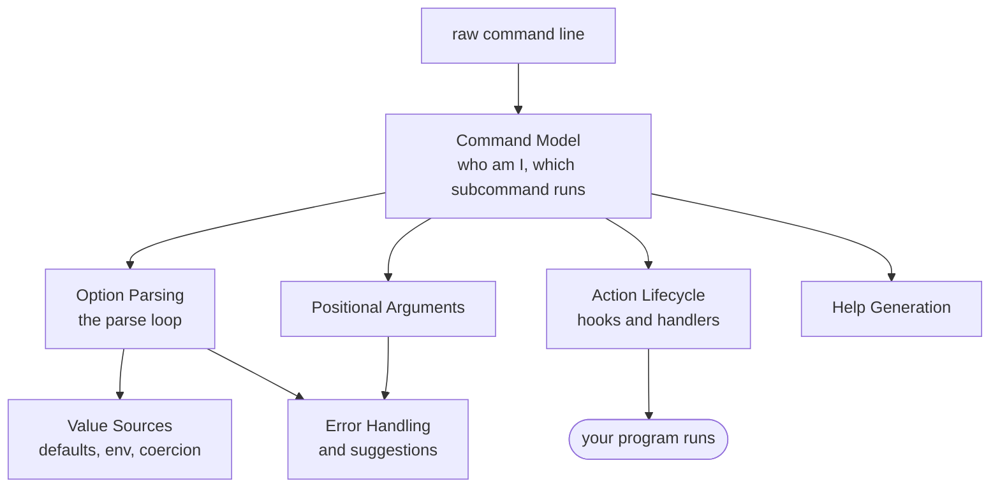
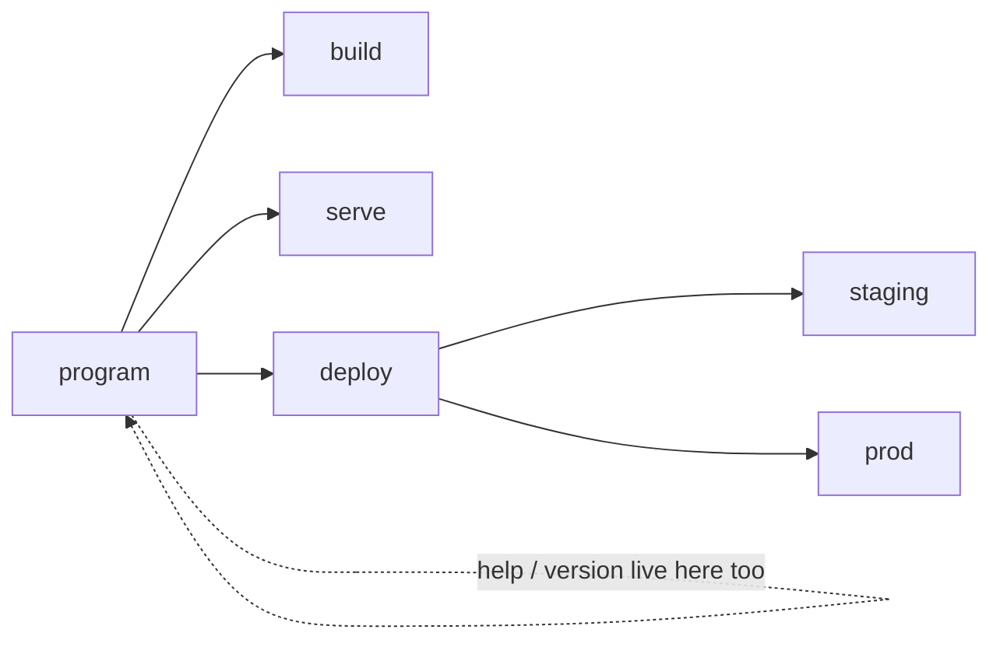
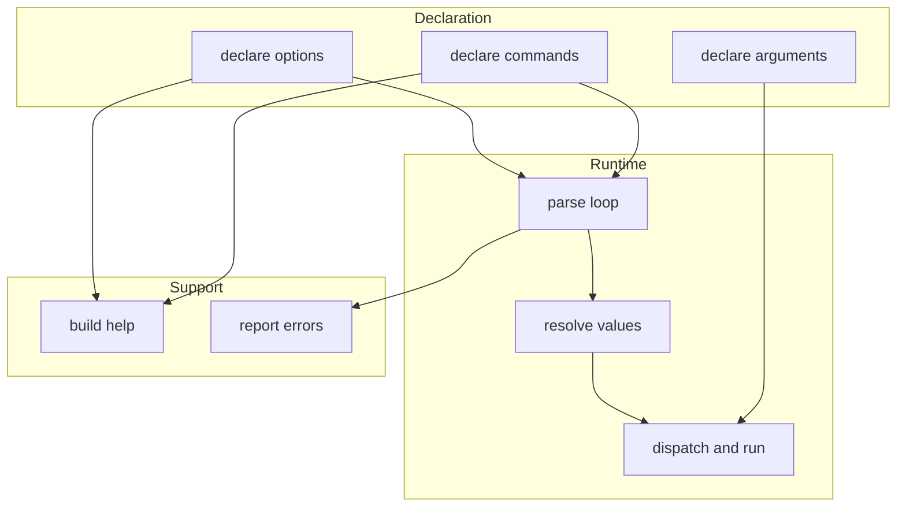

```
 ██████╗ ██████╗ ███╗   ███╗███╗   ███╗ █████╗ ███╗   ██╗██████╗ ███████╗██████╗         ██╗███████╗
██╔════╝██╔═══██╗████╗ ████║████╗ ████║██╔══██╗████╗  ██║██╔══██╗██╔════╝██╔══██╗        ██║██╔════╝
██║     ██║   ██║██╔████╔██║██╔████╔██║███████║██╔██╗ ██║██║  ██║█████╗  ██████╔╝        ██║███████╗
██║     ██║   ██║██║╚██╔╝██║██║╚██╔╝██║██╔══██║██║╚██╗██║██║  ██║██╔══╝  ██╔══██╗   ██   ██║╚════██║
╚██████╗╚██████╔╝██║ ╚═╝ ██║██║ ╚═╝ ██║██║  ██║██║ ╚████║██████╔╝███████╗██║  ██║██╗╚█████╔╝███████║
 ╚═════╝ ╚═════╝ ╚═╝     ╚═╝╚═╝     ╚═╝╚═╝  ╚═╝╚═╝  ╚═══╝╚═════╝ ╚══════╝╚═╝  ╚═╝╚═╝ ╚════╝ ╚══════╝
```



## Abstract

Commander is the layer that sits between a bare list of words typed at a terminal and the function a developer actually wants to run. It lets an author declare the shape of a command line program — its commands, its options, its arguments, its help — and then turns any real invocation into resolved values and a dispatched action. This root paper maps the whole system into a handful of capabilities, each explored in its own paper.

## Introduction

Every command line tool faces the same chore. The operating system hands the program a flat array of strings and nothing more. Somewhere those strings must be split into flags and their values, matched against what the tool understands, coerced into useful types, checked for mistakes, and finally routed to the right piece of code. Doing this by hand is tedious and easy to get subtly wrong, especially once a tool grows subcommands, shorthand flags, environment fallbacks, and a help screen that must stay in sync with everything else.

Commander exists to make that shape *declarative*. An author describes what the program accepts; the framework owns the mechanics of recognising it. The reader arriving here needs only one mental model: a program is a **tree of commands**, and parsing is a **walk down that tree**, where each command consumes the flags it recognises, passes the rest along, and eventually a single command takes charge and runs.

## Related Work

This set of papers decomposes the framework by capability. Start here, then descend:

- [Command Model](./command-model/README.md) — how commands and subcommands are declared, nested, and dispatched.
  - [Action Lifecycle](./command-model/action-lifecycle/README.md) — handlers, hooks, and the ordered choreography around a run.
- [Option Parsing](./option-parsing/README.md) — the parse loop that recognises flags and their values.
  - [Value Sources](./option-parsing/value-resolution/README.md) — where a setting's final value comes from and how it is coerced.
- [Positional Arguments](./positional-arguments/README.md) — the ordered operands a command consumes.
- [Help Generation](./help-generation/README.md) — the usage screen assembled from the declared shape.
- [Error Handling](./error-handling/README.md) — refusals, exit control, and did-you-mean suggestions.

## Description

The system has a single organising idea and several capabilities hanging off it.

**The organising idea is the command tree.** The top-level program is itself a command. Any command may own child commands, which may own their own children. A real invocation is resolved by walking this tree from the root: each command grabs the flags it recognises, and the first unrecognised word that names a child hands control down a level.



**Around that idea sit the capabilities.** Each maps to one paper:



The **parse loop** is the beating heart: it scans the arguments once, classifies each word as a flag, a flag-with-value, a plain operand, or an unknown to be reprocessed later, and emits an event whenever it recognises an option. **Value resolution** decides what a setting actually ends up as, blending command line input with environment variables, presets, defaults, and custom coercion, each tagged with the source it came from. **Positional arguments** capture the ordered operands that are not flags. **Dispatch** picks the single command that will run and invokes its handler inside an ordered lifecycle of hooks. **Help** is generated from the same declarations so it can never drift, and **error handling** turns every failure into a clear, exit-coded message, often with a spelling suggestion.

A reader can enter at any of these; they interlock but each stands on its own.

## Conclusion

Commander is best understood as a declarative description of a command tree plus a set of runtime capabilities that interpret a real invocation against it. The natural next stop is the [Command Model](./command-model/README.md), which establishes the tree that every other capability walks; from there the [Option Parsing](./option-parsing/README.md) paper opens up the parse loop where most of the real work happens.
