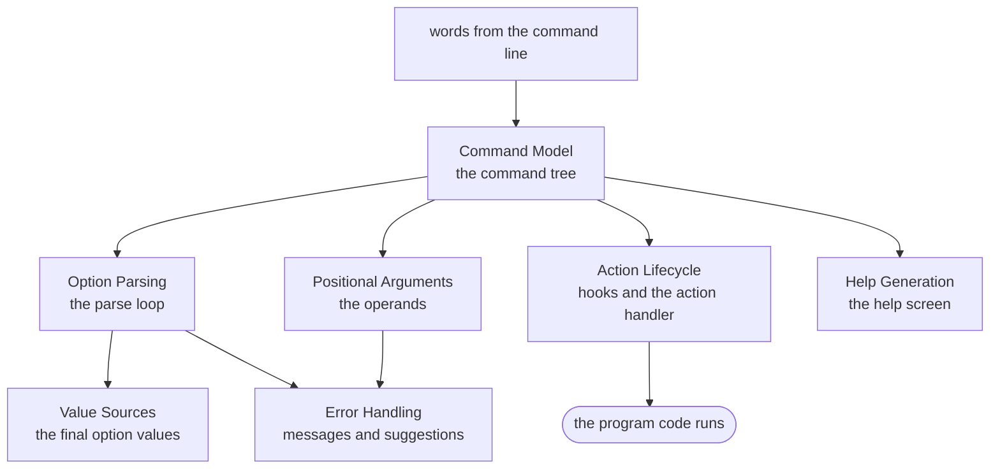
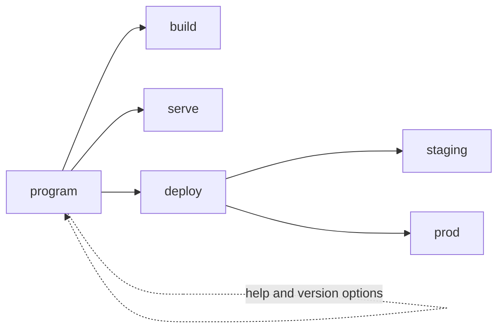
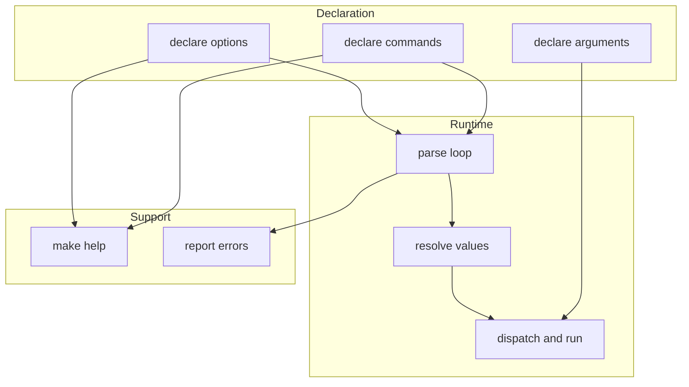

```mermaid
flowchart TD
    RAW["words from the command line"] --> CM["Command Model<br/>the command tree"]
    CM --> OP["Option Parsing<br/>the parse loop"]
    OP --> VR["Value Sources<br/>the final option values"]
    CM --> ARGS["Positional Arguments<br/>the operands"]
    OP --> ERR["Error Handling<br/>messages and suggestions"]
    ARGS --> ERR
    CM --> LIFE["Action Lifecycle<br/>hooks and the action handler"]
    CM --> HELP["Help Generation<br/>the help screen"]
    LIFE --> DONE(["the program code runs"])
```

## Abstract

Commander is a framework for command line programs in Node.js. An author declares the commands, options, and arguments of a program. Then Commander reads the words that the user types and gives the program the correct values. It also runs the correct code for the command that the user selects. This root paper divides the framework into a small set of capabilities. Each capability has its own paper.

## Introduction

All command line programs must do the same work with their input. The operating system gives the program only a flat list of words. The program must find the options and their values in this list. It must change text into useful types, find mistakes, and run the correct code. This work is difficult to do correctly by hand, especially when a program has subcommands and a help screen.

Commander lets the author declare this structure instead. The author tells Commander what the program accepts, and Commander does the parse. The reader needs one model to start. A program is a **command tree**, and a parse is a walk down this tree. Each command takes the options that it knows and sends the other words to a child. At the end, one command runs.

## Related Work

This set of papers divides the framework by capability. Start here, then go down the tree:

- [Command Model](./command-model/README.md) — how the author declares, nests, and dispatches commands.
  - [Action Lifecycle](./command-model/action-lifecycle/README.md) — the action handler and the hooks that run around it.
- [Option Parsing](./option-parsing/README.md) — the parse loop that finds options and their values.
  - [Value Sources](./option-parsing/value-resolution/README.md) — where the final value of an option comes from.
- [Positional Arguments](./positional-arguments/README.md) — the operands that a command uses, in their order.
- [Help Generation](./help-generation/README.md) — the help screen that Commander makes from the declarations.
- [Error Handling](./error-handling/README.md) — error messages, exit control, and suggestions.

## Description

The framework has one main idea and a set of capabilities around it.

**The main idea is the command tree.** The program itself is the root command. Each command can have child commands, and each child can have its own children. Commander walks this tree from the root for each parse. Each command takes the options that it knows. If the next operand is the name of a child, control goes down one level.

```mermaid
flowchart LR
    P["program"] --> A["build"]
    P --> B["serve"]
    P --> C["deploy"]
    C --> C1["staging"]
    C --> C2["prod"]
    P -. "help and version options" .-> P
```

**The capabilities are around this idea.** The diagram shows three groups of capabilities. Each capability has its own paper.

```mermaid
flowchart TD
    subgraph Declaration
      D1["declare commands"]
      D2["declare options"]
      D3["declare arguments"]
    end
    subgraph Runtime
      R1["parse loop"]
      R2["resolve values"]
      R3["dispatch and run"]
    end
    subgraph Support
      S1["make help"]
      S2["report errors"]
    end
    D1 --> R1
    D2 --> R1
    D3 --> R3
    R1 --> R2
    R2 --> R3
    R1 --> S2
    D1 --> S1
    D2 --> S1
```

The table gives the function of each capability.

| Capability | Function |
|---|---|
| Parse loop | It reads the words one time, from left to right. It finds each option and sends an event with the value. |
| Value sources | It sets the final value of each option from the command line, the environment, defaults, and custom parsers. |
| Positional arguments | It puts the operands into the declared argument slots. |
| Dispatch | It selects the command that runs. Then it calls the action handler between the lifecycle hooks. |
| Help | It makes the help screen from the declarations, thus the help is always correct. |
| Error handling | It changes each failure into a clear message with an exit code. It often adds a suggestion. |

A reader can start at any of these papers. The capabilities connect, but each paper is complete.

## Conclusion

Commander is a declared command tree plus a set of runtime capabilities. These capabilities examine each real command line against the tree. Read the [Command Model](./command-model/README.md) next, because all other capabilities walk the tree that it makes. Then read [Option Parsing](./option-parsing/README.md), which describes the parse loop. The parse loop does most of the work.
