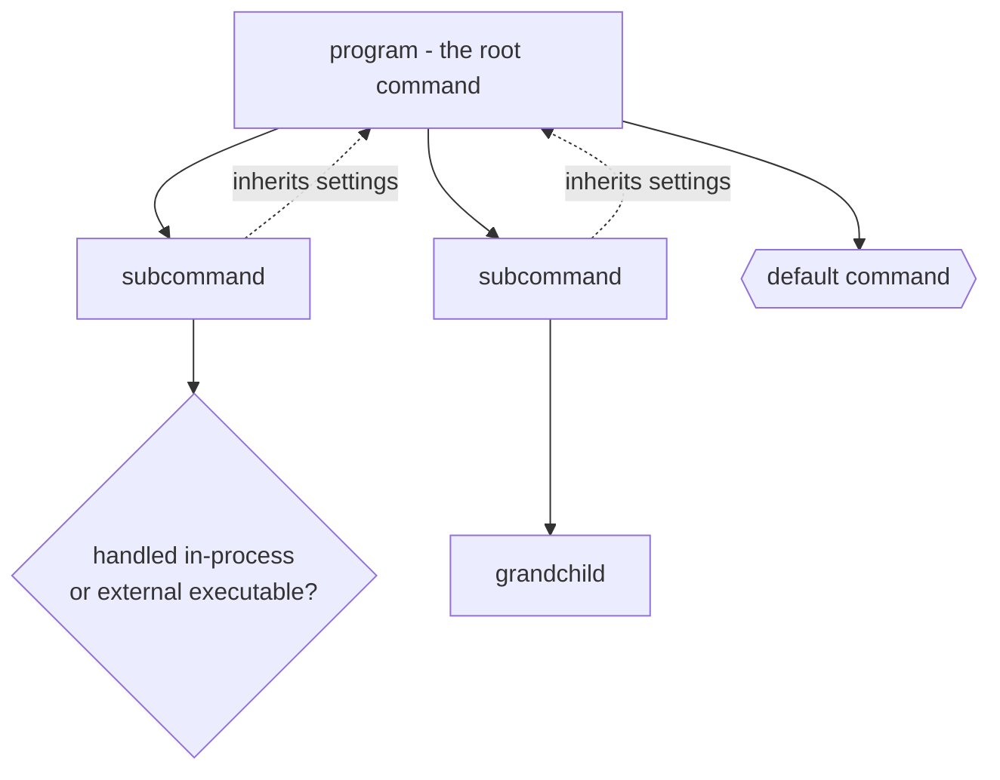
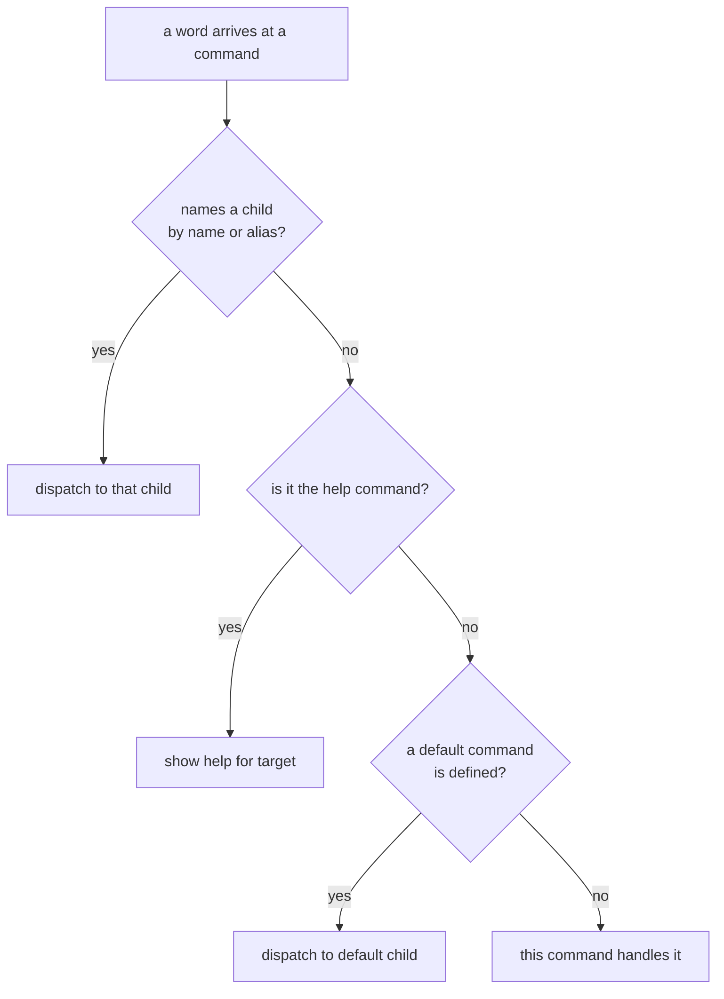
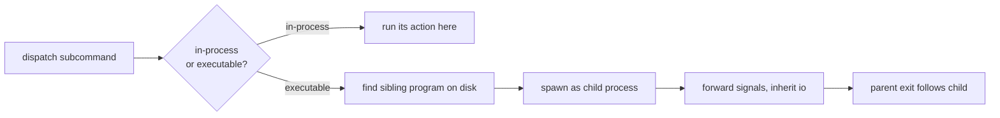

```
 ██████╗ ██████╗ ███╗   ███╗███╗   ███╗ █████╗ ███╗   ██╗██████╗     ███╗   ███╗ ██████╗ ██████╗ ███████╗██╗
██╔════╝██╔═══██╗████╗ ████║████╗ ████║██╔══██╗████╗  ██║██╔══██╗    ████╗ ████║██╔═══██╗██╔══██╗██╔════╝██║
██║     ██║   ██║██╔████╔██║██╔████╔██║███████║██╔██╗ ██║██║  ██║    ██╔████╔██║██║   ██║██║  ██║█████╗  ██║
██║     ██║   ██║██║╚██╔╝██║██║╚██╔╝██║██╔══██║██║╚██╗██║██║  ██║    ██║╚██╔╝██║██║   ██║██║  ██║██╔══╝  ██║
╚██████╗╚██████╔╝██║ ╚═╝ ██║██║ ╚═╝ ██║██║  ██║██║ ╚████║██████╔╝    ██║ ╚═╝ ██║╚██████╔╝██████╔╝███████╗███████╗
 ╚═════╝ ╚═════╝ ╚═╝     ╚═╝╚═╝     ╚═╝╚═╝  ╚═╝╚═╝  ╚═══╝╚═════╝     ╚═╝     ╚═╝ ╚═════╝ ╚═════╝ ╚══════╝╚══════╝
```



## Abstract

The command model is the framework's backbone: the idea that a program is a tree of named commands, each of which may own subcommands, arguments, options, and behaviour. This paper covers how commands are declared and nested, how one command hands control to a child, how aliases and a default command loosen the matching, and how a subcommand may live in-process or as a separate executable on disk. It is the structure every other capability walks over.

## Introduction

A trivial tool does one thing, so its command line is just options and operands. Real tools grow verbs — one to build, one to serve, one to deploy — and those verbs often grow their own verbs. Without structure this becomes a tangle of conditionals. The command model gives the tangle a shape: a tree, rooted at the program itself, where every node is a fully-fledged command with its own vocabulary.

The reader needs three notions. First, the root program *is* a command, not a special case. Second, nesting is uniform: a child command is built the same way as its parent and can nest again without limit. Third, children inherit certain settings from their parent when attached, so a policy set once near the root applies to the whole subtree unless a child overrides it.

## Related Work

- Parent: [Commander.js](../README.md) — the whole system and how the tree anchors it.
- Child: [Action Lifecycle](./action-lifecycle/README.md) — what happens once a command is chosen to run.
- The parse loop that decides *which* child a word names: [Option Parsing](../option-parsing/README.md).
- What a chosen command consumes as ordered operands: [Positional Arguments](../positional-arguments/README.md).
- How an unrecognised command name becomes a suggestion: [Error Handling](../error-handling/README.md).

## Description

**Declaring a command.** A command is created with a name and an optional signature describing its arguments. Attaching it to a parent registers it as a child, wires the parent link, and copies the inheritable settings downward. From that moment the child is addressable by name anywhere the parent is in control.

**Aliases and defaults loosen matching.** A command may answer to one or more aliases in addition to its name, so a long verb can have a terse synonym. One child may be marked the *default*: if the parent is invoked with operands but no recognised child name, the default command takes over. These two mechanisms make the tree forgiving without making it ambiguous.



**Dispatch is a handoff.** When a command recognises that the next word names a child, it does not process that word itself. It slices the word off, prepares the child for its own parse, runs any pre-subcommand hook, and lets the child resume parsing the remaining input from scratch in its own context. Control has moved one level down the tree, and the same logic repeats there. This recursion is what makes arbitrarily deep command hierarchies work with one uniform rule.

**In-process versus external commands.** A subcommand comes in two flavours. Most are *handled in-process*: they carry an action to run inside the same program. But a subcommand can instead be declared as a standalone executable, in which case dispatching it means locating a sibling program on disk — by convention named after the parent and the subcommand — and spawning it as a child process with the remaining arguments passed through. Input and output are inherited, termination signals are forwarded, and the parent's exit tracks the child's.



**Inheritance and state.** Attaching a child copies settings such as parsing policies and output configuration from the parent, so cross-cutting choices propagate. Separately, before the first parse a command snapshots its own initial state; a subsequent parse of the same program restores that snapshot first, so parsing is repeatable rather than accumulating leftovers from a previous run.

## Conclusion

The command model is a uniform, recursive tree: the program is the root, every node is a real command, and dispatch is a disciplined handoff from parent to child. Aliases and a default command keep matching flexible; the in-process-versus-executable split lets a program be a monolith or a family of binaries. With the tree in place, read [Action Lifecycle](./action-lifecycle/README.md) to see what a chosen command actually does, or [Option Parsing](../option-parsing/README.md) to see how the framework decides which child a word names.
