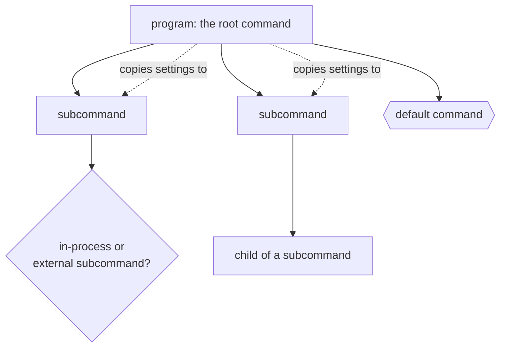
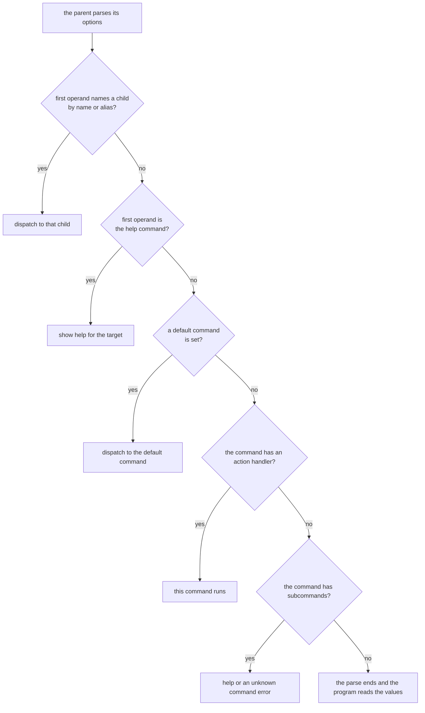
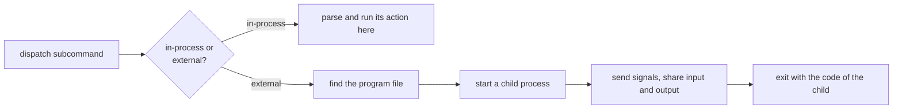

```mermaid
flowchart TD
    ROOT["program: the root command"]
    ROOT --> C1["subcommand"]
    ROOT --> C2["subcommand"]
    C2 --> G1["child of a subcommand"]
    ROOT -. "copies settings to" .-> C1
    ROOT -. "copies settings to" .-> C2
    ROOT --> DEF{{"default command"}}
    C1 --> KIND{"in-process or<br/>external subcommand?"}
```

## Abstract

The command model is the base of the framework. In this model, a program is a tree of named commands. Each command can have subcommands, arguments, options, and an action. This paper tells how an author declares and nests commands. It also tells how a command dispatches control to a child, and how aliases and a default command change the match. Finally, it tells how a subcommand can run in-process or as an external program.

## Introduction

A simple tool does only one thing, thus its command line has only options and operands. Larger tools have verbs, for example "build", "serve", and "deploy". These verbs often have their own verbs. Without a structure, the code for these verbs becomes a large set of conditions. The command model gives them a structure: a tree with the program at the root.

The reader must know three ideas:

- The program is a command. It is not a special case.
- All commands use the same structure. A child command is made in the same way as its parent, and it can have its own children.
- A child that its parent makes gets a copy of some settings from the parent. Thus, a setting near the root applies to the full subtree.

## Related Work

- Parent: [Commander.js](../README.md) — the full system and the place of the command tree in it.
- Child: [Action Lifecycle](./action-lifecycle/README.md) — what occurs after Commander selects the command that runs.
- The parse loop, which finds the operand that names a child: [Option Parsing](../option-parsing/README.md).
- The operands that the selected command uses: [Positional Arguments](../positional-arguments/README.md).
- The message for an unknown command name: [Error Handling](../error-handling/README.md).

## Description

**Declaration of a command.** An author gives a new command a name and, as an option, an argument signature. A command can join a parent in two ways:

1. The parent makes the child and attaches it. In this case, the child gets a copy of the settings of the parent.
2. The author makes the command alone and then attaches it to the parent. In this case, Commander does not copy the settings.

After the attach, the parent knows the child by its name. Commander does not let two children of one parent use the same name or alias.

**Aliases and a default command change the match.** A command can have one or more aliases in addition to its name. Thus, a long verb can have a short name. One child can be the *default command*. If no operand names a child, the parent sends control to the default command. The diagram shows the order of these checks after the parent parses its own options.

```mermaid
flowchart TD
    IN["the parent parses its options"] --> Q1{"first operand names a child<br/>by name or alias?"}
    Q1 -- yes --> DISP["dispatch to that child"]
    Q1 -- no --> Q2{"first operand is<br/>the help command?"}
    Q2 -- yes --> HELP["show help for the target"]
    Q2 -- no --> Q3{"a default command<br/>is set?"}
    Q3 -- yes --> DEFC["dispatch to the default command"]
    Q3 -- no --> Q4{"the command has an action handler?"}
    Q4 -- yes --> SELF["this command runs"]
    Q4 -- no --> Q5{"the command has subcommands?"}
    Q5 -- yes --> ERR["help or an unknown command error"]
    Q5 -- no --> END["the parse ends and the program reads the values"]
```

**Dispatch sends control down one level.** When the first operand names a child, the parent does not use that operand. It removes the operand and prepares the child for a new parse. Then it runs its pre-subcommand hooks. The child parses the other words again, in its own context. The same rules then apply at the lower level. Because of this recursion, one rule gives a command tree of any depth.

**In-process and external subcommands.** There are two types of subcommand:

- An *in-process subcommand* has an action handler that runs in the same program.
- An *external subcommand* is a separate program on disk. The author declares it with a description but without an action handler.

For an external subcommand, Commander first checks mandatory options and conflict rules. Then it finds the program file and starts it as a child process. The name of the file is the name of the parent, a hyphen, and the name of the subcommand. The author can also give a different file name.

```mermaid
flowchart LR
    D["dispatch subcommand"] --> Q{"in-process or<br/>external?"}
    Q -- in-process --> A["parse and run its action here"]
    Q -- external --> B["find the program file"]
    B --> C["start a child process"]
    C --> E["send signals, share input and output"]
    E --> F["exit with the code of the child"]
```

The search for the file uses the steps that follow:

1. Commander looks in the folder of the main script. It follows symbolic links to find the real folder. The author can also set a different folder.
2. If the file name has no extension, Commander also tries the usual script extensions for JavaScript and TypeScript.
3. If no local file exists, Commander uses the name as a command on the system path.

If the file is a script, Commander starts it with the same Node.js runtime. The child process uses the same input and output streams as the parent. Commander sends the usual stop and user signals to the child. When the child stops, the parent exits with the same exit code. If a signal stopped the child, the exit code is 1.

**Saved state makes the parse repeatable.** Before the first parse, a command saves its option values and their value sources. Before each subsequent parse of the same program, the command restores this saved state. Thus, the result of one parse does not change the next parse.

## Conclusion

The command model is a recursive tree. The program is the root, each node is a full command, and dispatch sends control from a parent to one child. Aliases and a default command make the match more flexible. External subcommands let one program be a family of separate programs. Next, read [Action Lifecycle](./action-lifecycle/README.md) to learn what a selected command does. Read [Option Parsing](../option-parsing/README.md) to learn how the parse loop separates options from operands.
