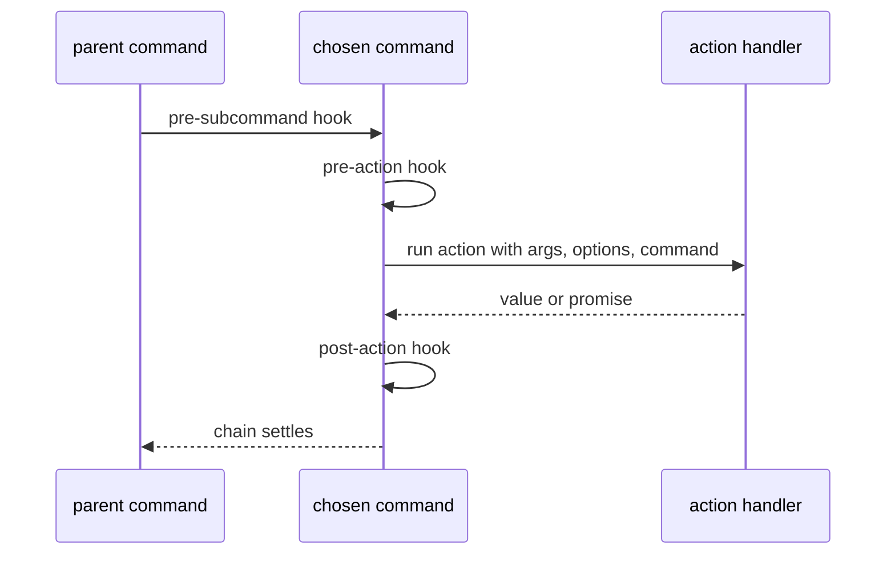
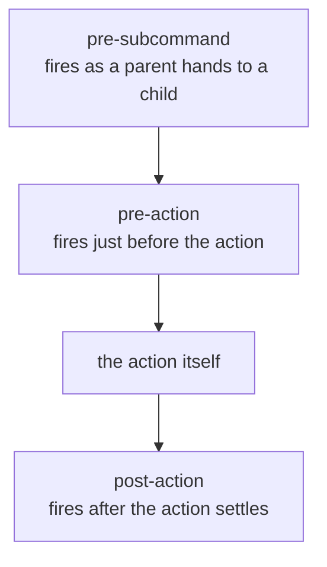
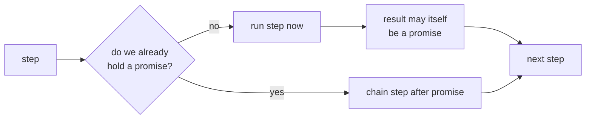

## Abstract

Once the tree has chosen a single command to run, the action lifecycle governs what happens next: the ordered sequence of hooks that fire around the command's own behaviour, the handler that receives the resolved arguments and options, and the machinery that lets any step be asynchronous without changing the ordering. This is where declaration turns into execution.

## Introduction

Choosing the right command is only half the job; the command still has to *do* something, and real programs need to wrap that doing with cross-cutting concerns — open a connection before the action, tear it down after, log around a whole subtree. If every command had to implement those concerns inline, they would be duplicated and fragile.

The lifecycle solves this by defining fixed moments around a command's run and letting authors attach behaviour to those moments. A reader needs two ideas. First, there are named moments — before a subcommand, before the action, after the action — and hooks registered at any command in the ancestry can observe them. Second, the whole chain is *order-preserving even when asynchronous*: the framework runs steps synchronously until something returns a promise, then chains the rest, so a mix of sync and async steps still executes in the declared order.

## Related Work

- Parent: [Command Model](../README.md) — how the command that runs was chosen.
- The resolved values a handler receives come from [Value Sources](../../option-parsing/value-resolution/README.md) and [Positional Arguments](../../positional-arguments/README.md).
- The whole system: [Commander.js](../../README.md).

## Description

**The action handler is the destination.** A command may carry one action: the piece of code the author actually wants to run. When invoked it receives the command's processed positional arguments spread out in order, then an object of resolved option values, and finally the command itself — so a handler can reach for whatever level of detail it needs.

**Hooks bracket the run.** Three named moments can carry listeners:

The pre-action and post-action moments gather hooks from the entire chain of the command and its ancestors, so a hook set near the root wraps every descendant's action. The ordering is deliberate: entering hooks run outermost-first on the way in, and the after moment runs in reverse, so setup and teardown nest cleanly like matching brackets.

**Asynchrony is threaded, not forked.** Each step — a hook, the action, a legacy event — is run through a small chaining rule: if nothing so far has produced a promise, the next step runs immediately; the instant a step returns a promise, every remaining step is chained onto it. The consequence is that a program built entirely from synchronous steps completes synchronously, while one that awaits anywhere becomes a single ordered promise the caller can await. The declared order never changes; only the timing does.

**Legacy events coexist.** Alongside modern hooks, a command still emits an event to its parent when it runs, preserving an older listener-based style. New code leans on hooks and the action handler; the events remain so existing programs keep working.

## Conclusion

The action lifecycle is a fixed, order-preserving choreography: pre-subcommand as control descends, then pre-action, the action, and post-action, with hooks from the whole ancestry nesting around the run and asynchrony threaded through without disturbing order. To revisit how the running command was selected, return to the [Command Model](../README.md); to see where the handler's argument and option values come from, read [Value Sources](../../option-parsing/value-resolution/README.md).
