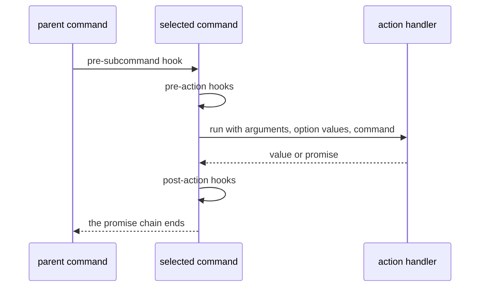
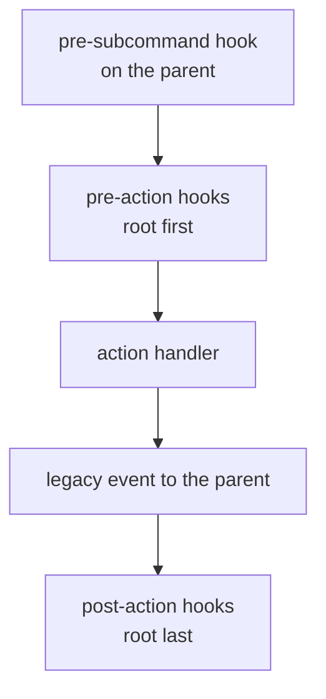
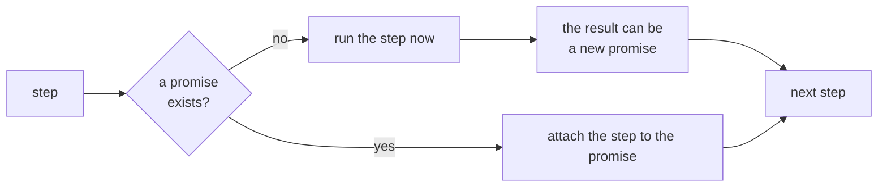

```mermaid
sequenceDiagram
    participant P as parent command
    participant C as selected command
    participant A as action handler
    P->>C: pre-subcommand hook
    C->>C: pre-action hooks
    C->>A: run with arguments, option values, command
    A-->>C: value or promise
    C->>C: post-action hooks
    C-->>P: the promise chain ends
```

## Abstract

The action lifecycle starts after Commander selects the command that runs. It is a fixed sequence of hooks around the action handler of that command. The action handler gets the final arguments and option values. Any step in the sequence can be asynchronous, but the order of the steps does not change. In this part of the framework, the declarations become a real run.

## Introduction

The selection of a command is only half of the work, because the command must then do its task. Real programs must also do other tasks around the main task. For example, a program can open a connection before the action and close it after the action. If each command does these tasks itself, the code repeats and becomes difficult to maintain.

The lifecycle solves this problem with fixed points around the run of a command. Authors attach hooks to these points. The reader must know two ideas:

- There are three named points: before a subcommand, before the action, and after the action.
- The sequence keeps its order when steps are asynchronous. Commander runs the steps one after the other until a step returns a promise. Then it attaches all other steps to the promise chain.

## Related Work

- Parent: [Command Model](../README.md) — how Commander selects the command that runs.
- The option values that the action handler gets: [Value Sources](../../option-parsing/value-resolution/README.md).
- The arguments that the action handler gets: [Positional Arguments](../../positional-arguments/README.md).
- The full system: [Commander.js](../../README.md).

## Description

**The action handler is the end point.** A command can have one action handler. This handler is the code that the author wants to run. The handler gets three groups of values, in this order:

1. One value for each declared argument, after the custom parsers and the variadic collection.
2. One object that holds the option values of the command.
3. The command itself.

Thus, a handler can get the level of detail that it needs. In an older mode, the command keeps its option values as its own properties. In this mode, the handler gets the command in the place of the option object.

**Hooks are around the run.** The table shows the three hook points.

| Hook point | When it runs | Where Commander finds the hooks |
|---|---|---|
| Pre-subcommand | When a parent dispatches to a child | Only on the parent that dispatches |
| Pre-action | Immediately before the action handler | On the command and on all its ancestors |
| Post-action | After the action handler ends | On the command and on all its ancestors |

Each hook gets two commands: the command that has the hook and the command that runs. Thus, a hook near the root can see which subcommand runs.

```mermaid
flowchart TD
    PRE_SUB["pre-subcommand hook<br/>on the parent"] --> PRE_ACT["pre-action hooks<br/>root first"]
    PRE_ACT --> ACT["action handler"]
    ACT --> LEG["legacy event to the parent"]
    LEG --> POST["post-action hooks<br/>root last"]
```

**The order of the hooks is like a set of brackets.** Commander collects the pre-action hooks from the root down to the command. Thus, a hook on the root runs first. For the post-action hooks, Commander uses the opposite order. Thus, a hook on the root runs last. Because of this order, the setup and the cleanup steps nest correctly.

**Asynchronous steps keep the order.** Commander uses one rule for each step: a hook, the action handler, or the legacy event. The rule is as follows:

- If no step has returned a promise, the next step runs immediately.
- If a step returns a promise, Commander attaches each subsequent step to that promise.

```mermaid
flowchart LR
    S1["step"] --> Q{"a promise<br/>exists?"}
    Q -- no --> RUN["run the step now"]
    Q -- yes --> CHAIN["attach the step to the promise"]
    RUN --> R2["the result can be<br/>a new promise"]
    R2 --> NEXT["next step"]
    CHAIN --> NEXT
```

If all steps are synchronous, the full run is synchronous. If one step is asynchronous, the run becomes one promise chain with the correct order. The order of the steps stays the same, and only the time changes. If an action handler is asynchronous, the program must use the asynchronous parse. The synchronous parse does not wait for the promise.

**Legacy events stay available.** After the action handler, a command also sends an event to its parent. This event keeps an older style of listener available. New code uses hooks and action handlers. The event stays so that old programs continue to operate.

## Conclusion

The action lifecycle is a fixed sequence of steps with a constant order. The sequence is the pre-subcommand hook, the pre-action hooks, the action handler, and the post-action hooks. Hooks from all ancestors nest around the run, and asynchronous steps do not change the order. To learn how Commander selects the command that runs, go back to the [Command Model](../README.md). To learn where the option values come from, read [Value Sources](../../option-parsing/value-resolution/README.md).
