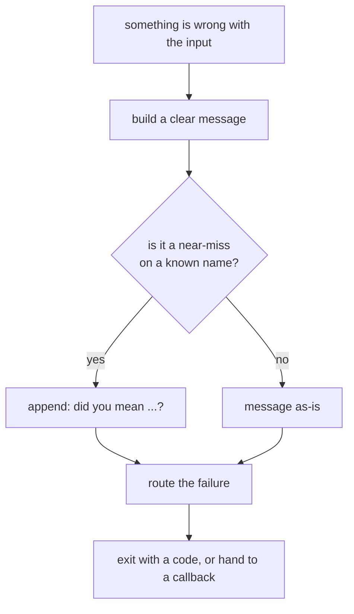
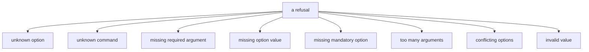
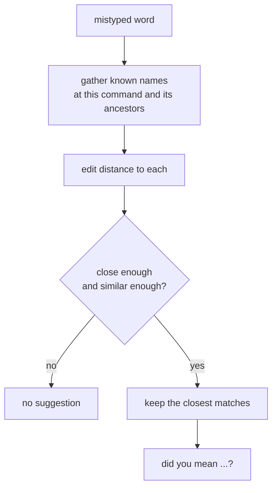
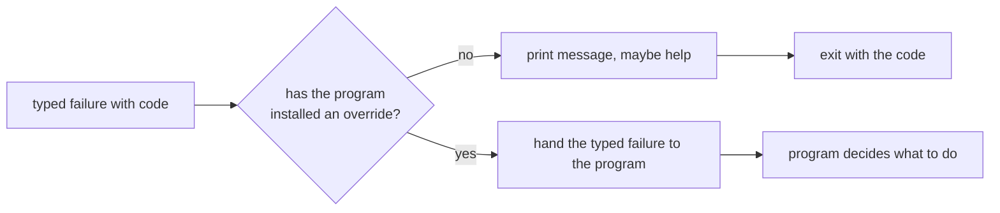

## Abstract

Error handling is how the framework refuses a bad invocation gracefully: it produces a clear, categorised message, often enriches it with a spelling suggestion, optionally shows help, and then either terminates the process with a meaningful exit code or hands the failure to the program to deal with. This paper covers the failure vocabulary, the did-you-mean suggestion engine, and the pluggable exit path.

## Introduction

Users mistype. They forget a required value, supply an unknown flag, name a command that does not exist, or pass a value outside the allowed set. A tool that responds to any of these with a stack trace or silent misbehaviour is hostile. Good error handling turns each mistake into a short explanation and, where possible, a nudge toward what the user probably meant.

The reader needs two ideas. First, every refusal is a *typed* failure carrying a category code and a suggested exit code, so scripts and wrappers can react programmatically, not just read English. Second, refusal is *routable*: by default it prints and exits, but a program can intercept every failure and decide for itself, which is what makes the framework testable and embeddable.

## Related Work

- Parent: [Commander.js](../README.md) — error handling as a cross-cutting support capability.
- Unknown flags come from [Option Parsing](../option-parsing/README.md); unknown commands from the [Command Model](../README.md).
- Missing, excess, and out-of-set values are detected in [Positional Arguments](../positional-arguments/README.md) and [Value Sources](../option-parsing/value-resolution/README.md).
- A refusal often shows the screen from [Help Generation](../help-generation/README.md).

## Description

**A vocabulary of failures.** The framework distinguishes the ways an invocation can be wrong, and each carries its own category so callers can tell them apart:

An invalid-value failure is special: it is the one a custom coercion routine or a choice restriction raises when it rejects input, and it flows back out as a clean message rather than an exception from deep inside processing.

**Did-you-mean suggestions.** When an unknown option or command is close to something real, the framework offers a guess. It compares the mistyped word against the visible known names using an edit-distance measure — counting insertions, deletions, substitutions, and adjacent transpositions — and keeps only candidates within a small distance and above a similarity threshold.

Ties at the same best distance are all offered, sorted for stable output, so a user near two real names sees both. For an unknown flag the search climbs through inherited options as well, since a flag might legitimately belong to an ancestor.

**Routing the refusal.** Once a message is built, what happens next is configurable. By default the framework writes to the error stream, optionally shows help, and exits the process with the failure's suggested code. But a program can install an override that intercepts every failure as a typed object instead of exiting — the mechanism that lets a host embed the parser, react to errors in code, and drive it under test without the process disappearing.

**Policy switches.** A few settings tune the behaviour: suggestions can be turned off, help can be shown automatically after any error, and whole classes of strictness — tolerating unknown options or excess arguments — can be relaxed so that what would otherwise be a refusal is quietly allowed through instead.

## Conclusion

Error handling makes refusal a first-class, structured outcome: typed failures with category and exit codes, enriched by an edit-distance suggestion engine that guesses at near-misses, and routed either to a printed exit or to a program-supplied callback for embedding and testing. To trace where these failures originate, revisit [Option Parsing](../option-parsing/README.md), [Positional Arguments](../positional-arguments/README.md), and [Value Sources](../option-parsing/value-resolution/README.md); to see what a refusal often displays alongside the message, read [Help Generation](../help-generation/README.md).
