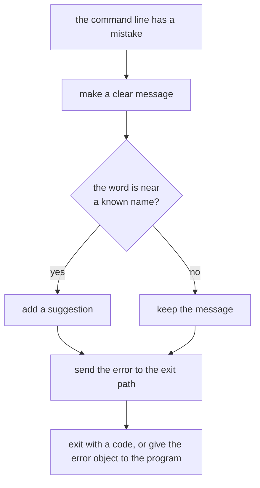
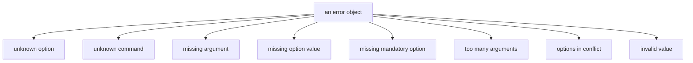
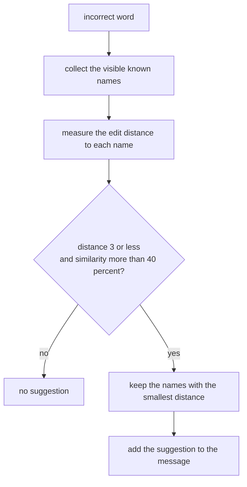
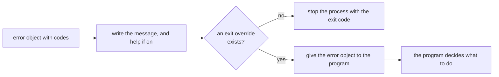

```mermaid
flowchart TD
    BAD["the command line has a mistake"] --> BUILD["make a clear message"]
    BUILD --> GUESS{"the word is near<br/>a known name?"}
    GUESS -- yes --> ADD["add a suggestion"]
    GUESS -- no --> PLAIN["keep the message"]
    ADD --> ROUTE["send the error to the exit path"]
    PLAIN --> ROUTE
    ROUTE --> EXIT["exit with a code, or give the error object to the program"]
```

## Abstract

Error handling is how Commander rejects an incorrect command line. Commander writes a clear message for each type of error. It often adds a suggestion for a word with a spelling mistake, and it can also show help. Then it stops the process with an exit code, or it gives the error to the program. This paper describes the types of error, the suggestion function, and the exit path that an author can replace.

## Introduction

Users make mistakes. They forget a necessary value, give an unknown option, or use the name of a command that does not exist. They can also give a value that is not in the permitted list. A tool must not answer these mistakes with a stack trace or with incorrect behavior. Good error handling changes each mistake into a short message. If possible, it also tells the user what they possibly meant.

The reader must know two ideas. First, each error is an *error object* with an error code and an exit code. Thus, scripts and other programs can examine the error, and they do not have to read the text. Second, an author can change the exit path. By default, Commander writes the message and exits. But a program can get each error object and make its own decision. This makes the framework easy to test and easy to put inside other programs.

## Related Work

- Parent: [Commander.js](../README.md) — error handling as a support capability for the full system.
- The source of unknown option errors: [Option Parsing](../option-parsing/README.md).
- The source of unknown command errors: [Command Model](../command-model/README.md).
- The sources of argument count errors: [Positional Arguments](../positional-arguments/README.md).
- The sources of invalid value, mandatory, and conflict errors: [Value Sources](../option-parsing/value-resolution/README.md).
- The help screen that an error can show: [Help Generation](../help-generation/README.md).

## Description

**Each type of error has its own error code.** Commander knows the different types of mistake. Each type has its own error code, thus programs can tell them apart.

```mermaid
flowchart TD
    F["an error object"] --> A["unknown option"]
    F --> B["unknown command"]
    F --> C["missing argument"]
    F --> D["missing option value"]
    F --> E["missing mandatory option"]
    F --> G["too many arguments"]
    F --> H["options in conflict"]
    F --> I["invalid value"]
```

The invalid value error is special. A custom parser or a choice list sends this error when it rejects a value. Commander catches the error and adds the name of the option or argument to the message. Thus, the user sees a clear message and not an exception from deep in the code. The exit code for all these errors is 1, unless the error gives a different code.

The same exit path also handles normal exits. When the program shows the help screen or the version number, it also uses this path. These exits have their own codes, and their exit code is usually 0.

**Suggestions for spelling mistakes.** If an unknown option or command is near a known name, Commander adds a suggestion. It measures the *edit distance* between the incorrect word and each known name. The edit distance counts these changes:

- The insertion of a letter.
- The deletion of a letter.
- The replacement of a letter.
- The exchange of two adjacent letters.

Commander keeps a known name only if the edit distance is 3 or less and the similarity is more than 40 percent. The similarity compares the edit distance with the length of the longer word. Commander never suggests a name with only one letter.

```mermaid
flowchart TD
    W["incorrect word"] --> CAND["collect the visible known names"]
    CAND --> DIST["measure the edit distance to each name"]
    DIST --> KEEP{"distance 3 or less<br/>and similarity more than 40 percent?"}
    KEEP -- no --> NONE["no suggestion"]
    KEEP -- yes --> BEST["keep the names with the smallest distance"]
    BEST --> OUT["add the suggestion to the message"]
```

If more than one name has the smallest distance, Commander shows all of them in alphabetical order. The known names come from different places for each type of error:

- For an unknown option, Commander suggests only for long options. It collects the visible long options of the command and of its ancestors. It stops at an ancestor that uses positional options.
- For an unknown command, Commander collects the visible subcommands of the current command. It also collects the first alias of each subcommand.

An author can turn off suggestions.

**The exit path.** After Commander makes the message, it sends the error to the exit path. The default behavior is as follows:

1. Commander writes the message to the error stream.
2. If the author turned on help after errors, Commander also writes the help screen or a short line of text.
3. Commander stops the process with the exit code of the error.

But a program can install an *exit override*. Then Commander gives each error object to the program and does not stop the process. If the author installs an exit override without a function, Commander throws the error object. Thus, a host program can examine errors in code, and tests can run without a process exit.

```mermaid
flowchart LR
    MSG["error object with codes"] --> PRINT["write the message, and help if on"]
    PRINT --> OVR{"an exit override<br/>exists?"}
    OVR -- no --> KILL["stop the process with the exit code"]
    OVR -- yes --> HAND["give the error object to the program"]
    HAND --> CHOICE["the program decides what to do"]
```

**Settings that change the behavior.** The table shows the settings that change error handling.

| Setting | Effect |
|---|---|
| Suggestions | On by default. An author can turn them off. |
| Help after errors | Off by default. When on, Commander shows help or a short text after each error message. |
| Unknown options | An error by default. An author can permit them. |
| Extra operands | An error by default. An author can permit them. |
| Output | An author can replace the functions that write the output and the errors. |

## Conclusion

Error handling makes each rejection a clear, structured result. Each error object has an error code and an exit code. A suggestion function adds a possible correct name for a spelling mistake. The exit path writes the message and exits, or it gives the error object to the program. To learn where these errors start, read [Option Parsing](../option-parsing/README.md), [Positional Arguments](../positional-arguments/README.md), and [Value Sources](../option-parsing/value-resolution/README.md). To learn about the help screen that an error can show, read [Help Generation](../help-generation/README.md).
