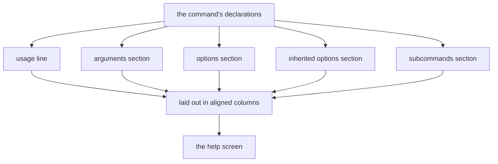
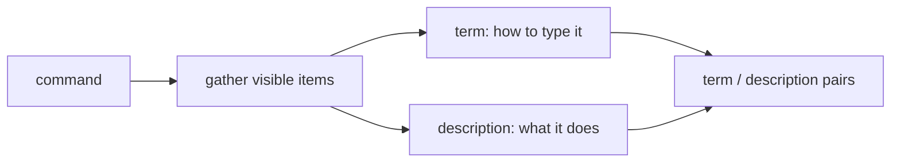
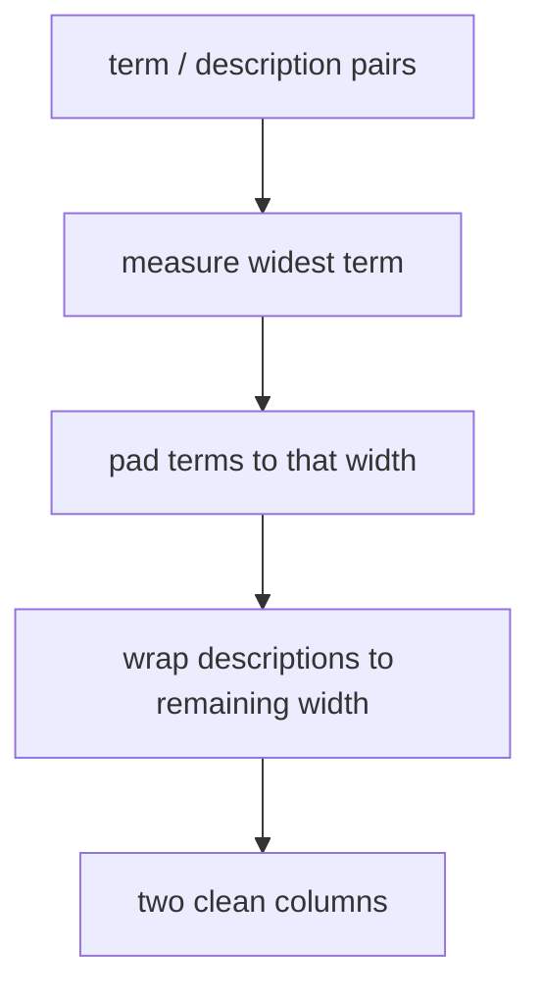
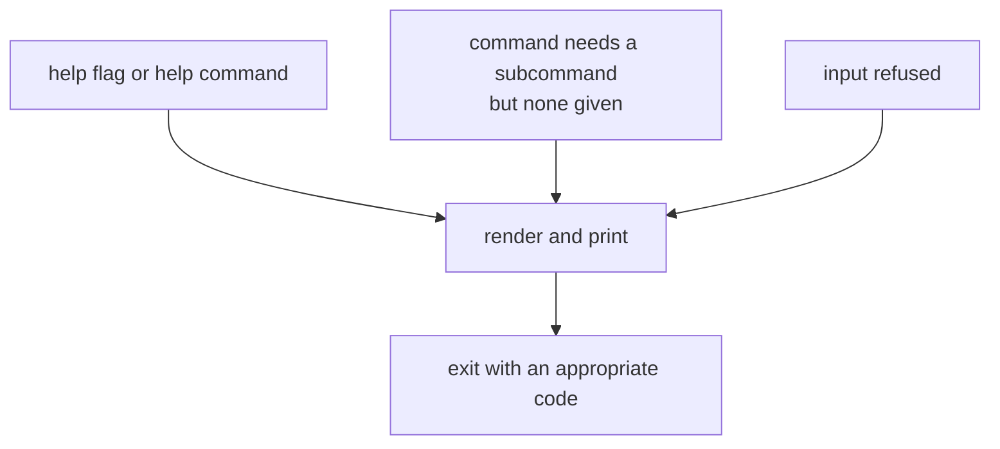

```
██╗  ██╗███████╗██╗     ██████╗
██║  ██║██╔════╝██║     ██╔══██╗
███████║█████╗  ██║     ██████╔╝
██╔══██║██╔══╝  ██║     ██╔═══╝
██║  ██║███████╗███████╗██║
╚═╝  ╚═╝╚══════╝╚══════╝╚═╝
```



## Abstract

Help generation assembles the usage screen a program prints when asked — or when it refuses an invocation. Crucially it is *derived*, not written: the same declarations that drive parsing are read back to produce the usage line, the lists of arguments, options, inherited options, and subcommands, all wrapped and aligned to the terminal. Because it reads the live model, the help can never drift out of sync with what the program actually accepts.

## Introduction

A command line tool is only usable if it can explain itself. Hand-written help is a maintenance trap: add an option, forget the help, and the documentation lies. The cure is to generate the screen from the single source of truth — the command's own declared shape — so adding a capability updates its documentation for free.

The reader needs to see help as a *rendering pass* over the model. It gathers the visible pieces of a command, decides their human-readable form, measures them so columns line up, groups and sorts them, and wraps everything to the available width. Every step is customisable, but the default is a clean, conventional screen.

## Related Work

- Parent: [Commander.js](../README.md) — help as one of the support capabilities.
- Help reads the same declarations used by [Option Parsing](../option-parsing/README.md) and [Positional Arguments](../positional-arguments/README.md).
- The subcommand list comes from the [Command Model](../README.md).
- Help is often shown as part of refusing bad input — see [Error Handling](../error-handling/README.md).

## Description

**What appears, and what is hidden.** A rendering begins by collecting the *visible* members of a command — its arguments, its own options, options inherited from ancestors, and its subcommands — filtering out anything marked hidden and folding in the automatic help and version entries. Each collected item is reduced to two strings: a *term* (how you would type it) and a *description* (what it does).



**The usage line.** At the top sits a synopsis: the chain of command names, a placeholder for options, the declared arguments in order with their required or optional brackets, and a hint that subcommands exist. This one line tells a reader the overall shape before the detail.

**Alignment by measurement.** To produce tidy columns, the renderer first measures the widest term across each section, then pads every term to that width so descriptions start at a common column. Long descriptions are wrapped to the remaining width, and continuation lines are indented to stay under their description column.



**Grouping, sorting, and styling.** Items can be assigned to named groups so related options or subcommands appear under their own headings, and within a section the order can be sorted or left as declared. A separate styling layer can decorate terms and descriptions — for emphasis or colour — without touching the layout logic, and it measures display width carefully so styled text still aligns. Authors may also inject extra text before or after the generated body.

**Two ways in.** The screen can be requested explicitly — a help flag or a help command — or produced implicitly when a command with subcommands is invoked with nothing to do, or when input is refused. In the explicit case the framework prints and exits; in the implicit case it is part of guiding the user back on track.



## Conclusion

Help generation is a rendering pass over the live command model: it gathers visible terms and descriptions, builds a synopsis, measures and pads for aligned columns, groups and styles, and wraps to the terminal — so documentation is always a byproduct of declaration rather than a parallel artifact to maintain. To see the declarations it renders, revisit [Option Parsing](../option-parsing/README.md) and [Positional Arguments](../positional-arguments/README.md); to see help's role in guiding mistakes, read [Error Handling](../error-handling/README.md).
