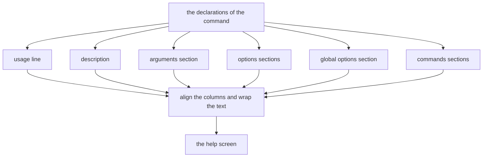
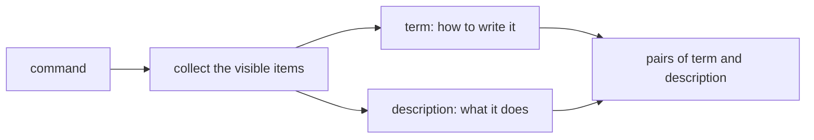
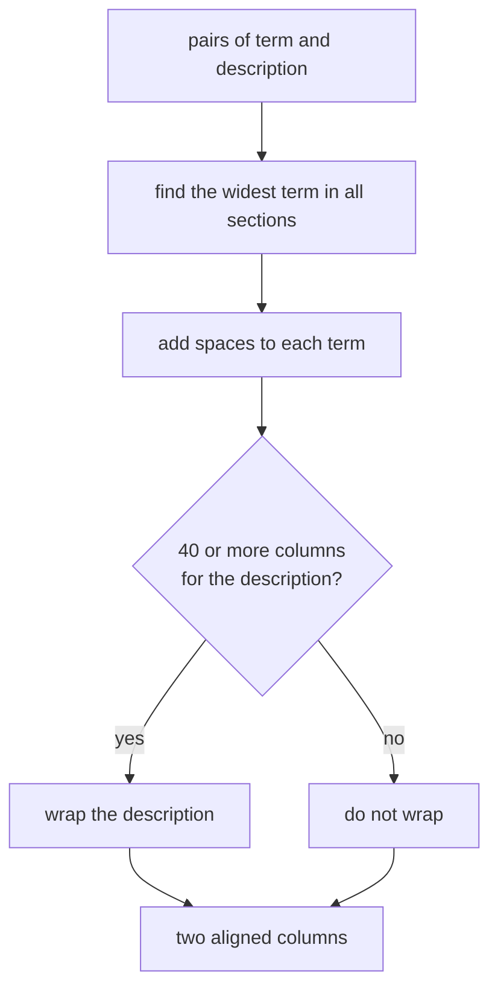
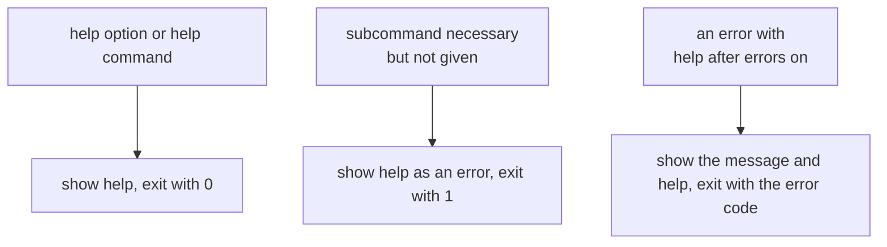

```mermaid
flowchart TD
    DECL["the declarations of the command"] --> USAGE["usage line"]
    DECL --> DESC["description"]
    DECL --> ARGS["arguments section"]
    DECL --> OPTS["options sections"]
    DECL --> GLOB["global options section"]
    DECL --> CMDS["commands sections"]
    USAGE --> FMT["align the columns and wrap the text"]
    DESC --> FMT
    ARGS --> FMT
    OPTS --> FMT
    GLOB --> FMT
    CMDS --> FMT
    FMT --> SCREEN["the help screen"]
```

## Abstract

Help generation makes the help screen that a program shows when the user asks for it. The program can also show it when it rejects a command line. The author does not write the help screen. Commander makes it from the same declarations that the parse loop uses. The screen has a usage line and lists of arguments, options, global options, and subcommands. Because Commander reads the live declarations, the help screen always agrees with the program.

## Introduction

A command line tool must be able to tell the user how to use it. Help text that the author writes by hand is difficult to keep correct. If an author adds an option and forgets the help text, the help text becomes incorrect. Commander solves this problem because it makes the help screen from the declarations of the command. Thus, when an author adds an option, the help screen shows it immediately.

The reader must think of help as a *rendering pass* over the declarations. The pass has these steps:

1. It collects the visible items of a command.
2. It makes a text form for each item.
3. It measures the items so that the columns align.
4. It puts the items into groups and sorts them.
5. It wraps the text to the available width.

An author can change each step, but the default result is a clear, usual help screen.

## Related Work

- Parent: [Commander.js](../README.md) — help as one of the support capabilities.
- The declarations that help reads: [Option Parsing](../option-parsing/README.md) and [Positional Arguments](../positional-arguments/README.md).
- The tree that gives the list of subcommands: [Command Model](../command-model/README.md).
- The help screen as a part of an error: [Error Handling](../error-handling/README.md).

## Description

**Visible items and hidden items.** The rendering pass starts when it collects the *visible* items of a command. These items are as follows:

- The arguments. This section shows only if at least one argument has a description.
- The options of the command, plus the built-in help option. If an option of the author uses the same flag as the help option, the help option does not show that flag.
- The global options, which are the options of the ancestors. This section shows only if the author turns it on.
- The subcommands, plus the built-in help command if the command has one.

The pass does not show items that the author marks as hidden. The pass changes each item into two text values: a *term* and a *description*. The term tells how to write the item. The description tells what the item does.

```mermaid
flowchart LR
    CMD["command"] --> VIS["collect the visible items"]
    VIS --> TERM["term: how to write it"]
    VIS --> DESC["description: what it does"]
    TERM --> PAIR["pairs of term and description"]
    DESC --> PAIR
```

The description of an option can also show extra data in parentheses. This data can include the choice list, the default value, the preset value, and the environment variable. The description of an argument can show its choice list and its default value. In the commands section, a subcommand shows its short summary if it has one.

**The usage line.** The first line of the screen is a summary of the full command line. It shows the names of the ancestors and the command, plus the first alias. Then it shows a mark for options and a mark for subcommands. Then it shows the declared arguments in order, with angle brackets or square brackets. Thus, the reader sees the full form of the command before the details. An author can replace the usage text.

**The pass measures the terms to align the columns.** First, the pass finds the widest term in all sections together. Then it adds spaces to each term to make it that width. Thus, all descriptions start in the same column. The pass wraps long descriptions to the width that is available. It indents the continuation lines to the same column as the description.

```mermaid
flowchart TD
    ITEMS["pairs of term and description"] --> MEASURE["find the widest term in all sections"]
    MEASURE --> PAD["add spaces to each term"]
    PAD --> Q{"40 or more columns<br/>for the description?"}
    Q -- yes --> WRAP["wrap the description"]
    Q -- no --> KEEP["do not wrap"]
    WRAP --> COLS["two aligned columns"]
    KEEP --> COLS
```

These rules control the width:

- The help width is the width of the terminal. If the output is not a terminal, the width is 80 columns.
- If less than 40 columns are available for descriptions, the pass does not wrap the text.
- If a description has its own indented lines, the pass does not wrap it.

**Groups, sort order, and style.** An author can put options or subcommands into named groups. Each group shows under its own heading. The author can sort the items in a section, or keep the order of the declarations. A separate style layer can add color or emphasis to each part of the screen. This layer does not change the layout. The pass measures the width without the color codes, thus the columns stay aligned. If the output does not support color, Commander removes the color codes. The usual color settings in environment variables also apply. An author can also add text before or after the screen.

**Three ways to show the help screen.** The table shows when the help screen appears and how the program exits.

| Trigger | Output stream | Exit code |
|---|---|---|
| The user gives the help option or the help command | Standard output | 0 |
| A command with subcommands gets no subcommand and has no action handler | Standard error | 1 |
| An error occurs and the author turned on help after errors | Standard error | The exit code of the error |

```mermaid
flowchart TD
    T1["help option or help command"] --> SHOW1["show help, exit with 0"]
    T2["subcommand necessary<br/>but not given"] --> SHOW2["show help as an error, exit with 1"]
    T3["an error with<br/>help after errors on"] --> SHOW3["show the message and help, exit with the error code"]
```

For errors, the author can also give a short line of text in place of the full help screen.

## Conclusion

Help generation is a rendering pass over the live declarations. It collects the visible terms and descriptions and makes a usage line. It aligns the columns, puts items into groups, adds style, and wraps the text to the terminal. Thus, the help screen is a result of the declarations, and the author does not maintain it separately. To learn about the declarations that it shows, read [Option Parsing](../option-parsing/README.md) and [Positional Arguments](../positional-arguments/README.md). To learn how help helps the user after a mistake, read [Error Handling](../error-handling/README.md).
