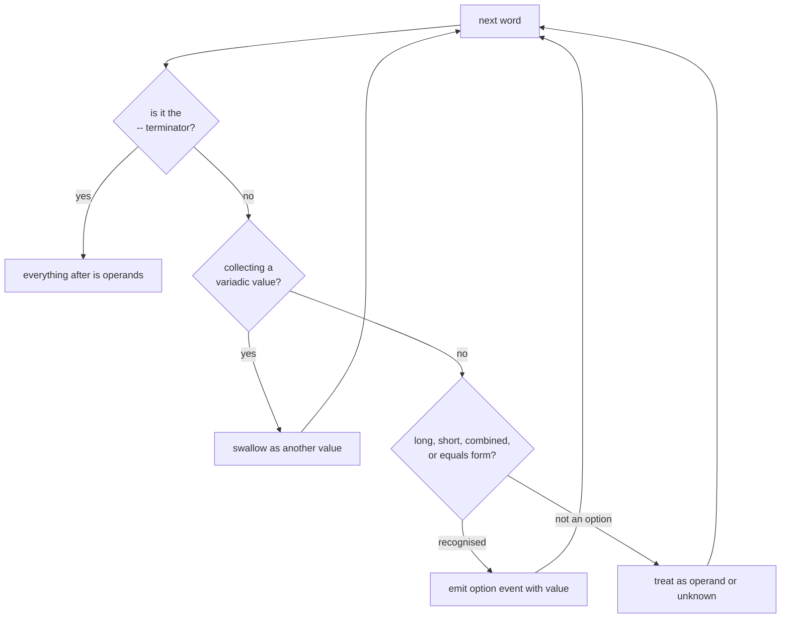
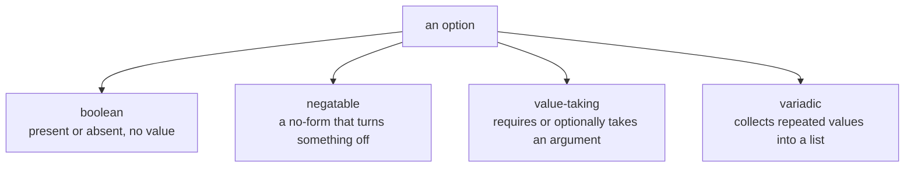
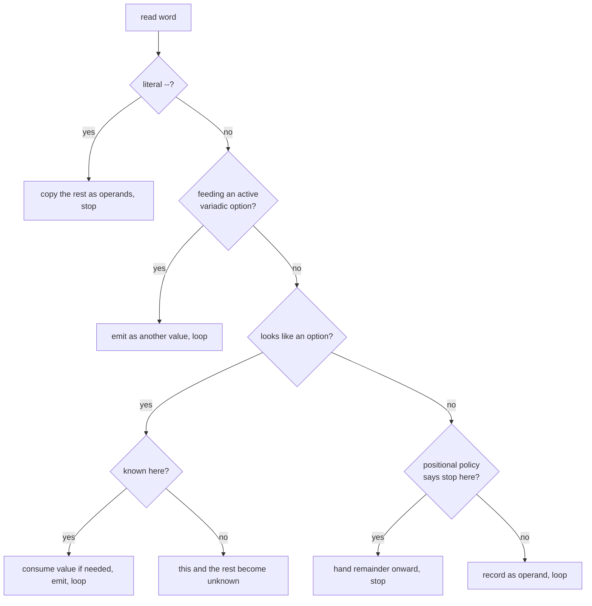

```
 ██████╗ ██████╗ ████████╗██╗ ██████╗ ███╗   ██╗    ██████╗  █████╗ ██████╗ ███████╗██╗███╗   ██╗ ██████╗
██╔═══██╗██╔══██╗╚══██╔══╝██║██╔═══██╗████╗  ██║    ██╔══██╗██╔══██╗██╔══██╗██╔════╝██║████╗  ██║██╔════╝
██║   ██║██████╔╝   ██║   ██║██║   ██║██╔██╗ ██║    ██████╔╝███████║██████╔╝███████╗██║██╔██╗ ██║██║  ███╗
██║   ██║██╔═══╝    ██║   ██║██║   ██║██║╚██╗██║    ██╔═══╝ ██╔══██║██╔══██╗╚════██║██║██║╚██╗██║██║   ██║
╚██████╔╝██║        ██║   ██║╚██████╔╝██║ ╚████║    ██║     ██║  ██║██║  ██║███████║██║██║ ╚████║╚██████╔╝
 ╚═════╝ ╚═╝        ╚═╝   ╚═╝ ╚═════╝ ╚═╝  ╚═══╝    ╚═╝     ╚═╝  ╚═╝╚═╝  ╚═╝╚══════╝╚═╝╚═╝  ╚═══╝ ╚═════╝
```



## Abstract

Option parsing is the single left-to-right scan that turns a flat list of words into recognised options, their values, and the leftover operands. This paper describes that parse loop and the vocabulary of option *kinds* it recognises — boolean, negatable, value-taking, and variadic — along with the several surface forms a flag can take on the command line. It is the busiest capability in the framework and the one every invocation passes through.

## Introduction

The operating system delivers arguments as undifferentiated strings. A dash-led word might be a flag the current command knows, a flag that belongs to a subcommand further down the tree, a negative number that only looks like a flag, or genuinely unknown. The same option might appear as a long name, a single-letter short, several shorts bundled behind one dash, or a name joined to its value by an equals sign. Parsing must sort all of this out in one pass, without yet knowing which command will ultimately run.

The reader needs two ideas. First, the loop *classifies* rather than validates: it decides what each word is and files it as a recognised option, a plain operand, or an unknown to be reprocessed by a subcommand later. Second, recognising an option does not itself compute a value — it announces the option and lets the value-resolution layer decide what the value becomes. That separation keeps the scan simple and the value rules in one place.

## Related Work

- Parent: [Commander.js](../README.md) — where the parse loop sits in the whole flow.
- Child: [Value Sources](./value-resolution/README.md) — what happens to an option after it is recognised.
- The operands this loop sets aside are consumed by [Positional Arguments](../positional-arguments/README.md).
- Words that name a child are handed off per the [Command Model](../README.md).
- An unrecognised flag becomes a message via [Error Handling](../error-handling/README.md).

## Description

**Four kinds of option.** Every option falls into exactly one kind, decided from how it was declared:



A boolean is simply on or off. A negatable option is the *no*-prefixed twin of a setting, flipping it off and, when it stands alone, defaulting the underlying setting to on. A value-taking option consumes an argument, either required or optional. A variadic option keeps swallowing following words as more values until the next thing that looks like a flag.

**Surface forms.** The same option can be written several ways, and the loop recognises each:

```
--verbose            long boolean
--output file.txt    long with a following value
--output=file.txt    long joined by equals
-o file.txt          short with a following value
-abc                 bundled shorts: -a -b then -c
-ofile.txt           short with value packed behind it
--no-color           negated form
```

Bundled shorts are peeled one letter at a time: a leading known boolean is consumed and the remaining letters are re-fed as if they were a fresh dash-group, so a run of flags collapses into one token. A short flag that takes a value can carry that value immediately behind it in the same word.

**The scan, step by step.** The loop keeps a running destination — operands versus unknowns — and two pieces of transient state: whether it is mid-way through collecting a variadic option's values, and whether it is peeling a bundle of shorts.



A double-dash on its own is a hard terminator: everything after it is taken literally as operands, never as flags. A word that matches the pattern of a negative number is treated as a value rather than an option, unless the command actually declares a digit as a short flag. When a dash-led word is *not* recognised by the current command, the loop flips its destination to *unknown* and lets that word and everything after it flow down to a subcommand, which gets its own chance to recognise them.

**Positional policies bend the scan.** Two opt-in modes change where the scan yields. In positional mode, once a subcommand name appears the current command stops claiming options and hands the rest down, so a child can own flags that share a name with the parent. In pass-through mode, the first plain operand freezes option processing entirely, so everything after it is forwarded untouched — invaluable when wrapping another tool whose flags must not be intercepted.

**Recognition emits, it does not compute.** Whenever the loop identifies a known option it announces it, optionally with a raw value string. Turning that announcement into a stored, coerced, sourced value is the job of the next layer.

## Conclusion

Option parsing is one disciplined left-to-right scan that classifies every word, recognises four kinds of option across several surface forms, peels bundled shorts, honours the double-dash terminator and negative numbers, and defers anything it does not recognise to a subcommand. It announces recognised options rather than computing their values. Follow that announcement into [Value Sources](./value-resolution/README.md), or step back to the [Command Model](../README.md) to see how the operands it sets aside choose the running command.
