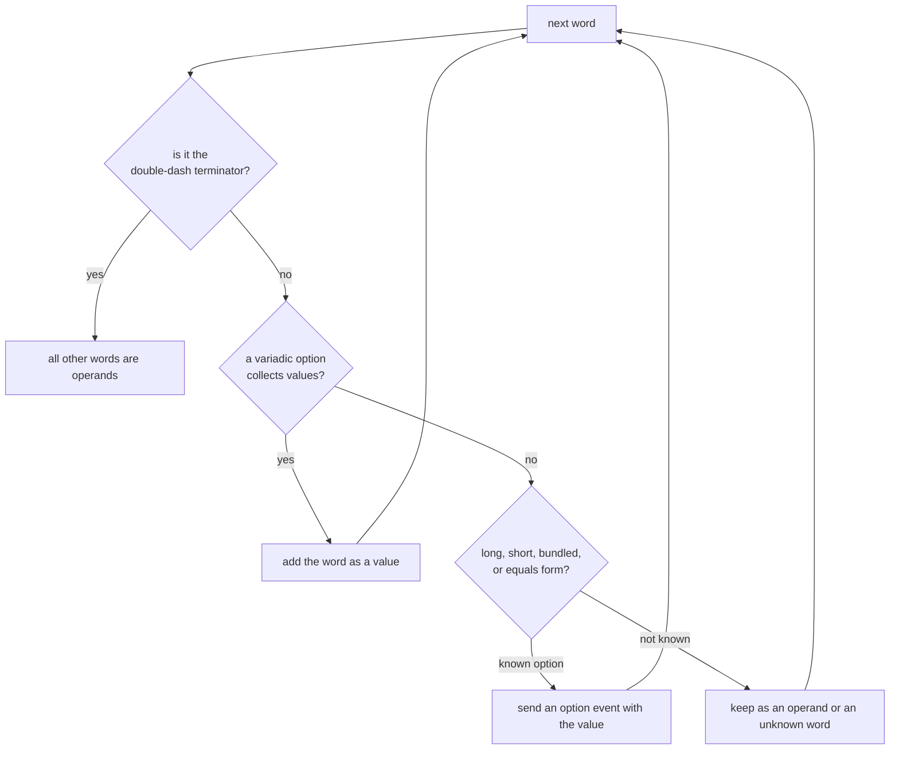
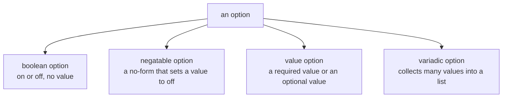
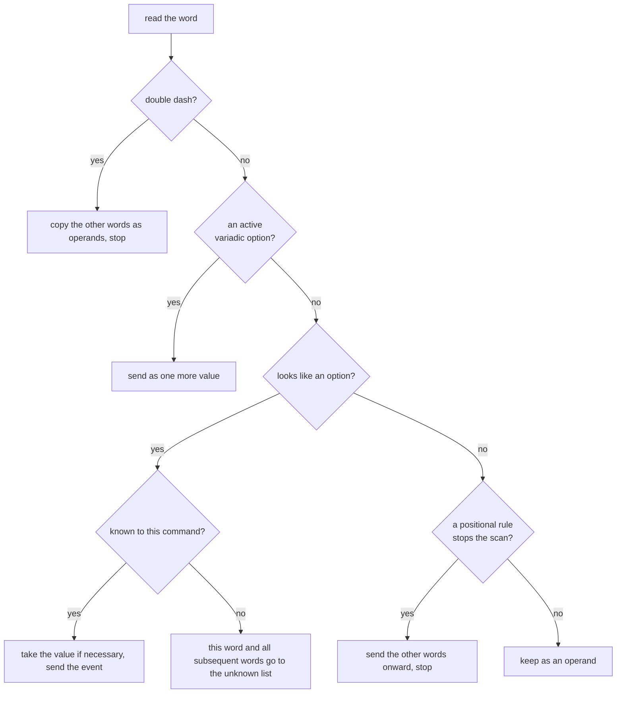

```mermaid
flowchart TD
    START["next word"] --> LIT{"is it the<br/>double-dash terminator?"}
    LIT -- yes --> STOP["all other words are operands"]
    LIT -- no --> VAR{"a variadic option<br/>collects values?"}
    VAR -- yes --> EAT["add the word as a value"]
    VAR -- no --> FORM{"long, short, bundled,<br/>or equals form?"}
    FORM -- "known option" --> EMIT["send an option event with the value"]
    FORM -- "not known" --> OPER["keep as an operand or an unknown word"]
    EMIT --> START
    EAT --> START
    OPER --> START
```

## Abstract

Option parsing is one scan from left to right over the words of the command line. The scan changes a flat list of words into known options, their values, and the other operands. This paper describes this *parse loop* and the four kinds of option that it knows. It also describes the different forms that an option can have on the command line. Each command line goes through the parse loop.

## Introduction

The operating system gives the program its arguments as plain text words. A word that starts with a dash can have different meanings:

- It can be an option of the current command.
- It can be an option of a subcommand lower in the tree.
- It can be a negative number.
- It can be an unknown option.

Also, the same option can have different forms. It can be a long name or a short letter. It can also be a group of short letters after one dash, or a name with an equals sign and a value. The parse loop must sort all of these words in one scan. At this time, it does not know which command will run.

The reader must know two ideas. First, the parse loop *classifies* words, but it does not validate them. It puts each word into one of three groups: known options, operands, and unknown words. A subcommand parses the unknown words again later. Second, the parse loop does not calculate option values. It sends an event for each known option, and the value layer sets the final value. This separation keeps the parse loop simple and keeps all value rules in one place.

## Related Work

- Parent: [Commander.js](../README.md) — the place of the parse loop in the full flow.
- Child: [Value Sources](./value-resolution/README.md) — what occurs to an option after the parse loop finds it.
- The operands that the parse loop keeps: [Positional Arguments](../positional-arguments/README.md).
- The dispatch of an operand that names a child: [Command Model](../command-model/README.md).
- The message for an unknown option: [Error Handling](../error-handling/README.md).

## Description

**There are four kinds of option.** The declaration of an option sets its kind. Each option has one kind only.


```mermaid
flowchart TD
    O["an option"] --> B["boolean option<br/>on or off, no value"]
    O --> N["negatable option<br/>a no-form that sets a value to off"]
    O --> R["value option<br/>a required value or an optional value"]
    O --> V["variadic option<br/>collects many values into a list"]
```

The kinds are as follows:

- A *boolean option* is on or off. It does not take a value.
- A *negatable option* has a name that starts with "no". It sets its value to off. If no positive option with the same name exists, its value is on by default.
- A *value option* takes a value. The value is required or optional.
- A *variadic option* is a value option that collects the next words as more values. It stops at the next word that looks like an option.

**An option can have many forms.** The parse loop knows each form in the list below.

```
--verbose            long boolean option
--output file.txt    long option, value in the next word
--output=file.txt    long option, value after an equals sign
-o file.txt          short option, value in the next word
-abc                 bundled short options: -a, then -b, then -c
-ofile.txt           short option, value in the same word
--no-color           negatable option
```

The parse loop reads a bundle of short options one letter at a time. If the first letter is a known boolean option, the loop uses it. Then it reads the other letters as a new bundle. If the first letter is a short option with a required value, the other letters are its value. An author can set the same rule for a short option with an optional value. This setting is on by default. The equals form applies only to an option that takes a value.

**How a value option gets its value.** The two types of value option use different rules:

- An option with a *required value* always takes the next word. This is true also when the next word starts with a dash.
- An option with an *optional value* takes the next word only if the word does not look like an option. A negative number counts as a value.

If no word is available for a required value, the parse loop reports an error.

**The scan, step by step.** The parse loop writes each word to one of two lists: the operand list or the unknown list. It also keeps two temporary states. One state is the active variadic option. The other state is the rest of a bundle of short options.


```mermaid
flowchart TD
    A["read the word"] --> B{"double dash?"}
    B -- yes --> Z["copy the other words as operands, stop"]
    B -- no --> C{"an active<br/>variadic option?"}
    C -- yes --> C2["send as one more value"]
    C -- no --> D{"looks like an option?"}
    D -- yes --> E{"known to this command?"}
    E -- yes --> F["take the value if necessary, send the event"]
    E -- no --> G["this word and all subsequent words go to the unknown list"]
    D -- no --> H{"a positional rule<br/>stops the scan?"}
    H -- yes --> I["send the other words onward, stop"]
    H -- no --> J["keep as an operand"]
```

These rules apply to special words:

- A double dash alone stops the parse loop. All words after it are operands, also when they start with a dash.
- A word in the form of a negative number is a value, not an option. But if the command or an ancestor has a digit as a short option, this rule does not apply.
- If the current command does not know a word that starts with a dash, the loop changes to the unknown list. That word and all subsequent words go to this list. A subcommand can then find its own options in this list.
- In a command without subcommands, a negative number is an operand, not an unknown word.

**Positional rules change the scan.** An author can turn on two optional rules:

- With *positional options*, the options of a command must come before its subcommand. When the loop finds the name of a subcommand, it stops. All other words go to the child. Thus, a child can use an option name that its parent also uses.
- With *pass-through options*, the loop stops at the first word that it does not know. All other words go to the program without a change. This rule helps when a program starts a different tool that has its own options.

A subcommand can use pass-through options only if its parent commands use positional options. If not, Commander reports an error when the author declares it.

**The parse loop sends events, but it does not calculate values.** When the loop finds a known option, it sends an event for that option. The event can carry a raw text value. The value layer then changes this event into a stored option value with a value source.

## Conclusion

Option parsing is one scan from left to right that classifies each word. It knows four kinds of option and many forms of each option. It reads bundles of short options and stops at the double-dash terminator. It keeps negative numbers as values and sends unknown words to a subcommand. It sends events for known options, but it does not calculate their values. Follow those events into [Value Sources](./value-resolution/README.md). Or go to the [Command Model](../command-model/README.md) to learn how the operands select the command that runs.
