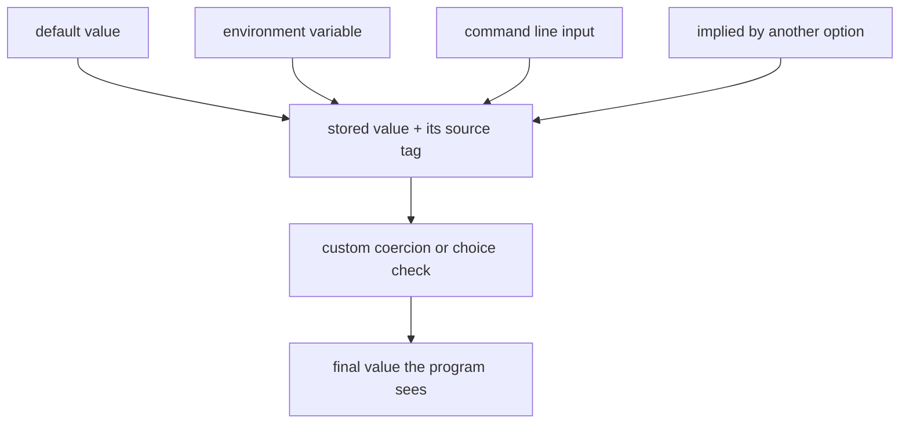
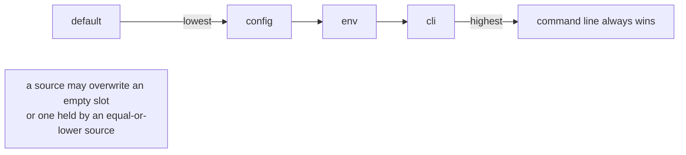
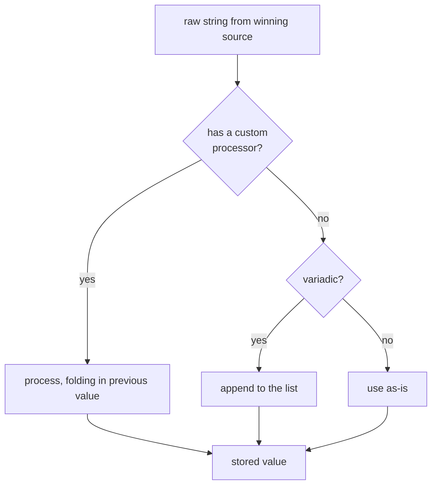
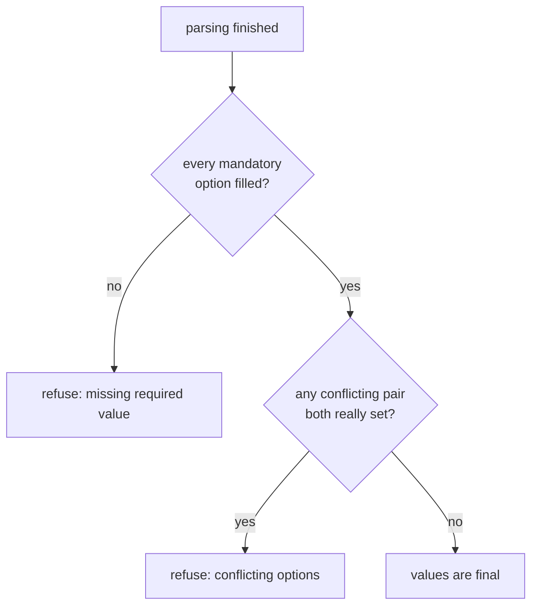

```
██╗   ██╗ █████╗ ██╗     ██╗   ██╗███████╗    ███████╗ ██████╗ ██╗   ██╗██████╗  ██████╗███████╗███████╗
██║   ██║██╔══██╗██║     ██║   ██║██╔════╝    ██╔════╝██╔═══██╗██║   ██║██╔══██╗██╔════╝██╔════╝██╔════╝
██║   ██║███████║██║     ██║   ██║█████╗      ███████╗██║   ██║██║   ██║██████╔╝██║     █████╗  ███████╗
╚██╗ ██╔╝██╔══██║██║     ██║   ██║██╔══╝      ╚════██║██║   ██║██║   ██║██╔══██╗██║     ██╔══╝  ╚════██║
 ╚████╔╝ ██║  ██║███████╗╚██████╔╝███████╗    ███████║╚██████╔╝╚██████╔╝██║  ██║╚██████╗███████╗███████║
  ╚═══╝  ╚═╝  ╚═╝╚══════╝ ╚═════╝ ╚══════╝    ╚══════╝ ╚═════╝  ╚═════╝ ╚═╝  ╚═╝ ╚═════╝╚══════╝╚══════╝
```



## Abstract

Value resolution decides what an option is actually worth once parsing is done. A single setting can be fed from a default, an environment variable, the command line, or another option's implication, and each candidate carries a *source* label used to arbitrate priority. On top of that sit coercion, presets, choice restrictions, mandatory checks, and conflict rules. This paper explains how one canonical value emerges from all those inputs.

## Introduction

The parse loop announces that an option was seen, sometimes with a raw string. But "seen on the command line" is only one way a value can arrive. A well-behaved tool also reads environment variables for defaults, ships built-in defaults, lets one flag imply settings for others, and coerces raw strings into numbers, lists, or validated choices. When several of these speak at once, something must decide who wins.

The organising concept the reader needs is the **value source**. Every stored value remembers where it came from — a built-in default, configuration, an environment variable, an implication, or the command line. Priority is expressed in terms of these labels: a lower-priority source may only fill a slot that is still empty or was itself set by an equal-or-lower-priority source. This single rule replaces a tangle of special cases.

## Related Work

- Parent: [Option Parsing](../README.md) — the scan that announces an option before its value is resolved.
- The same coercion and choice ideas apply to [Positional Arguments](../../positional-arguments/README.md).
- Resolved values are handed to the handler described in [Action Lifecycle](../../command-model/action-lifecycle/README.md).
- Conflict and mandatory failures surface through [Error Handling](../../error-handling/README.md).
- The whole system: [Commander.js](../../README.md).

## Description

**Sources and their priority.** A stored value is always paired with a tag naming its source. When a new candidate arrives, it is written only if it is allowed to overwrite what is there.



The command line is the strongest ordinary source. Environment values fill in only where the command line was silent. Defaults sit at the bottom, present just so a setting is never undefined when nothing else spoke.

**Coercion turns strings into values.** Raw input is text. An option may carry a custom processor that converts each raw string into whatever type the program wants, and — importantly — that processor receives the previously accumulated value, which is how repeated flags fold into a running total or a growing list. Coercion runs once, on the value that actually won, so the same string is never processed twice from two sources.



**Presets and fill-ins for absent values.** Some option kinds are used without an explicit value — a boolean, a negated form, an optional-value option left bare. For these a *preset* can stand in for the missing argument, and when even that is absent the framework fills a sensible placeholder: on for a plain boolean or a bare optional, off for a negated option.

**Choices restrict the vocabulary.** An option can declare a fixed set of allowed values; anything outside the set is rejected at coercion time with a clear message. This turns a free-text argument into an enumerated one without extra validation code.

**Implication lets one flag set others.** An option may declare that, when it is set by a real source, certain other options should take given values — but only where those others have not been set by something stronger. A dedicated helper handles the awkward case of a setting that has both an on-form and an off-form sharing one slot, deducing which twin the value really came from before letting an implication apply.

**Mandatory and conflict are gate checks.** Two post-parse checks guard consistency. A mandatory option must end up with a value from somewhere; if the slot is still empty, parsing fails. Conflicting options that were both supplied by real sources are refused. Both walk the command and its ancestors so the rules hold across the whole active branch of the tree.



## Conclusion

Value resolution is arbitration by source: every value remembers where it came from, and priority — default below env below command line, with implication filling only empty slots — decides who wins, after which coercion, presets, choices, and the mandatory and conflict gates shape the final result. Return to [Option Parsing](../README.md) for how values are first announced, or continue to [Action Lifecycle](../../command-model/action-lifecycle/README.md) to see these values delivered to the code that runs.
