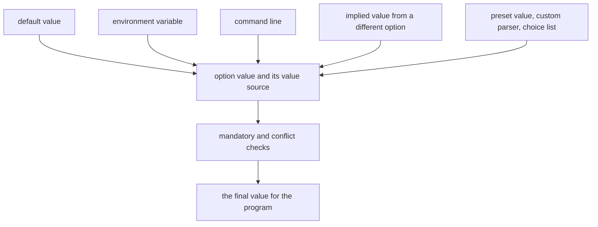
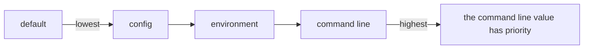
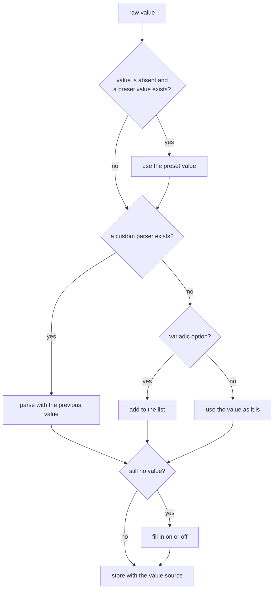
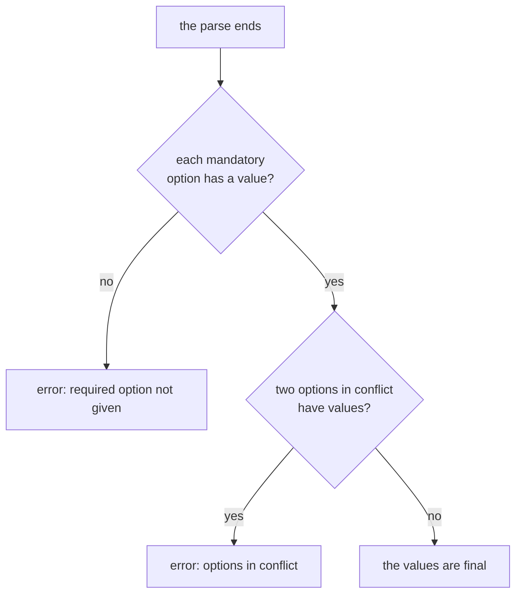

```mermaid
flowchart TD
    DEF["default value"] --> STORE["option value and its value source"]
    ENV["environment variable"] --> STORE
    CLI["command line"] --> STORE
    IMP["implied value from a different option"] --> STORE
    PARSE["preset value, custom parser, choice list"] --> STORE
    STORE --> CHECK["mandatory and conflict checks"]
    CHECK --> FINAL["the final value for the program"]
```

## Abstract

Value resolution sets the final value of each option after the parse. One option can get its value from a default, an environment variable, the command line, or a different option. Each value has a *value source* label, and Commander uses this label to decide which value has priority. Custom parsers, preset values, choice lists, mandatory checks, and conflict rules also change the result. This paper tells how one final value comes from all these inputs.

## Introduction

The parse loop sends an event when it finds an option, sometimes with a raw text value. But the command line is only one place where a value can come from. A good tool also reads environment variables and has default values. Also, one option can set the values of different options. Raw text must often change into numbers, lists, or values from a fixed set. When more than one input gives a value, a rule must select one value.

The main concept for the reader is the **value source**. Each option value keeps a label that tells where the value came from. The table shows the labels.

| Value source | Who sets it |
|---|---|
| Default | Commander, from the default value in the declaration |
| Config | Program code only. Commander does not set this label itself. |
| Environment | Commander, from an environment variable |
| Implied | Commander, from a different option |
| Command line | Commander, from the parse loop |

The priority rules use these labels. Thus, one rule replaces many special cases.

## Related Work

- Parent: [Option Parsing](../README.md) — the scan that finds an option before Commander sets its value.
- The same custom parser and choice list apply to [Positional Arguments](../../positional-arguments/README.md).
- The action handler that gets the final values: [Action Lifecycle](../../command-model/action-lifecycle/README.md).
- The messages for mandatory and conflict failures: [Error Handling](../../error-handling/README.md).
- The full system: [Commander.js](../../README.md).

## Description

**Value sources and their priority.** Commander always keeps an option value together with its value source. The order of the steps sets the priority. The steps occur in this sequence for each command:

1. When the author declares an option with a default value, Commander stores that value with the default label.
2. The parse loop sends the command line values. A command line value always replaces the earlier value.
3. Commander reads the environment variables. An environment value applies only if the slot is empty or has a default, config, or environment label.
4. Commander applies the implied values. An implied value applies only if the slot is empty or has a default or implied label.

```mermaid
flowchart LR
    L1["default"] -->|"lowest"| L2["config"]
    L2 --> L3["environment"]
    L3 --> L4["command line"]
    L4 -->|"highest"| WIN["the command line value has priority"]
```

Thus, the command line is the strongest source. An environment value applies only when the command line did not give a value. A value that program code sets without a label is also safe from environment values. Default values are the weakest source. They make sure that an option has a value when no other source gives one.

**A custom parser changes text into a value.** Raw input is text. An option can have a *custom parser* that changes each raw text value into a different type. The custom parser also gets the previous value of the option. Thus, a repeated option can add to a total or to a list. Commander reads the environment after the command line. Thus, the custom parser does not run on both a command line value and an environment value.

```mermaid
flowchart TD
    RAW["raw value"] --> PRE{"value is absent and<br/>a preset value exists?"}
    PRE -- yes --> USEP["use the preset value"]
    PRE -- no --> HAS
    USEP --> HAS{"a custom parser exists?"}
    HAS -- yes --> PROC["parse with the previous value"]
    HAS -- no --> VARI{"variadic option?"}
    VARI -- yes --> COLL["add to the list"]
    VARI -- no --> ASIS["use the value as it is"]
    PROC --> FILL{"still no value?"}
    COLL --> FILL
    ASIS --> FILL
    FILL -- yes --> SET["fill in on or off"]
    FILL -- no --> DONE["store with the value source"]
    SET --> DONE
```

For a variadic option without a custom parser, the first new value replaces the default value. Each subsequent value goes at the end of the list.

**Preset values and fill-in values.** Some options can occur without a value. Examples are a boolean option, a negatable option, and an option with an optional value but no value. For these options, a *preset value* can replace the absent value. If there is no preset value, Commander uses a fill-in value:

- For a negatable option, the fill-in value is off.
- For a boolean option or an option with an optional value, the fill-in value is on.

**A choice list limits the values.** An option can have a fixed list of permitted values. If a value is not in the list, Commander rejects it with an invalid value error. The message shows the permitted values. The choice list operates as a custom parser, thus it uses the same error path.

**An implied value lets one option set others.** An option can declare values for other options. Commander applies these implied values only when the first option has a value from a real source. Default values and implied values are not real sources for this rule. A negatable option and its positive option share one slot. For this case, Commander uses the value to find which of the two options gave it. Then it applies only the implied values of that option.

**Mandatory and conflict checks guard the result.** Two checks occur after the parse:

- A *mandatory option* must have a value from a source. If the slot is empty, Commander reports an error.
- A *conflict rule* names options that must not occur together. If two such options have values, Commander reports an error. A value with the default label does not count.

Both checks examine the command and all its ancestors. Thus, the rules apply to the full active branch of the tree. If a value in a conflict came from the environment, the message names the environment variable.

```mermaid
flowchart TD
    P["the parse ends"] --> M{"each mandatory<br/>option has a value?"}
    M -- no --> FAIL1["error: required option not given"]
    M -- yes --> K{"two options in conflict<br/>have values?"}
    K -- yes --> FAIL2["error: options in conflict"]
    K -- no --> OK["the values are final"]
```

## Conclusion

Value resolution selects a value by its value source. Each value keeps a label for its source. The command line has priority over the environment, and the environment has priority over the default. An implied value fills only an empty slot or a slot with a weak label. After that, custom parsers, preset values, choice lists, and the two checks make the final result. Go back to [Option Parsing](../README.md) to learn how the parse loop finds options. Or continue to [Action Lifecycle](../../command-model/action-lifecycle/README.md) to learn how the final values go to the action handler.
