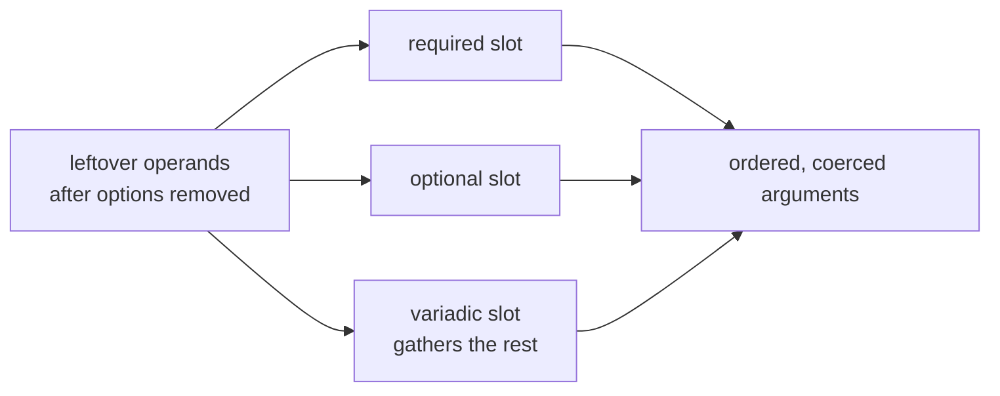
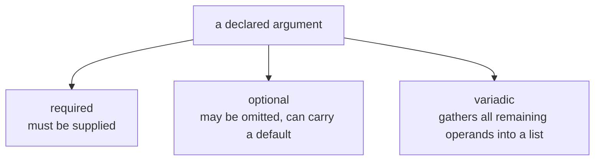
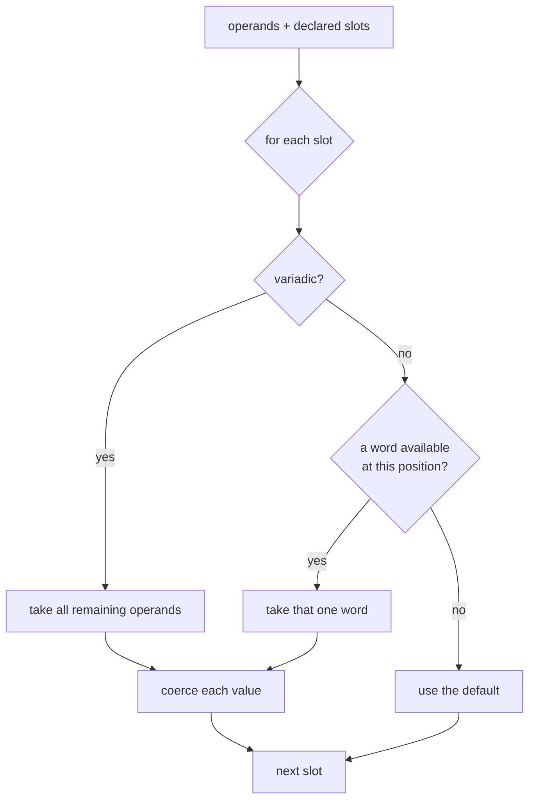
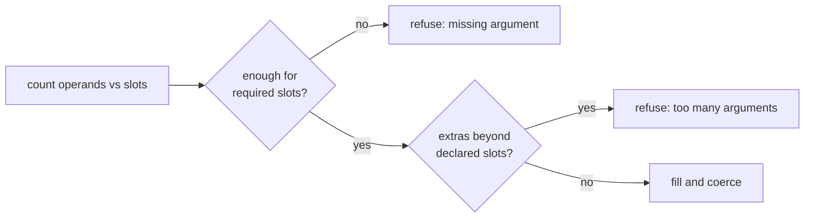

```
 █████╗ ██████╗  ██████╗ ██╗   ██╗███╗   ███╗███████╗███╗   ██╗████████╗███████╗
██╔══██╗██╔══██╗██╔════╝ ██║   ██║████╗ ████║██╔════╝████╗  ██║╚══██╔══╝██╔════╝
███████║██████╔╝██║  ███╗██║   ██║██╔████╔██║█████╗  ██╔██╗ ██║   ██║   ███████╗
██╔══██║██╔══██╗██║   ██║██║   ██║██║╚██╔╝██║██╔══╝  ██║╚██╗██║   ██║   ╚════██║
██║  ██║██║  ██║╚██████╔╝╚██████╔╝██║ ╚═╝ ██║███████╗██║ ╚████║   ██║   ███████║
╚═╝  ╚═╝╚═╝  ╚═╝ ╚═════╝  ╚═════╝ ╚═╝     ╚═╝╚══════╝╚═╝  ╚═══╝   ╚═╝   ╚══════╝
```



## Abstract

Positional arguments are the ordered operands a command consumes once the flags have been stripped away — the file names, targets, and values that a verb acts on. This paper covers how a command declares the shape of its argument list, how required, optional, and variadic slots are filled from the leftover words, and how each argument can be coerced or restricted just like an option's value.

## Introduction

Not everything on a command line is a flag. After options are recognised and set aside, what remains are plain words whose *meaning comes from their position*: the first is the source, the second the destination, and so on. A command needs to declare how many such words it expects, which are compulsory, which may be omitted, and whether a final slot should soak up any number of trailing words.

The reader needs one distinction: options are matched by name and may appear in any order, but arguments are matched by *place*. Because of that, the rules are about counting and ordering — is a required slot filled, is there an optional slot to receive an extra word, does a variadic slot exist to gather the remainder — rather than about recognition.

## Related Work

- Parent: [Commander.js](../README.md) — where operands fit in the overall flow.
- Operands are set aside by the parse loop in [Option Parsing](../option-parsing/README.md).
- Coercion and choice restrictions mirror those in [Value Sources](../option-parsing/value-resolution/README.md).
- The filled arguments are delivered to a handler via [Action Lifecycle](../command-model/action-lifecycle/README.md).
- Too few or too many operands become messages via [Error Handling](../error-handling/README.md).

## Description

**Three kinds of slot.** Each declared argument is one of three shapes, signalled by how it is written:



A required argument must be present. An optional one may be left out, in which case it falls back to its default. A variadic argument is greedy: it collects every remaining operand into a list, so it only makes sense as the last slot.

**Filling the slots.** Once options are removed, the leftover operands are matched to the declared slots left to right. Non-variadic slots each take one word; a variadic slot at the end takes all that remain. Slots with no matching word fall back to their defaults, and a variadic with nothing left becomes an empty list rather than nothing at all.



**Coercion and choices, as with options.** Each argument may carry a custom processor that turns its raw string into a richer value, and for a variadic slot that processor folds across the collected words to build one accumulated result. An argument may also restrict itself to a fixed set of allowed values, rejecting anything outside the set. These are the same value-shaping tools options use, applied by position instead of by name.

**Counting is checked.** Before the slots are filled the command verifies the arithmetic: too few operands to satisfy the required slots is a failure, and — unless the command opts to tolerate extras — more operands than declared slots is also a failure. This is what lets a command trust that, by the time its handler runs, each declared argument is present and well-formed.



## Conclusion

Positional arguments are matched by place, not name: required, optional, and variadic slots are filled left to right from the operands the parse loop set aside, coerced and choice-checked like option values, and guarded by a count check that guarantees a well-formed argument list before the handler runs. See [Option Parsing](../option-parsing/README.md) for how operands are separated from flags, or [Value Sources](../option-parsing/value-resolution/README.md) for the coercion machinery these arguments reuse.
