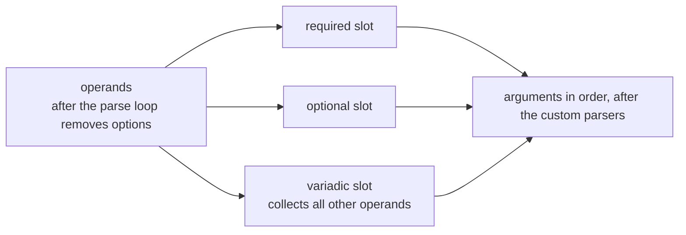
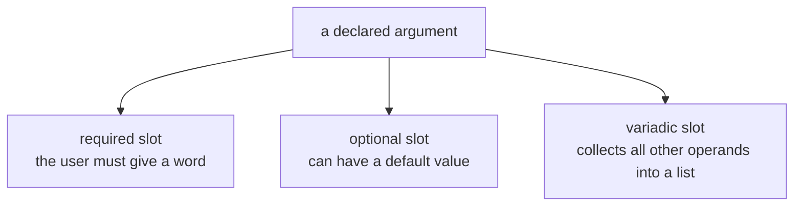
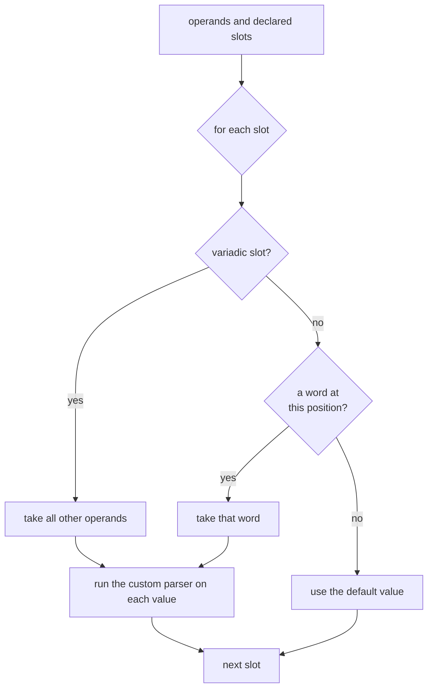
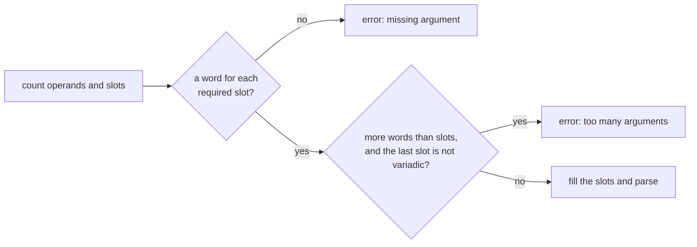

```mermaid
flowchart LR
    OPS["operands<br/>after the parse loop removes options"] --> SLOT1["required slot"]
    OPS --> SLOT2["optional slot"]
    OPS --> SLOT3["variadic slot<br/>collects all other operands"]
    SLOT1 --> OUT["arguments in order, after the custom parsers"]
    SLOT2 --> OUT
    SLOT3 --> OUT
```

## Abstract

Positional arguments are the operands that a command uses after the parse loop removes the options. Examples are file names, targets, and values for a verb. This paper tells how a command declares its argument slots. It also tells how Commander fills required, optional, and variadic slots from the operands. Each argument can have a custom parser or a choice list, as an option can.

## Introduction

Not all words on a command line are options. After the parse loop removes the options, plain words stay. The *position* of each word gives its meaning. For example, the first word is the source and the second word is the destination. A command must declare how many words it expects and which words are necessary. It must also declare if a last slot collects all other words.

The reader must know one difference. Commander finds an option by its name, and options can occur in any order. But Commander finds an argument by its *position*. Thus, the rules for arguments are about the count and the order of words. They are not about names.

## Related Work

- Parent: [Commander.js](../README.md) — the place of the operands in the full flow.
- The parse loop that keeps the operands: [Option Parsing](../option-parsing/README.md).
- The same custom parser and choice list for options: [Value Sources](../option-parsing/value-resolution/README.md).
- The action handler that gets the arguments: [Action Lifecycle](../command-model/action-lifecycle/README.md).
- The messages for too few or too many operands: [Error Handling](../error-handling/README.md).

## Description

**There are three kinds of slot.** The declaration of an argument sets its kind. The table shows the kinds and their written forms.

| Kind of slot | Written form | Behavior |
|---|---|---|
| Required | A name in angle brackets, or a name without brackets | The user must give a word. |
| Optional | A name in square brackets | The user can omit the word. Then the slot uses its default value. |
| Variadic | A name that ends with three dots | The slot collects all other operands into a list. |

```mermaid
flowchart TD
    A["a declared argument"] --> R["required slot<br/>the user must give a word"]
    A --> O["optional slot<br/>can have a default value"]
    A --> V["variadic slot<br/>collects all other operands into a list"]
```

A variadic slot takes all other operands. Thus, it is correct only as the last slot.

**Commander fills the slots from left to right.** After the parse loop removes the options, Commander matches the operands to the slots in order. Each slot that is not variadic takes one word. A variadic slot at the end takes all other words. If no word is available for a slot, the slot uses its default value. If a variadic slot gets no words and has no default value, its value is an empty list.

```mermaid
flowchart TD
    START["operands and declared slots"] --> LOOP{"for each slot"}
    LOOP --> ISV{"variadic slot?"}
    ISV -- yes --> REST["take all other operands"]
    ISV -- no --> ONE{"a word at<br/>this position?"}
    ONE -- yes --> TAKE["take that word"]
    ONE -- no --> DEF["use the default value"]
    REST --> PARSE["run the custom parser on each value"]
    TAKE --> PARSE
    DEF --> NEXT["next slot"]
    PARSE --> NEXT
```

**Custom parsers and choice lists operate as for options.** An argument can have a custom parser that changes its raw text into a different value. For a variadic slot, the custom parser runs on each word in sequence. Each run gets the result of the previous run, and the first run gets the default value. Thus, the parser makes one result from all words. An argument can also have a choice list of permitted values. If a word is not in the list, Commander reports an invalid value error. Commander does not run the custom parser on a default value.

**Commander checks the count first.** Before Commander fills the slots, it counts the operands. The checks are as follows:

- If a required slot has no word, Commander reports a missing argument error.
- If there are more operands than slots, Commander reports a "too many arguments" error. This check does not apply when the last slot is variadic.
- An author can permit extra operands. Then Commander does not report the second error.

Thus, when the action handler runs, each required argument has a value. Commander does these steps also when a command has no action handler.

```mermaid
flowchart LR
    CNT["count operands and slots"] --> Q1{"a word for each<br/>required slot?"}
    Q1 -- no --> E1["error: missing argument"]
    Q1 -- yes --> Q2{"more words than slots,<br/>and the last slot is not variadic?"}
    Q2 -- yes --> E2["error: too many arguments"]
    Q2 -- no --> OK["fill the slots and parse"]
```

## Conclusion

Commander finds positional arguments by their position, not by a name. It fills required, optional, and variadic slots from left to right with the operands from the parse loop. Custom parsers and choice lists change and check the values, as they do for options. A count check makes sure that the argument list is correct before the action handler runs. See [Option Parsing](../option-parsing/README.md) to learn how the parse loop separates operands from options. See [Value Sources](../option-parsing/value-resolution/README.md) for the custom parser that arguments also use.
