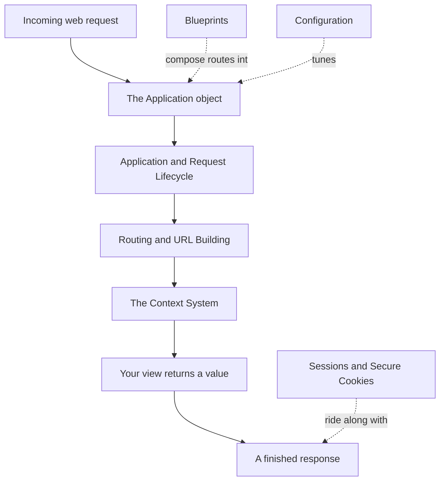
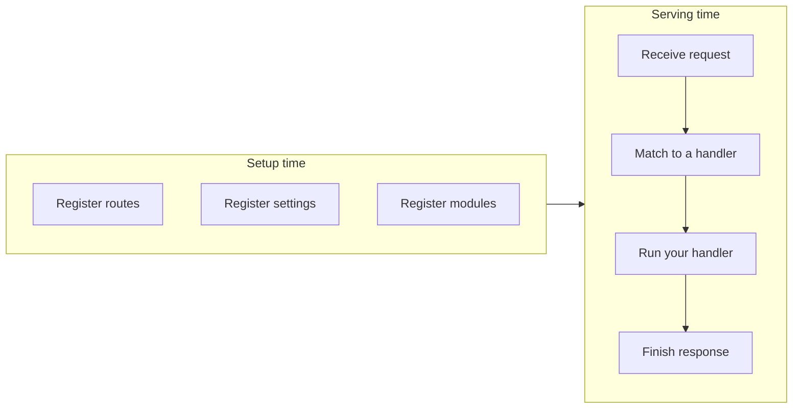
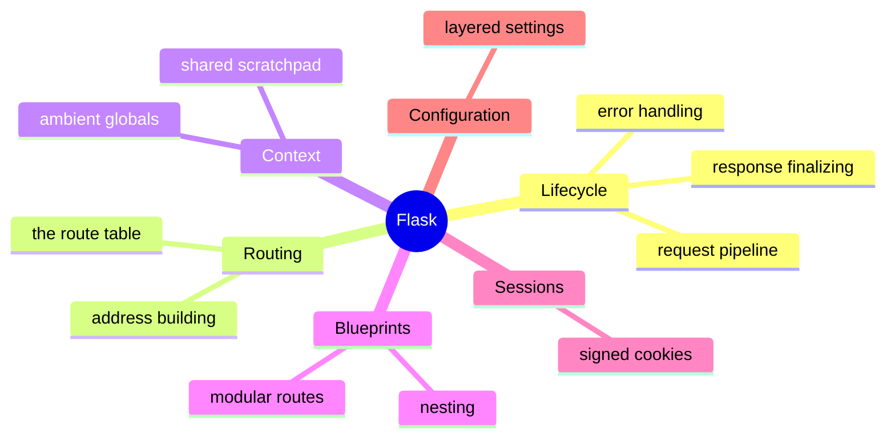

```
███████╗██╗      █████╗ ███████╗██╗  ██╗
██╔════╝██║     ██╔══██╗██╔════╝██║ ██╔╝
█████╗  ██║     ███████║███████╗█████╔╝
██╔══╝  ██║     ██╔══██║╚════██║██╔═██╗
██║     ███████╗██║  ██║███████║██║  ██╗
╚═╝     ╚══════╝╚═╝  ╚═╝╚══════╝╚═╝  ╚═╝
   a micro web framework for Python
```



## Abstract

Flask is a small, unopinionated toolkit for building web applications and APIs in Python. It gives you one central *application object* that receives web requests, decides which piece of your code should answer each one, hands that code a convenient view of the incoming request, and turns whatever your code returns into a proper response. Everything else — how requests are matched to code, how shared data is made available, how apps are split into modules, how sessions and settings work — is layered around that core loop. Flask deliberately stays "micro": it ships the essentials and lets you add the rest.

## Introduction

Web servers speak a raw, low-level dialect: a request arrives as a bag of environment values, and a response must be produced as status, headers, and a stream of bytes. Writing every application directly against that dialect is tedious and error-prone. Flask sits in the middle. It presents a friendly surface to the application author — decorate a function, return a string or some data — while handling the unglamorous mechanics of matching, dispatch, error handling, and cleanup underneath.

The framework's defining idea is *ergonomics through context*. While a request is being handled, Flask makes the current application, the current request, a session, and a scratchpad for shared data available as ambient globals, so your code can reach for them without threading them through every function call. This convenience is carefully engineered to stay correct even when many requests are handled at once. Understanding Flask means understanding that central request loop and the handful of systems that orbit it.

## Related Work

This is the root paper. The major capabilities of Flask are documented as child papers:

- [Application and Request Lifecycle](./application-and-request-lifecycle/README.md) — the central object and the pipeline a request travels through.
- [Routing and URL Building](./routing-and-url-building/README.md) — matching an address to your code, and generating addresses back.
- [The Context System](./the-context-system/README.md) — the ambient globals that make application authoring convenient and safe.
- [Blueprints](./blueprints/README.md) — composing a large application from reusable modules.
- [Sessions and Secure Cookies](./sessions-and-secure-cookies/README.md) — remembering data about a visitor between requests.
- [Configuration](./configuration/README.md) — loading and organizing an application's settings.

## Description

At the heart of Flask is a single object that represents your whole application. You create it once, register your pages and behaviors on it during setup, and then hand it to a web server. From that point on, every request the server receives is passed to this object, which runs it through a well-defined pipeline and returns a response.



The systems in this documentation set divide cleanly into two phases. **Setup** happens once, before any traffic: you attach routes, load settings, and register modules. **Serving** happens per request: the application matches the request to a handler, establishes the ambient context, runs your code, and finalizes the response.

Two long-standing hallmarks round out the picture but are lighter integrations rather than large subsystems. Flask embeds a mature templating engine so that handlers can render HTML pages from reusable templates, and it ships a command-line tool for running and inspecting an application during development. Both lean on the same central object and context system described in the child papers.



Flask's design philosophy is visible throughout: provide sensible defaults, keep the surface small, and make almost every decision overridable. The framework favors explicit registration during setup and predictable behavior during serving, which is what makes both small scripts and large applications comfortable to write on the same foundation.

## Conclusion

Flask is best understood as one request loop surrounded by a few well-chosen conveniences. If you are new to the framework, begin with the [Application and Request Lifecycle](./application-and-request-lifecycle/README.md) to see the whole pipeline end to end, then read [Routing and URL Building](./routing-and-url-building/README.md) and [The Context System](./the-context-system/README.md) to understand how requests reach your code and how your code reaches shared state. From there, [Blueprints](./blueprints/README.md), [Sessions and Secure Cookies](./sessions-and-secure-cookies/README.md), and [Configuration](./configuration/README.md) cover how real applications grow, remember, and are tuned.
