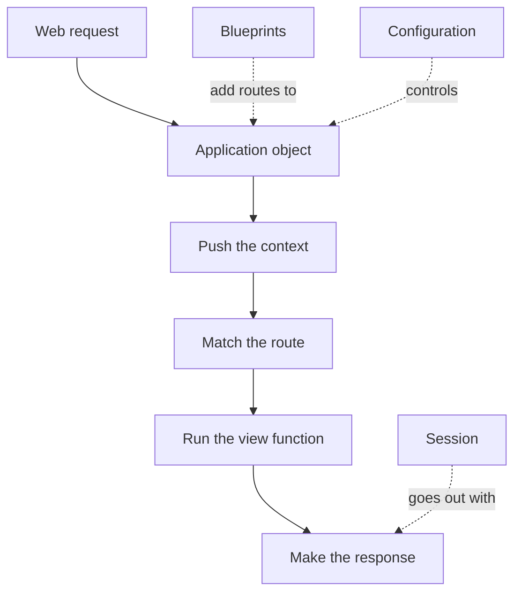
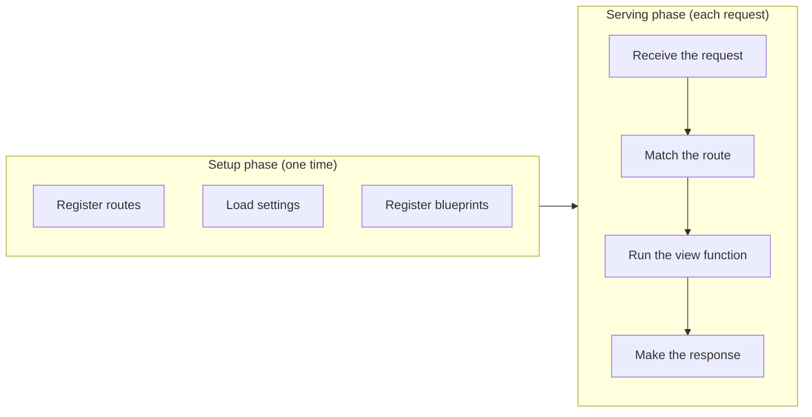
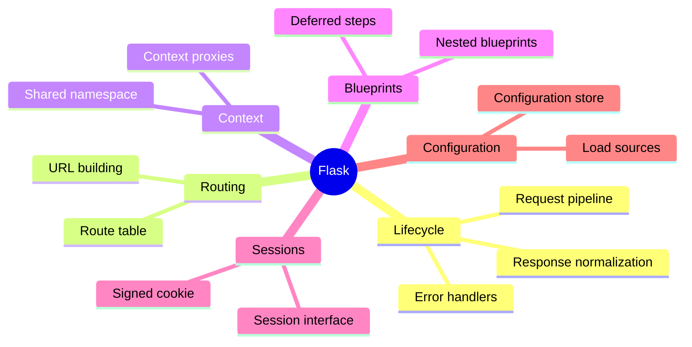

```mermaid
flowchart TD
    W["Web request"] --> APP["Application object"]
    APP --> PUSH["Push the context"]
    PUSH --> MATCH["Match the route"]
    MATCH --> VIEW["Run the view function"]
    VIEW --> RESP["Make the response"]

    BP["Blueprints"] -. "add routes to" .-> APP
    CFG["Configuration"] -. "controls" .-> APP
    SESS["Session"] -. "goes out with" .-> RESP
```

## Abstract

Flask is a small framework for web applications and web APIs in Python. Its center is one application object. The application object receives each web request and finds the view function for it. Then it runs the view function and changes the return value into a response. The other features of Flask attach to this request pipeline. Flask gives only the necessary parts, and the application author adds the other parts.

## Introduction

A web server gives each request to the application in a low-level form. The request is a set of environment values. The application must send back a status, headers, and a body of bytes. Flask changes this low-level form into a simple form for the application author. The author writes a function and returns a string or some data. Flask does the route lookup, the dispatch, the error handling, and the cleanup.

The main design idea of Flask is the context. While Flask handles a request, it makes some objects available through context proxies. These objects are the current application, the current request, the session, and a shared namespace. Your code can use these objects without a parameter in each function call. Each request has its own context, thus the context proxies stay correct when many requests run at the same time.

## Related Work

This is the root paper. The child papers describe the main features of Flask:

- [Application and Request Lifecycle](./application-and-request-lifecycle/README.md) — This paper describes the application object and the request pipeline.
- [Routing and URL Building](./routing-and-url-building/README.md) — This paper describes how Flask matches a URL to a view function and builds URLs.
- [The Context System](./the-context-system/README.md) — This paper describes the context and the context proxies.
- [Blueprints](./blueprints/README.md) — This paper describes how you make a large application from modules.
- [Sessions and Secure Cookies](./sessions-and-secure-cookies/README.md) — This paper describes how Flask keeps visitor data between requests.
- [Configuration](./configuration/README.md) — This paper describes how Flask loads and keeps the settings of an application.

## Description

Flask has two phases: the setup phase and the serving phase. In the setup phase, you create the application object one time. Then you register routes, hooks, error handlers, settings, and blueprints on it. In the serving phase, a web server gives each request to the application object. The application object sends the request through the request pipeline and returns a response.

```mermaid
flowchart LR
    subgraph Setup ["Setup phase (one time)"]
        R1["Register routes"]
        R2["Load settings"]
        R3["Register blueprints"]
    end
    subgraph Serving ["Serving phase (each request)"]
        D["Receive the request"]
        M["Match the route"]
        H["Run the view function"]
        F["Make the response"]
    end
    Setup --> Serving
    D --> M --> H --> F
```

The setup phase closes after the first request. If code tries to register a new route or hook after that time, Flask stops it with an error. This rule keeps the shape of the application stable in the serving phase. Thus the request pipeline always sees the same routes and hooks.

The table shows the phase in which each main feature does its work.

| Feature | Setup phase | Serving phase |
|---|---|---|
| Application and Request Lifecycle | Collects hooks and error handlers | Runs the request pipeline |
| Routing and URL Building | Adds URL rules to the route table | Matches each request and builds URLs |
| The Context System | Gives an application context to setup code, if necessary | Pushes and pops one context for each request |
| Blueprints | Adds module setup to the application | Scopes hooks and error handlers to a module |
| Sessions and Secure Cookies | Not used | Opens and saves the session |
| Configuration | Loads the settings | Gives settings to all features |

Flask also includes two smaller integrations. The first integration is a template engine. View functions use it to make HTML pages from templates. The second integration is a command-line tool. Developers use it to run the application and to do maintenance tasks. Both integrations use the same application object and the same context.

```mermaid
mindmap
  root((Flask))
    Lifecycle
      Request pipeline
      Response normalization
      Error handlers
    Routing
      Route table
      URL building
    Context
      Context proxies
      Shared namespace
    Blueprints
      Deferred steps
      Nested blueprints
    Sessions
      Signed cookie
      Session interface
    Configuration
      Configuration store
      Load sources
```

Flask has a default for most behavior, and you can replace most parts. For example, you can replace the session interface, the request class, and the response class. Flask uses explicit registration in the setup phase. It uses a predictable order in the serving phase. Thus a small script and a large application use the same base.

## Conclusion

Flask is one request pipeline with a small set of features around it. If you are new to Flask, start with [Application and Request Lifecycle](./application-and-request-lifecycle/README.md) to see the full pipeline. Then read [Routing and URL Building](./routing-and-url-building/README.md) and [The Context System](./the-context-system/README.md). These papers show how a request gets to your code and how your code gets the current objects. After that, read [Blueprints](./blueprints/README.md), [Sessions and Secure Cookies](./sessions-and-secure-cookies/README.md), and [Configuration](./configuration/README.md).
