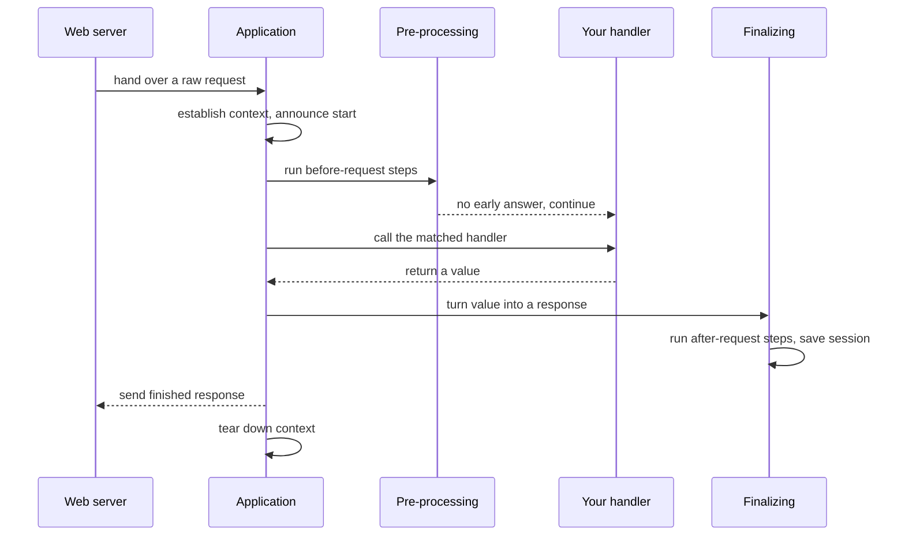
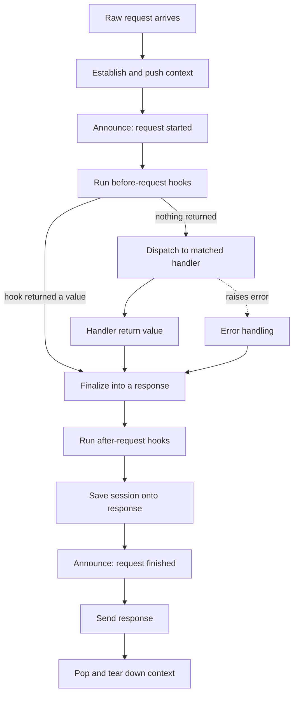
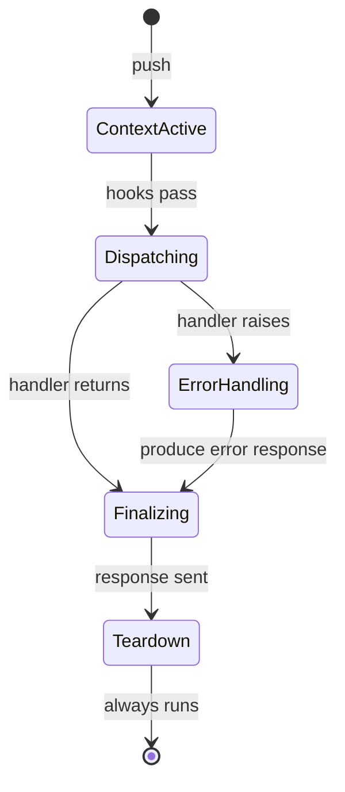

```
██╗     ██╗███████╗███████╗ ██████╗██╗   ██╗ ██████╗██╗     ███████╗
██║     ██║██╔════╝██╔════╝██╔════╝╚██╗ ██╔╝██╔════╝██║     ██╔════╝
██║     ██║█████╗  █████╗  ██║      ╚████╔╝ ██║     ██║     █████╗
██║     ██║██╔══╝  ██╔══╝  ██║       ╚██╔╝  ██║     ██║     ██╔══╝
███████╗██║██║     ███████╗╚██████╗   ██║   ╚██████╗███████╗███████╗
╚══════╝╚═╝╚═╝     ╚══════╝ ╚═════╝   ╚═╝    ╚═════╝╚══════╝╚══════╝
        the central object and the per-request pipeline
```



## Abstract

This is the beating heart of Flask: the single application object and the fixed sequence of steps every request travels through. The application object is created once and serves as the registry for everything your program can do. When a request arrives, it is driven through a pipeline — set up the ambient context, announce that a request has started, run any pre-processing, call the matched handler, convert whatever comes back into a proper response, run post-processing, and clean up — with a robust path for when things go wrong.

## Introduction

A web application must answer two very different needs. During *setup*, the author registers everything the app can do: pages, error behaviors, hooks that run around requests, and settings. During *serving*, that same app must respond to a flood of independent requests quickly and correctly. Flask unifies both needs in one object. It behaves as a registry while you build it, and as a request-processing machine once a server starts calling it.

The reason the lifecycle deserves its own paper is that its order is a contract. Hooks that run before a request, the handler itself, hooks that run after, session saving, and teardown all fire in a guaranteed sequence, and cleanup is guaranteed even when an error interrupts the flow. Understanding this order is what lets you reason about where your own code runs and why the ambient globals are available exactly when they are.

## Related Work

- Parent: [Flask](../README.md) — the project overview.
- [Routing and URL Building](../routing-and-url-building/README.md) — the "match to a handler" step is documented in depth here.
- [The Context System](../the-context-system/README.md) — the "establish context" and "tear down" steps create and destroy the ambient globals.
- [Sessions and Secure Cookies](../sessions-and-secure-cookies/README.md) — the session is loaded early and saved during finalizing.
- [Configuration](../configuration/README.md) — settings that steer the lifecycle live on the same object.

## Description

**The application as a registry.** Before any traffic, the application object collects every capability of your program. Handlers are attached to addresses, error behaviors are registered per error type, and hooks are registered to run around requests or when a context is torn down. Once the first request has been served, the setup surface is considered closed, which keeps a running application's shape stable and predictable.

**The bridge to the outside world.** Web servers speak a standard Python server protocol. The application object *is* callable in that protocol: when a server calls it with a raw request environment, it kicks off the pipeline and ultimately streams bytes back. This callable is kept as a thin, replaceable outer layer, so that middleware can wrap the application while your original object stays reachable.



**The pipeline, step by step.** Every request follows the same course. First a context is established so the ambient globals point at this request. A signal announces the request has started. Pre-processing hooks get a chance to short-circuit with an early answer. If they do not, the request is dispatched to the handler that routing selected. Whatever the handler returns — a string, some structured data, a tuple, or a full response object — is normalized into a proper response. Post-processing hooks may adjust that response, the session is written onto it, and a signal announces the request is finished. Finally the response is sent and the context is torn down.

**Turning return values into responses.** Flask is generous about what a handler may return, and a dedicated normalization step reconciles all the shorthand forms into one canonical response. This is why authors can return the simplest thing that expresses their intent and still get correct status codes, headers, and bodies. The request and response are themselves presented as enriched objects that make common tasks — reading form data, query parameters, or JSON on the way in; setting headers and cookies on the way out — convenient.

**Error handling as a first-class path.** If a handler raises, control diverts to error handling rather than crashing the pipeline. Flask looks for the most specific registered behavior for that error, falling back through more general handlers, and produces a response through the same finalizing step. Standard web errors and arbitrary exceptions are both accommodated, and there is a guarded "safe finalize" mode used when an error occurs while already handling an error.



**Guaranteed cleanup.** No matter how a request ends — success, a handled error, or an unexpected failure — the context is torn down and teardown hooks run. This guarantee is what makes it safe to open resources like database connections during a request and rely on Flask to release them afterward.

**Also on the same object.** The application object doubles as the entry point for running a local development server, creating a test client that exercises the pipeline without a real network, and reaching the embedded templating engine. Async handlers are supported by transparently running them to completion within the same synchronous pipeline.

## Conclusion

The lifecycle is the spine of Flask: one object that is a registry at setup and a request machine at serving, driving every request through the same ordered pipeline with guaranteed cleanup. Read [Routing and URL Building](../routing-and-url-building/README.md) next to see how the "dispatch" step chooses a handler, and [The Context System](../the-context-system/README.md) to understand the "establish context" and "tear down" bookends that make the ambient globals work. Return to the [project overview](../README.md) for the big picture.
