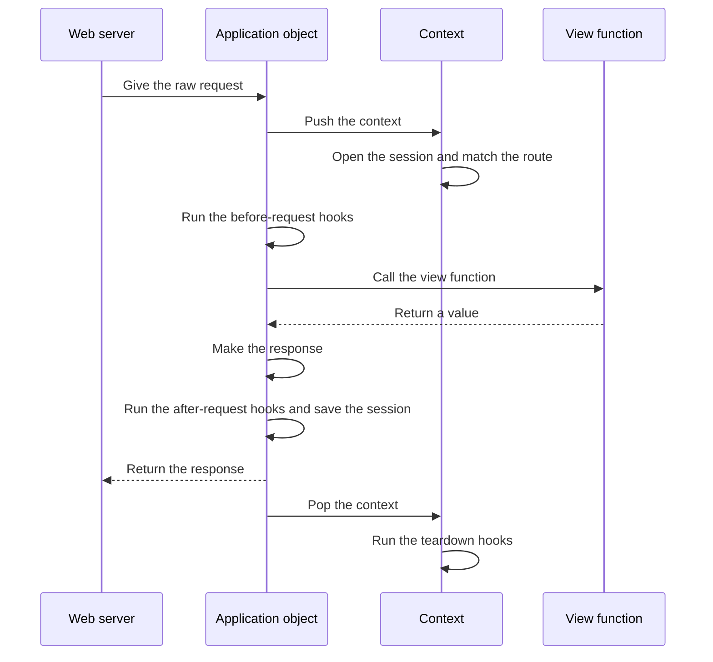
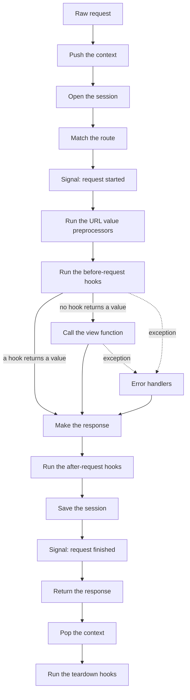
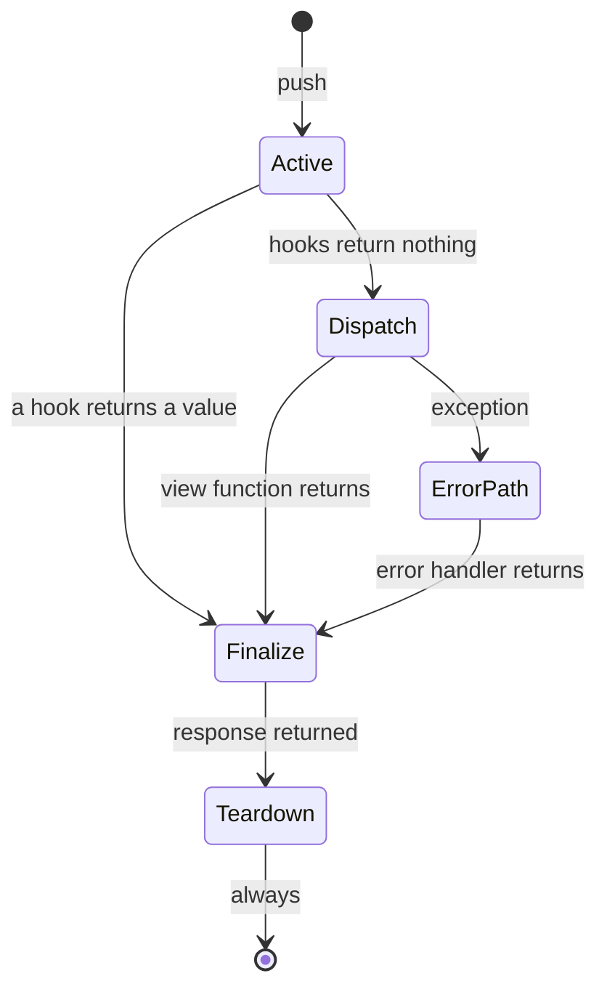

```mermaid
sequenceDiagram
    participant Server as Web server
    participant App as Application object
    participant Ctx as Context
    participant View as View function
    Server->>App: Give the raw request
    App->>Ctx: Push the context
    Ctx->>Ctx: Open the session and match the route
    App->>App: Run the before-request hooks
    App->>View: Call the view function
    View-->>App: Return a value
    App->>App: Make the response
    App->>App: Run the after-request hooks and save the session
    App-->>Server: Return the response
    App->>Ctx: Pop the context
    Ctx->>Ctx: Run the teardown hooks
```

## Abstract

This feature is the center of Flask. It has two parts: the application object and the request pipeline. The application object is a registry for all routes, hooks, and error handlers. When a request arrives, the application object sends it through a fixed sequence of steps. If an error occurs, a separate error path makes the response. In all cases, the cleanup steps run at the end.

## Introduction

A web application has two different jobs. In the setup phase, the author registers what the application can do. In the serving phase, the application answers many independent requests. Flask does both jobs with one object. The object is a registry during the setup phase and a request processor during the serving phase.

The order of the steps in the request pipeline is a contract. The before-request hooks, the view function, the after-request hooks, the session save, and the teardown hooks always run in the same order. The teardown hooks run also when an error stops the request. If you know this order, you know where your code runs. You also know when the context proxies are available.

## Related Work

- Parent: [Flask](../README.md) — This paper gives the overview of the project.
- [Routing and URL Building](../routing-and-url-building/README.md) — This paper describes the route match in step 2 of the request pipeline.
- [The Context System](../the-context-system/README.md) — This paper describes the context that Flask pushes at the start and pops at the end.
- [Sessions and Secure Cookies](../sessions-and-secure-cookies/README.md) — This paper describes how Flask opens the session and saves it onto the response.
- [Blueprints](../blueprints/README.md) — This paper describes how blueprints add hooks and error handlers with a smaller scope.
- [Configuration](../configuration/README.md) — This paper describes the settings that control the request pipeline, such as the debug flag.

## Description

**The application as a registry.** Before the serving phase, the application object collects all capabilities of your program. It keeps the route table, the view functions, the error handlers, and the hooks. Each hook has a scope: the full application or one blueprint. After the first request, the registry is closed for changes.

**The connection to the web server.** Python web servers call applications through the standard WSGI interface. The application object is callable through this interface. The call goes to an inner entry point, and this entry point runs the request pipeline. Middleware can wrap the inner entry point. Then your original application object stays available with all its methods.

```mermaid
flowchart TD
    START["Raw request"] --> PUSH["Push the context"]
    PUSH --> OPEN["Open the session"]
    OPEN --> MATCH["Match the route"]
    MATCH --> SIG1["Signal: request started"]
    SIG1 --> URLP["Run the URL value preprocessors"]
    URLP --> PRE["Run the before-request hooks"]
    PRE -->|"a hook returns a value"| FIN
    PRE -->|"no hook returns a value"| DISP["Call the view function"]
    DISP --> FIN["Make the response"]
    FIN --> POST["Run the after-request hooks"]
    POST --> SAVE["Save the session"]
    SAVE --> SIG2["Signal: request finished"]
    SIG2 --> SEND["Return the response"]
    SEND --> POP["Pop the context"]
    POP --> TD["Run the teardown hooks"]

    PRE -.->|"exception"| ERR["Error handlers"]
    DISP -.->|"exception"| ERR
    ERR --> FIN
```

**The request pipeline, step by step.** Each request goes through the same steps:

1. Flask makes a context with the request data and pushes it.
2. The context opens the session and matches the request to a route. If the match fails, the context keeps the routing error for later.
3. Flask sends the "request started" signal.
4. Flask runs the URL value preprocessors and then the before-request hooks.
5. If a before-request hook returns a value, Flask uses that value as the response and does not call the view function.
6. Otherwise, Flask calls the view function of the matched endpoint. If the match failed in step 2, Flask raises the routing error here.
7. Flask changes the return value into a response object.
8. Flask runs the after-request hooks and then saves the session onto the response.
9. Flask sends the "request finished" signal and returns the response to the web server.
10. Flask pops the context. The context runs the teardown hooks and closes the request.

**The order of the hooks.** The hooks run in a fixed order between the application and its blueprints. The before-request hooks of the application run first. Then the hooks of each blueprint run, from the outer blueprint to the inner blueprint. The after-request hooks and the teardown hooks run in the opposite direction. In each scope, these hooks run in the reverse order of registration. An after-request hook for only the current request runs before all other after-request hooks.

**Return values and responses.** A view function can return many forms of value. A normalization step changes each form into one response object. Thus the author can return the simplest value for the task. The table shows the accepted forms.

| Return value | Result |
|---|---|
| A string or bytes | A response with that body |
| A dictionary or a list | A JSON response |
| A generator or an iterator | A streamed response |
| A tuple | A body with a status, headers, or both |
| A response object | Flask uses it without change |
| A WSGI callable | Flask calls it and makes a response from the result |
| Nothing | An error, because a view function must return a value |

The request object and the response object add helpers for common tasks. The request object gives form data, query parameters, and JSON data. It also applies limits from the configuration, such as the maximum size of the content. The response object lets you set headers and cookies.

**The error path.** If a hook or the view function raises an exception, Flask sends it to the error handlers. Flask looks for an error handler in this order:

1. A blueprint error handler for the status code.
2. An application error handler for the status code.
3. A blueprint error handler for the exception class or a parent class.
4. An application error handler for the exception class or a parent class.

If no error handler exists for an HTTP error, Flask uses the HTTP error as the response. If no error handler exists for another exception, Flask sends the "request exception" signal. In debug mode or test mode, Flask then raises the exception again for the debugger. In other modes, Flask logs the exception and makes an "internal server error" response. For this response, Flask uses a safe mode: an error in the after-request hooks goes to the log and does not stop the response.

```mermaid
stateDiagram-v2
    [*] --> Active: push
    Active --> Dispatch: hooks return nothing
    Active --> Finalize: a hook returns a value
    Dispatch --> Finalize: view function returns
    Dispatch --> ErrorPath: exception
    ErrorPath --> Finalize: error handler returns
    Finalize --> Teardown: response returned
    Teardown --> [*]: always
```

**Cleanup always runs.** A request can end with a success, a handled error, or an unhandled failure. In each case, Flask pops the context, and the teardown hooks run. All teardown hooks run, also when one of them fails. Flask collects the errors and raises them together at the end. Thus you can open a resource, such as a database connection, during a request and close it in a teardown hook.

**Other entry points.** The application object also gives these entry points:

- A development server. Flask starts it for local tests.
- A test client. The test client sends requests through the full request pipeline without a network.
- The template engine. View functions use it to make HTML pages.
- Support for asynchronous functions. Flask runs each asynchronous view function or hook to completion inside the synchronous request pipeline.

## Conclusion

The request lifecycle is the base of Flask. One object is a registry in the setup phase and a request processor in the serving phase. Each request goes through the same ordered request pipeline, and the cleanup always runs. Next, read [Routing and URL Building](../routing-and-url-building/README.md) to see how Flask finds the view function. Then read [The Context System](../the-context-system/README.md) to learn about the push and the pop at the two ends of the request pipeline. Go back to the [project overview](../README.md) for the full picture.
