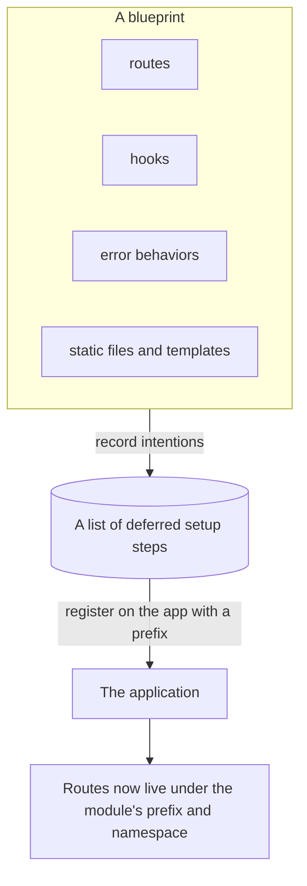
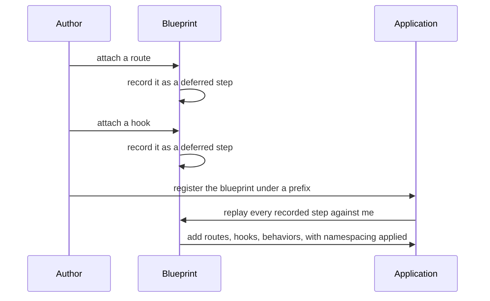
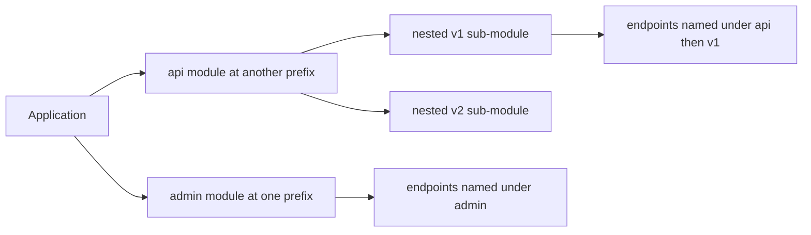

## Abstract

Blueprints let you build an application out of self-contained modules. A blueprint looks and feels like a miniature application — you attach routes, hooks, error behaviors, and its own templates and static files to it — but it is not an application and cannot serve requests on its own. Instead, everything you do to a blueprint is *recorded* as a deferred step. When the blueprint is registered onto a real application, those steps replay against it, optionally under a shared address prefix and a name that namespaces its endpoints. The same blueprint can be registered more than once, and blueprints can nest inside other blueprints.

## Introduction

A single flat application becomes unwieldy as it grows. You want to group the pages and behaviors that belong together — an admin section, an API version, a storefront — into cohesive units that can be developed, reused, and mounted independently. Many frameworks solve this with a plug-in system layered on top of the core. Flask solves it with a mechanism that mirrors the application's own setup surface.

The central idea is *deferred registration*. A blueprint offers the same registration methods the application does, but instead of acting immediately, it remembers the intent. Only when the blueprint is attached to an application do those remembered intents run, and at that moment the application supplies context the blueprint could not know in advance: where to mount it, what to call it, and which application it now belongs to. This late binding is what makes blueprints portable and reusable across applications and even within the same one.

## Related Work

- Parent: [Flask](../README.md) — the project overview.
- [Routing and URL Building](../routing-and-url-building/README.md) — a blueprint's routes join the application's route table, and its endpoints gain a namespace prefix.
- [Application and Request Lifecycle](../application-and-request-lifecycle/README.md) — hooks contributed by a blueprint run within the same request pipeline.
- [Configuration](../configuration/README.md) — an application composed of blueprints still shares one configuration.

## Description

**A blueprint mirrors the application's setup surface.** Anything you can register on an application during setup — a route, a before-request or teardown hook, an error behavior, a template helper, its own folder of static files — you can register on a blueprint the same way. The difference is entirely in timing.

**Record now, apply later.** Each setup call on a blueprint appends to an ordered list of deferred steps. Registration walks that list and runs each step against a small setup state that knows the target application, the address prefix chosen for this registration, and whether this is the blueprint's first time being registered. Some steps are meant to run only once no matter how many times the blueprint is mounted; the framework offers a way to mark those.

**Prefixes and namespaced endpoints.** When registered, a blueprint can be given an address prefix that is prepended to all of its routes, so the same module can live at one location in one app and a different location in another. Its endpoint names are prefixed with the blueprint's name, keeping them distinct from identically named handlers elsewhere. This is why linking to a page inside a module refers to it by its namespaced name rather than its raw address.

**Registered more than once, and nested.** Because a blueprint only records intentions, the same blueprint can be mounted at several prefixes within one application, each registration a fresh replay under a different name. Blueprints can also be registered inside other blueprints; when the parent is finally mounted, the nesting is resolved so that prefixes concatenate and names compound, producing a tidy tree of modules.

**Scoped hooks and behaviors.** Hooks and error behaviors registered on a blueprint can be scoped to only the requests handled by that blueprint's routes, or broadened to the whole application. This lets a module carry its own before-request checks or error pages without imposing them on unrelated parts of the app.

## Conclusion

Blueprints are Flask's answer to growth: reusable modules that record their setup and apply it against a real application at registration time, under a shared prefix and namespace. They compose directly with [routing](../routing-and-url-building/README.md), whose table and endpoint names they extend, and with the [request pipeline](../application-and-request-lifecycle/README.md), whose hooks they contribute to. See the [project overview](../README.md) for how modular composition fits alongside Flask's other capabilities.
