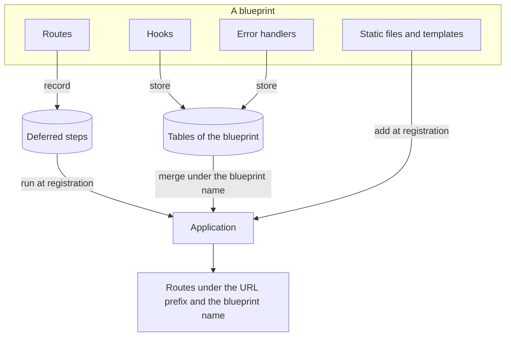
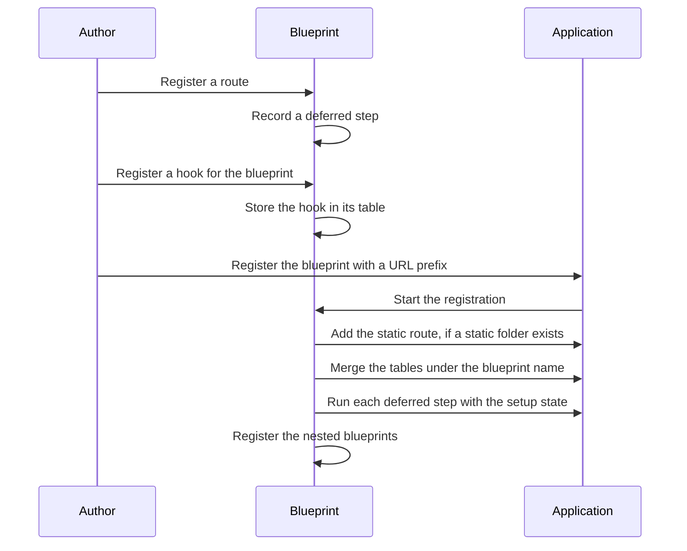
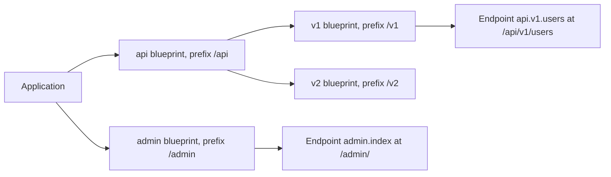

```mermaid
flowchart TD
    subgraph BP ["A blueprint"]
        R1["Routes"]
        R2["Hooks"]
        R3["Error handlers"]
        R4["Static files and templates"]
    end
    R1 -->|"record"| DEF[("Deferred steps")]
    R2 -->|"store"| OWN[("Tables of the blueprint")]
    R3 -->|"store"| OWN
    DEF -->|"run at registration"| APP["Application"]
    OWN -->|"merge under the blueprint name"| APP
    R4 -->|"add at registration"| APP
    APP --> LIVE["Routes under the URL prefix and the blueprint name"]
```

## Abstract

A blueprint is a module that holds one part of an application. It has the same setup methods as the application, for routes, hooks, error handlers, templates, and static files. But a blueprint is not an application, and it cannot serve requests alone. A blueprint keeps its setup for later. When you register the blueprint on an application, Flask applies the setup to that application. The registration can add a URL prefix, and the blueprint name becomes a prefix of each endpoint name.

## Introduction

A flat application becomes difficult to manage when it grows. You often want to put related pages and behavior into one unit, such as an admin area or one version of an API. Then you can develop, use again, and mount each unit independently. Flask does this with blueprints, which have the same setup methods as the application.

The central idea is deferred registration. A blueprint accepts the same setup calls as the application, but it does not apply them immediately. When you register the blueprint on an application, the application gives the other necessary information. This information is the target application, the URL prefix, and the registered name. Because of this late binding, you can use one blueprint in many applications or many times in one application.

## Related Work

- Parent: [Flask](../README.md) — This paper gives the overview of the project.
- [Routing and URL Building](../routing-and-url-building/README.md) — This paper describes the route table that receives the URL rules of a blueprint.
- [Application and Request Lifecycle](../application-and-request-lifecycle/README.md) — This paper describes the request pipeline that runs the hooks of a blueprint.
- [Configuration](../configuration/README.md) — This paper describes the one configuration store that all blueprints of an application share.

## Description

**The same setup methods.** You can register on a blueprint almost all items that you can register on an application. These items include routes, hooks, error handlers, template helpers, URL default functions, and a static folder. The difference is the time when Flask applies them.

**Two kinds of setup data.** A blueprint keeps its setup data in two ways:

- Routes and items for the full application become deferred steps. A deferred step is a small function that runs when Flask registers the blueprint.
- Hooks, error handlers, and URL processors for the blueprint stay in tables on the blueprint. At registration, Flask merges these tables into the tables of the application under the blueprint name.

```mermaid
sequenceDiagram
    participant Author
    participant BP as Blueprint
    participant App as Application
    Author->>BP: Register a route
    BP->>BP: Record a deferred step
    Author->>BP: Register a hook for the blueprint
    BP->>BP: Store the hook in its table
    Author->>App: Register the blueprint with a URL prefix
    App->>BP: Start the registration
    BP->>App: Add the static route, if a static folder exists
    BP->>App: Merge the tables under the blueprint name
    BP->>App: Run each deferred step with the setup state
    BP->>BP: Register the nested blueprints
```

**The setup state.** At registration, Flask makes a setup state and gives it to each deferred step. The setup state holds the target application, the URL prefix, the subdomain, the registered name, and the URL default values. It also tells if this registration is the first registration of the blueprint. A once-only step runs only at the first registration. The blueprint uses once-only steps for its hooks and error handlers for the full application.

**URL prefixes and endpoint names.** At registration, a blueprint can get a URL prefix. Flask adds the prefix to the start of each URL rule of the blueprint. Flask also adds the blueprint name and a dot to the start of each endpoint name. Thus two blueprints can each have a view function with the same name. For this reason, blueprint names and endpoint names in a blueprint cannot contain a dot.

```mermaid
flowchart LR
    ROOT["Application"] --> ADMIN["admin blueprint, prefix /admin"]
    ROOT --> API["api blueprint, prefix /api"]
    API --> V1["v1 blueprint, prefix /v1"]
    API --> V2["v2 blueprint, prefix /v2"]
    ADMIN --> AE["Endpoint admin.index at /admin/"]
    V1 --> VE["Endpoint api.v1.users at /api/v1/users"]
```

**Multiple registrations and nested blueprints.** You can register one blueprint more than one time in one application. Each registration must have a unique name. If the name is already in use, Flask raises an error. You can also register a blueprint on another blueprint. When Flask registers the parent blueprint, it also registers each child blueprint. The URL prefixes, the subdomains, and the names of the parent and the child join together.

**The setup closes after registration.** After the first registration, the setup of a blueprint is closed. If code tries to add a route to the blueprint after that time, Flask raises an error. This rule makes sure that all registrations of a blueprint get the same setup. Also, a blueprint cannot register on itself.

**Scoped hooks and error handlers.** By default, a hook on a blueprint runs only for requests to the routes of that blueprint. An error handler on a blueprint works in the same way. The blueprint also has a second form of these setup methods for the full application. This form registers the hook or the error handler for all requests of the application. For a request to a blueprint route, Flask looks for a blueprint error handler before an application error handler.

| Item on a blueprint | Scope | How Flask applies it |
|---|---|---|
| Route | Blueprint | Deferred step |
| Hook or error handler | Requests to the blueprint | Merge into the tables of the application |
| Hook or error handler for the full application | All requests | Once-only deferred step |
| Template filter, test, or global | All templates | Once-only deferred step |
| Static folder | Blueprint | Static route at registration |

**Static files and templates.** A blueprint can have its own static folder and template folder. If the blueprint has a static folder, Flask adds a static route for it at registration. If the blueprint has no URL prefix, the static route of the application has priority. Template folders of blueprints have a lower priority than the template folder of the application.

## Conclusion

Blueprints let an application grow from modules. A blueprint keeps its setup and applies it to a real application at registration, with a URL prefix and a name prefix. Blueprints add URL rules to the route table of [routing](../routing-and-url-building/README.md). They add scoped hooks to the [request pipeline](../application-and-request-lifecycle/README.md). See the [project overview](../README.md) to learn how blueprints fit with the other features of Flask.
