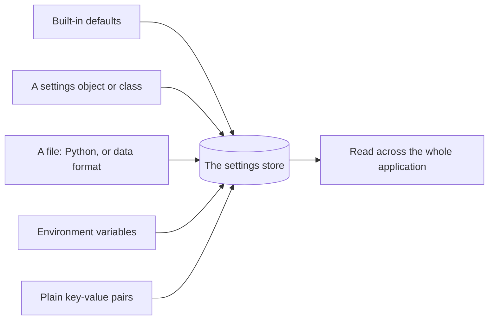
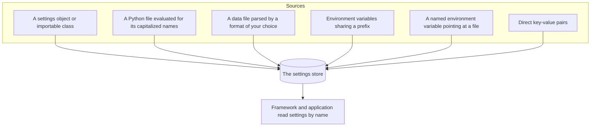
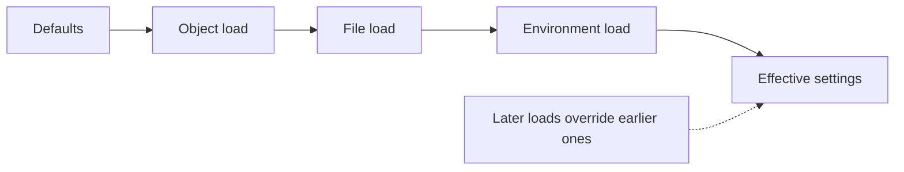

```
 ██████╗ ██████╗ ███╗   ██╗███████╗██╗ ██████╗
██╔════╝██╔═══██╗████╗  ██║██╔════╝██║██╔════╝
██║     ██║   ██║██╔██╗ ██║█████╗  ██║██║  ███╗
██║     ██║   ██║██║╚██╗██║██╔══╝  ██║██║   ██║
╚██████╗╚██████╔╝██║ ╚████║██║     ██║╚██████╔╝
 ╚═════╝ ╚═════╝ ╚═╝  ╚═══╝╚═╝     ╚═╝ ╚═════╝
       one settings store, many ways to fill it
```



## Abstract

Configuration is the single place an application keeps the values that tune its behavior — the secret used to sign sessions, whether debugging is on, cookie policies, and any settings your own code invents. Flask presents this as one dictionary-like store that starts from sensible defaults and can be filled from many sources: a settings object or class, a Python file, a data file, environment variables, or plain key-value pairs. Whatever the source, the result is one uniform store the rest of the application reads from.

## Introduction

Every non-trivial application has knobs that must change between environments — development versus production, one deployment versus another — without editing the program's code. Secrets in particular must be kept out of source. A configuration system's job is to gather these values from wherever they live and present them uniformly to the code that needs them.

Flask's approach is deliberately plain: the configuration is a dictionary that also knows how to load itself from a variety of sources. There is no schema and no ceremony. What the system contributes is a set of convenient loaders and a shared convention — settings live on the application and are read by name — so that the framework's own behavior and your application's behavior are tuned through exactly the same store.

## Related Work

- Parent: [Flask](../README.md) — the project overview.
- [Sessions and Secure Cookies](../sessions-and-secure-cookies/README.md) — the signing secret, cookie attributes, and session lifetime are configuration values.
- [Application and Request Lifecycle](../application-and-request-lifecycle/README.md) — the debug flag and other switches that steer the pipeline live in configuration.
- [Blueprints](../blueprints/README.md) — a modular application still shares this one configuration store.

## Description

**One store, read by name.** The configuration behaves like a dictionary that lives on the application. Framework features consult it for their own settings, and your handlers consult it for yours. Because there is only one store, there is only one place to look and one place to change behavior.

**Many loaders, one destination.** The value of the system is in how many ways it can be filled, all converging on the same store. Only names written in capitals are treated as settings, which lets a source freely mix helpers and constants while only the intended values are absorbed.



**Loading from an object.** A common pattern is to keep settings as attributes on a class or module and pour them in at once. Only the capitalized attributes are absorbed, so ordinary helpers on the object are ignored. This makes it natural to define layered profiles — a base set of settings with per-environment overrides — as ordinary classes.

**Loading from files.** Settings can come from a standalone Python file that is evaluated for its capitalized names, or from a structured data file parsed by a format you choose. The latter keeps settings entirely out of code, which suits deployment pipelines that inject a file at release time.

**Loading from the environment.** Two environment-based loaders exist. One pulls in every variable sharing a common prefix, converting each into a setting and intelligently interpreting values so numbers and booleans arrive as the right types. The other reads a single variable whose value is the path to a settings file, adding one level of indirection so the choice of file can itself be an environment decision.

**Instance-relative settings.** Applications often need a private, writable folder that is not part of the code tree — a place for a local settings file, an on-disk database, or uploaded content. Flask can locate such an *instance folder* and resolve configuration files relative to it, keeping machine-specific values separate from shared code.



**Order and overriding.** Loading is cumulative and last-write-wins: later sources overwrite earlier ones for the same name. This is what enables the familiar layering of a broad default profile refined by narrower, environment-specific values, with secrets injected last from the environment so they never touch source control.

## Conclusion

Configuration is intentionally the least magical part of Flask: one dictionary on the application, fillable from objects, files, and the environment, read uniformly by framework and application alike. It supplies the secret that powers [sessions](../sessions-and-secure-cookies/README.md), the switches that steer the [request pipeline](../application-and-request-lifecycle/README.md), and the shared settings of an app assembled from [blueprints](../blueprints/README.md). See the [project overview](../README.md) to place it among Flask's other capabilities.
