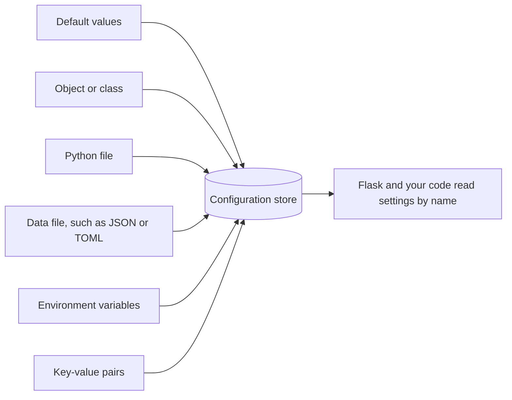
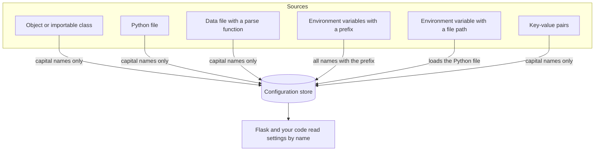
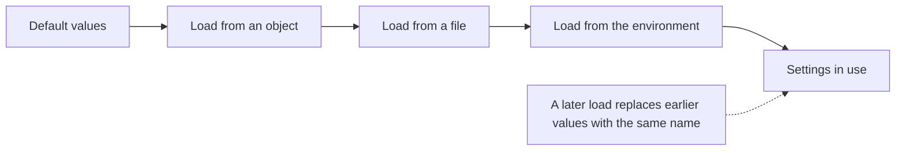

```mermaid
flowchart LR
    D["Default values"] --> CFG[("Configuration store")]
    OBJ["Object or class"] --> CFG
    PY["Python file"] --> CFG
    FILE["Data file, such as JSON or TOML"] --> CFG
    ENV["Environment variables"] --> CFG
    MAP["Key-value pairs"] --> CFG
    CFG --> USE["Flask and your code read settings by name"]
```

## Abstract

The configuration is the one place where an application keeps the values that control its behavior. Examples are the secret key for sessions, the debug flag, the cookie options, and the settings of your own code. Flask gives a configuration store that acts as a dictionary. The configuration store starts with default values. You can fill it from many sources: an object, a Python file, a data file, environment variables, or key-value pairs. All sources go into the same configuration store, and the full application reads from it.

## Introduction

Most applications have values that change between environments, such as development and production. A change of environment must not cause a change of the program code. Also, secret values must not be in the source code. A configuration system collects these values from their sources. Then it gives them to the code in one form.

Flask uses a simple approach. The configuration store is a dictionary with some load functions, and it has no schema. The framework and your application read settings from the same configuration store by name. Some settings are also attributes of the application object, such as the secret key, the debug flag, and the test flag. These attributes read from and write to the configuration store.

## Related Work

- Parent: [Flask](../README.md) — This paper gives the overview of the project.
- [Sessions and Secure Cookies](../sessions-and-secure-cookies/README.md) — This paper describes the session settings: the secret key, the cookie attributes, and the session lifetime.
- [Application and Request Lifecycle](../application-and-request-lifecycle/README.md) — This paper describes the request pipeline, which reads the debug flag and the error settings.
- [Routing and URL Building](../routing-and-url-building/README.md) — This paper describes how URL building uses the server name outside a request.
- [Blueprints](../blueprints/README.md) — This paper describes blueprints, which all share the one configuration store of the application.

## Description

**One store, read by name.** The configuration store belongs to the application object. Flask features read their settings from it, and your view functions read your settings from it. Because there is only one store, there is only one place to change behavior. You can also get all settings with a common name prefix as a separate dictionary.

**Default values.** The configuration store starts with a set of default values. The table shows some important settings.

| Setting | Purpose | Default value |
|---|---|---|
| Debug flag | Turns on debug behavior | From an environment variable, else off |
| Test flag | Turns on test behavior | Off |
| Secret key | Signs the session cookie | Not set |
| Fallback keys | Verify cookies that old keys signed | Not set |
| Session lifetime | Limits the age of a session cookie | 31 days |
| Server name | Lets Flask build URLs outside a request | Not set |
| Application root | Gives the base path of the application | "/" |
| Trusted hosts | Limits the accepted host names | Not set |
| Maximum content length | Limits the size of the request body | Not set |
| Maximum form memory size | Limits the size of form fields in memory | 500,000 bytes |
| Automatic OPTIONS | Adds the OPTIONS method to each URL rule | On |

**Load sources.** Many load functions fill the same configuration store. Most load functions take only names in capital letters. Thus a source can contain helper values that Flask ignores. The prefix loader for environment variables is different, because it takes all variables with the prefix.

```mermaid
flowchart TD
    subgraph Sources
        S1["Object or importable class"]
        S2["Python file"]
        S3["Data file with a parse function"]
        S4["Environment variables with a prefix"]
        S5["Environment variable with a file path"]
        S6["Key-value pairs"]
    end
    S1 -->|"capital names only"| STORE[("Configuration store")]
    S2 -->|"capital names only"| STORE
    S3 -->|"capital names only"| STORE
    S4 -->|"all names with the prefix"| STORE
    S5 -->|"loads the Python file"| STORE
    S6 -->|"capital names only"| STORE
    STORE --> READ["Flask and your code read settings by name"]
```

**Load from an object.** You can keep settings as attributes of a class or a module and load them together. Flask takes only the attributes with capital-letter names. Flask can also import the object from its import name. With classes, you can define a base profile and a subclass for each environment. If a class uses computed properties, make an instance of the class before you load it.

**Load from files.** Settings can come from a Python file. Flask runs the file and takes its capital-letter names. Settings can also come from a data file, such as a JSON file or a TOML file. You give the parse function for the file format. Relative file paths start at the root path of the configuration. An option tells Flask to ignore a file that does not exist.

**Load from the environment.** Two load functions use environment variables:

- The prefix loader reads all variables that start with a prefix. The default prefix is "FLASK". The loader removes the prefix and tries to parse each value as JSON. If the parse fails, the value stays a string. Thus numbers, booleans, lists, and dictionaries get the correct type. A double underscore in a name sets a key in a nested dictionary.
- The file loader reads one variable that contains the path of a Python settings file. Then it loads that file. If the variable is not set, Flask raises an error, unless you tell it to ignore a variable that is not set.

**The instance folder.** Many applications need a private folder for local files, such as a local settings file or a database file. Flask calls this folder the instance folder. By default, the instance folder is next to your main module or package, with the name "instance". If the application is an installed package, the instance folder is under the installation prefix. If you turn on instance-relative configuration, the configuration store finds files relative to the instance folder. Thus local values stay separate from the shared code.

```mermaid
flowchart LR
    BASE["Default values"] --> L1["Load from an object"] --> L2["Load from a file"] --> L3["Load from the environment"] --> FINAL["Settings in use"]
    NOTE["A later load replaces earlier values with the same name"] -.-> FINAL
```

**Order and override.** Each load writes into the same configuration store. If two sources have the same name, the value from the later load replaces the earlier value. A typical order is the default values, then a base object, then a file, and then environment variables. Secret values come last, from the environment. Thus secret values are never in source control.

## Conclusion

The configuration is the simplest part of Flask. It is one dictionary on the application, and you can fill it from objects, files, and the environment. Flask and your code read it in the same way. It gives the secret key to [sessions](../sessions-and-secure-cookies/README.md) and the switches to the [request pipeline](../application-and-request-lifecycle/README.md). It also holds the shared settings of an application that [blueprints](../blueprints/README.md) make. See the [project overview](../README.md) to learn how the configuration fits with the other features of Flask.
