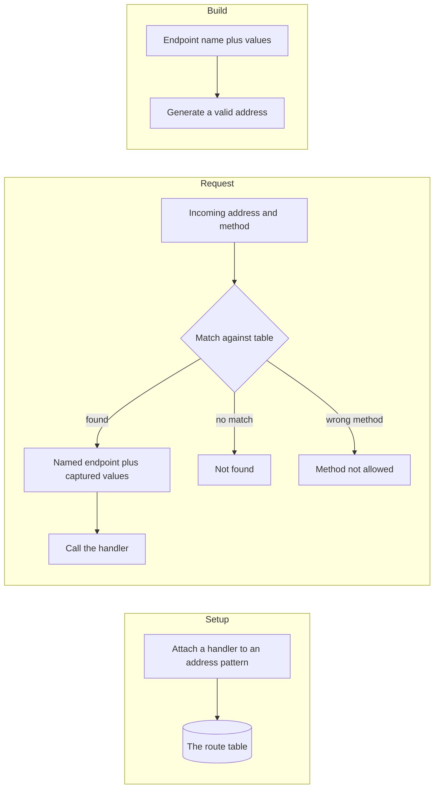
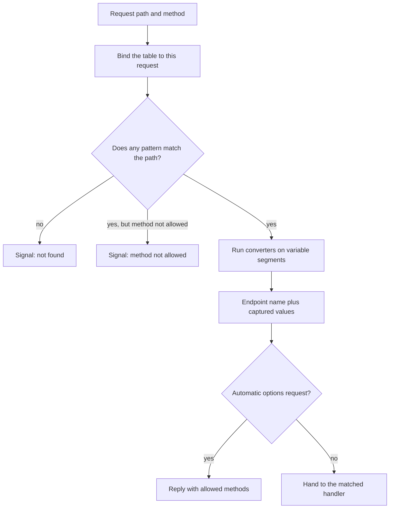

```
██████╗  ██████╗ ██╗   ██╗████████╗██╗███╗   ██╗ ██████╗
██╔══██╗██╔═══██╗██║   ██║╚══██╔══╝██║████╗  ██║██╔════╝
██████╔╝██║   ██║██║   ██║   ██║   ██║██╔██╗ ██║██║  ███╗
██╔══██╗██║   ██║██║   ██║   ██║   ██║██║╚██╗██║██║   ██║
██║  ██║╚██████╔╝╚██████╔╝   ██║   ██║██║ ╚████║╚██████╔╝
╚═╝  ╚═╝ ╚═════╝  ╚═════╝    ╚═╝   ╚═╝╚═╝  ╚═══╝ ╚═════╝
        addresses in, handlers out, addresses back out
```



## Abstract

Routing is how Flask connects a web address to the piece of your code that should answer it. During setup you attach handlers to address patterns; these accumulate in a *route table*. When a request arrives, its path and method are matched against that table to select a named endpoint and to capture any variable parts of the path. The same table works in reverse: given an endpoint name and some values, Flask can *build* a correct address, so links never have to be hand-written and stay consistent when patterns change.

## Introduction

The web identifies things by address. A framework's routing layer is the dictionary that translates between the addresses the outside world uses and the functions the application is written in. Without it, every handler would have to inspect raw paths itself, and every link in a page would be a brittle string.

Flask's routing has two directions that are easy to conflate but worth separating. *Matching* goes from an address to code: it must handle variable path segments, type conversions, multiple allowed methods, and the difference between "no such page" and "that method is not allowed here." *Building* goes from code to an address: given the name of a destination and the values it needs, produce the canonical link. Because both directions consult the same table, they can never drift apart — a promise that pays off constantly in real applications.

## Related Work

- Parent: [Flask](../README.md) — the project overview.
- [Application and Request Lifecycle](../application-and-request-lifecycle/README.md) — matching is the "dispatch" step of the request pipeline.
- [Blueprints](../blueprints/README.md) — modules contribute their own routes under a shared prefix, and endpoint names become namespaced.
- [The Context System](../the-context-system/README.md) — address building relies on the active context to know the current application and request.

## Description

**Registering a route.** In setup, a handler is bound to an address pattern together with the set of methods it accepts. Flask records the pattern in the route table and remembers the handler under an *endpoint* name — a stable label, defaulting to the handler's own name, that identifies the destination independently of its address. Attempting to register two different handlers under the same endpoint is caught immediately, preventing silent collisions.

**Patterns with variables and types.** Address patterns can contain variable segments whose values are captured and passed to the handler. Each variable may declare a converter that both validates the incoming segment and shapes the captured value — for example restricting a segment to whole numbers or allowing it to span multiple path parts. The same converters are used in reverse when building addresses.



**Matching, and the two kinds of miss.** When a request arrives, the table is bound to the specifics of that request and consulted. A successful match yields the endpoint name and a dictionary of captured values that are handed straight to the handler. A path that matches nothing produces a "not found" outcome; a path that matches but with a method the pattern does not allow produces a distinct "method not allowed" outcome. Flask also answers method-discovery requests automatically, replying with the set of methods an address supports without bothering your handler. Redirect-style matches are honored as well, so trailing-slash conventions behave as authors expect.

**Building addresses in reverse.** The counterpart to matching is generating links. Given an endpoint name and the values its pattern needs, Flask produces a valid, correctly escaped address. Extra values that are not part of the pattern are appended as query parameters. Because building reads the same table that matching does, renaming or restructuring an address only requires changing the pattern; every generated link updates with it. Authors can also register defaults that are folded into every build for a given endpoint, and hooks that inject shared values.

**Endpoints as the stable name.** The endpoint, not the raw path, is the identity of a destination. This indirection is what lets modules be mounted under different prefixes, lets addresses evolve without breaking links, and gives the framework a clean key for associating handlers, defaults, and build rules. When applications are split into modules, endpoint names gain a namespace prefix so that identically named handlers in different modules never clash.

## Conclusion

Routing is a two-way dictionary between addresses and code, anchored on stable endpoint names and driven by a single table used for both matching and building. Having read how requests reach handlers, continue to [The Context System](../the-context-system/README.md) to see how a handler reaches shared state, or to [Blueprints](../blueprints/README.md) to see how routes from many modules combine. The [request pipeline](../application-and-request-lifecycle/README.md) shows exactly where matching sits in the flow.
