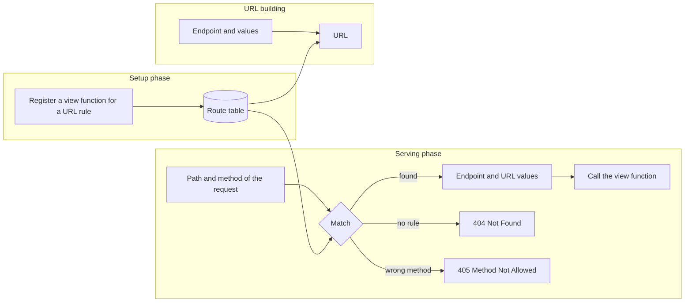
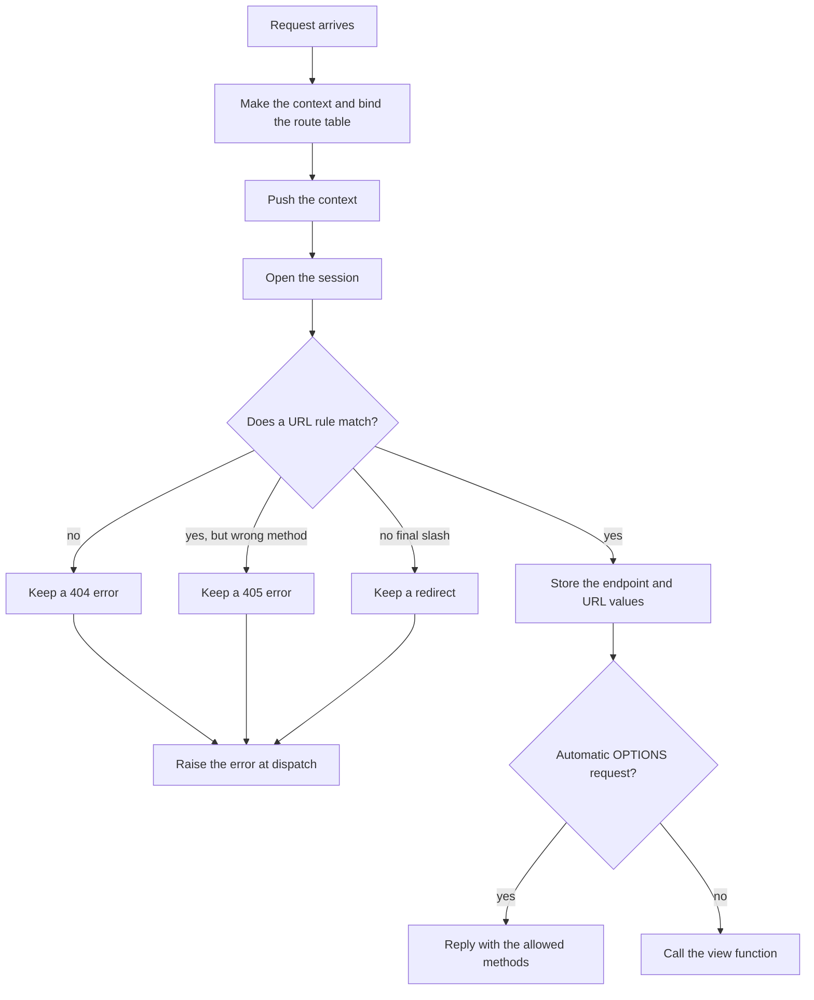
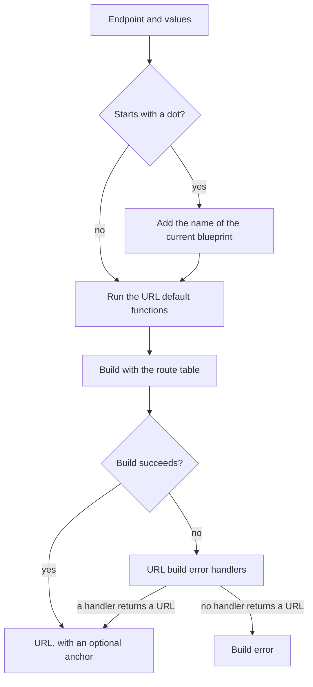

```mermaid
flowchart LR
    subgraph Setup ["Setup phase"]
        DEC["Register a view function for a URL rule"] --> TBL[("Route table")]
    end
    subgraph Serving ["Serving phase"]
        URL["Path and method of the request"] --> MATCH{"Match"}
        MATCH -->|"found"| PICK["Endpoint and URL values"]
        MATCH -->|"no rule"| E404["404 Not Found"]
        MATCH -->|"wrong method"| E405["405 Method Not Allowed"]
        PICK --> CALL["Call the view function"]
    end
    subgraph Build ["URL building"]
        NAME["Endpoint and values"] --> GEN["URL"]
    end
    TBL --> MATCH
    TBL --> GEN
```

## Abstract

Routing connects a URL to the view function that answers it. In the setup phase, you register view functions for URL rules. Flask keeps these URL rules in the route table. When a request arrives, Flask matches its path and method against the route table. The match gives an endpoint and the URL values from the variable parts of the path. The route table also works in the opposite direction, because Flask can build a correct URL from an endpoint and values.

## Introduction

The web identifies each resource with a URL. The routing layer translates between the URLs of the outside world and the functions of the application. Without routing, each view function must read the raw path itself. Also, each link in a page is a fixed string that can become incorrect.

Routing in Flask has two directions. Matching goes from a URL to code. It must handle variable parts, type conversion, allowed methods, and the difference between "not found" and "method not allowed". URL building goes from code to a URL. It takes an endpoint name and the necessary values and gives the correct link. Both directions use the same route table, thus they always agree.

## Related Work

- Parent: [Flask](../README.md) — This paper gives the overview of the project.
- [Application and Request Lifecycle](../application-and-request-lifecycle/README.md) — This paper shows where matching and dispatch occur in the request pipeline.
- [The Context System](../the-context-system/README.md) — This paper describes the context, which does the match and keeps the bound route table.
- [Blueprints](../blueprints/README.md) — This paper describes how blueprints add URL rules with a URL prefix and add a name prefix to endpoints.
- [Configuration](../configuration/README.md) — This paper describes the settings for URL building outside a request, such as the server name.

## Description

**Route registration.** In the setup phase, you register a view function for a URL rule and a set of HTTP methods. Flask adds the URL rule to the route table. Flask also stores the view function under an endpoint name. The endpoint name is a stable label for the destination. By default, it is the name of the view function. If two different view functions use the same endpoint name, Flask stops with an error.

Flask has a shortcut form for each single method: GET, POST, PUT, PATCH, DELETE, and QUERY. If you give no methods, the URL rule accepts only GET. By default, Flask also adds the OPTIONS method to each URL rule. A setting in the configuration turns off this automatic OPTIONS method.

**Variable parts and converters.** A URL rule can have variable parts. Flask captures the value of each variable part and gives it to the view function as a parameter. Each variable part can have a converter. A converter checks the segment of the path and changes it into a typed value. For example, one converter accepts only whole numbers, and another converter accepts a path with slashes. You can register your own converters on the application.

```mermaid
flowchart TD
    IN["Request arrives"] --> BIND["Make the context and bind the route table"]
    BIND --> PUSH["Push the context"]
    PUSH --> SESS["Open the session"]
    SESS --> TRY{"Does a URL rule match?"}
    TRY -->|"no"| NF["Keep a 404 error"]
    TRY -->|"yes, but wrong method"| NA["Keep a 405 error"]
    TRY -->|"no final slash"| RD["Keep a redirect"]
    TRY -->|"yes"| RES["Store the endpoint and URL values"]
    NF --> LATER["Raise the error at dispatch"]
    NA --> LATER
    RD --> LATER
    RES --> AUTO{"Automatic OPTIONS request?"}
    AUTO -->|"yes"| OPT["Reply with the allowed methods"]
    AUTO -->|"no"| CALL["Call the view function"]
```

**Matching.** Matching occurs when Flask pushes the context for a request. Before that, Flask makes the context and binds the route table to the host and the path. If the configuration has a list of trusted hosts, Flask checks the host of the request against that list. When Flask pushes the context, the context opens the session first. Thus a custom converter can read the session. After that, the context matches the path and the method against the route table.

**The results of a match.** A successful match stores the endpoint and the URL values on the request. A failed match does not stop the request immediately. Flask keeps the routing error and raises it when it dispatches the request. Thus the before-request hooks run also for a request that gets a 404 error. The possible results are:

| Result | Cause | Response |
|---|---|---|
| Match | A URL rule accepts the path and the method | Flask calls the view function |
| Not found | No URL rule accepts the path | 404 error |
| Method not allowed | A URL rule accepts the path, but not the method | 405 error |
| Redirect | The URL rule ends with a slash, but the path does not | Redirect to the path with the slash |
| Automatic OPTIONS | The method is OPTIONS and the URL rule has automatic OPTIONS | Flask replies with the allowed methods |

**URL building.** URL building is the opposite of matching. Flask takes an endpoint name and values and builds a valid URL with correct escaping. If a value is not part of the URL rule, Flask adds it to the query string. If an endpoint name starts with a dot, Flask adds the name of the current blueprint before it. Before Flask builds the URL, it runs the URL default functions for the endpoint. These functions can add shared values, such as a language code.

```mermaid
flowchart TD
    NAME["Endpoint and values"] --> DOT{"Starts with a dot?"}
    DOT -->|"yes"| BPN["Add the name of the current blueprint"]
    DOT -->|"no"| DEF
    BPN --> DEF["Run the URL default functions"]
    DEF --> BLD["Build with the route table"]
    BLD --> OK{"Build succeeds?"}
    OK -->|"yes"| URL["URL, with an optional anchor"]
    OK -->|"no"| BEH["URL build error handlers"]
    BEH -->|"a handler returns a URL"| URL
    BEH -->|"no handler returns a URL"| ERR["Build error"]
```

**Relative and absolute URLs.** The form of the URL depends on the context. Inside a request, Flask builds a URL without the scheme and host by default. Outside a request, Flask builds an absolute URL by default. For an absolute URL outside a request, the configuration must have the server name. If the server name is not set, Flask raises an error.

| Situation | Default URL form | Necessary settings |
|---|---|---|
| Inside a request | Path only, without the scheme and host | None |
| Outside a request | Absolute URL, with the scheme and host | Server name, and also the application root and URL scheme if necessary |

**Endpoints as stable names.** The endpoint identifies a destination, not the raw path. Because of this, you can change a URL rule, and all built links change with it. Blueprints can also mount the same module under different URL prefixes. Flask uses the endpoint as the key for the view function, the default values, and the build rules. In a blueprint, Flask adds the blueprint name to the start of each endpoint name. Thus two view functions with the same name in different blueprints do not conflict.

## Conclusion

Routing is a two-way map between URLs and code. It uses stable endpoint names and one route table for matching and for URL building. Next, read [The Context System](../the-context-system/README.md) to see how a view function gets the current objects. Read [Blueprints](../blueprints/README.md) to see how routes from many modules join one route table. The [request pipeline](../application-and-request-lifecycle/README.md) shows where matching and dispatch occur.
