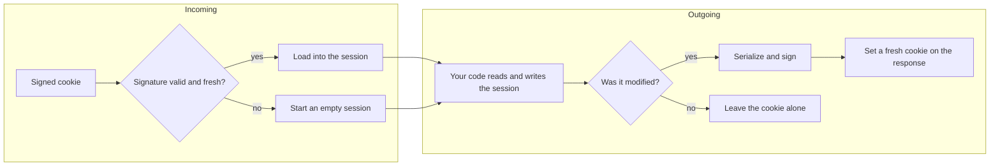
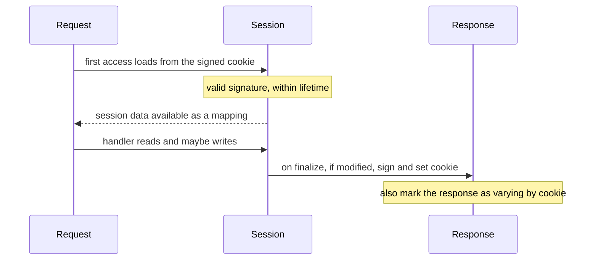
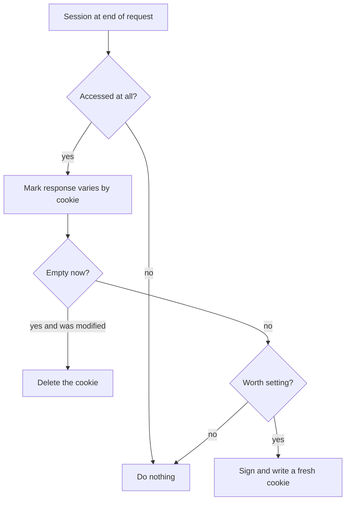

```
███████╗███████╗███████╗███████╗██╗ ██████╗ ███╗   ██╗███████╗
██╔════╝██╔════╝██╔════╝██╔════╝██║██╔═══██╗████╗  ██║██╔════╝
███████╗█████╗  ███████╗███████╗██║██║   ██║██╔██╗ ██║███████╗
╚════██║██╔══╝  ╚════██║╚════██║██║██║   ██║██║╚██╗██║╚════██║
███████║███████╗███████║███████║██║╚██████╔╝██║ ╚████║███████║
╚══════╝╚══════╝╚══════╝╚══════╝╚═╝ ╚═════╝ ╚═╝  ╚═══╝╚══════╝
        remember a visitor with a signed, tamper-proof cookie
```



## Abstract

A session lets an application remember small amounts of data about a visitor across requests — who they are logged in as, a shopping cart, a one-time notice. By default Flask stores that data nowhere on the server: it packs the session into a *signed cookie* that lives in the visitor's browser. The signature, keyed by the application's secret, means the data can be read by the browser but not forged or tampered with. On each request the cookie is verified and loaded; if your code changes the session, a fresh signed cookie is written onto the response.

## Introduction

The web's request-response cycle is stateless: each request arrives with no memory of the last. Sessions are the standard way to bridge that gap, giving the illusion of continuity. The question every framework must answer is *where* the remembered data lives. Storing it on the server is one option, but it requires shared storage and cleanup. Flask's default takes the opposite tack: keep the data with the client, and make it trustworthy with cryptography.

This works because of *signing*. The session's contents are serialized and stamped with a signature derived from a secret only the server knows. The browser holds the cookie and sends it back on every request, but cannot alter it without invalidating the signature. The server therefore trusts what it reads, within a freshness window. The cost is that the data is visible to the client and limited in size — so sessions hold identifiers and small flags, not secrets or bulk data. Crucially, the entire mechanism is defined behind a replaceable interface, so an application that outgrows client-side storage can swap in a server-side scheme without changing how handlers use the session.

## Related Work

- Parent: [Flask](../README.md) — the project overview.
- [The Context System](../the-context-system/README.md) — the session is one of the values a context carries and is exposed as an ambient global.
- [Application and Request Lifecycle](../application-and-request-lifecycle/README.md) — the session is read on first access and written during response finalizing.
- [Configuration](../configuration/README.md) — the secret key, cookie attributes, and lifetime are all configuration values.

## Description

**The session behaves like a dictionary.** To your code, the session is just a mapping you read from and write to. It quietly tracks whether it has been *accessed* and whether it has been *modified*, and those two flags drive the framework's decisions about caching headers and whether a new cookie needs to be sent.

**Reading on the way in.** The session is loaded lazily — the first time your code touches it during a request. Flask takes the incoming signed cookie, checks its signature against the application's secret and its age against the configured lifetime, and if both hold, deserializes the contents into the session. A missing, forged, or stale cookie simply yields a fresh empty session rather than an error.



**Signing on the way out.** During response finalizing, Flask decides what to do with the session. If it was never touched, nothing changes. If it was accessed, the response is marked as varying by cookie so caches treat different visitors distinctly. If it holds data, the contents are serialized, signed, and written as a fresh cookie carrying the configured attributes — path, domain, security flags, same-site policy, and expiration. If the session was emptied, the cookie is cleared. To survive secret rotation, the framework can verify against a list of former secrets while always signing with the current one.

**A richer-than-JSON payload.** Because a signed cookie is fundamentally text, session contents must be serialized to a textual form. Flask uses an enhanced serialization that preserves common Python values a plain text format would flatten — such as dates, sets, and byte strings — by tagging them so they round-trip faithfully. This is why a session can hold more than bare strings and numbers.

**Permanence and lifetime.** A session can be marked *permanent*, which ties its cookie's expiration to a configured lifetime rather than ending when the browser closes. The freshness check on the way in uses the same lifetime, so an old cookie is rejected even if the browser still holds it.



**A replaceable interface.** All of this lives behind a single, swappable session interface. The signed-cookie scheme is merely the default implementation. An application can provide its own — backed by a server-side store, for instance — and every handler keeps using the session exactly as before, because the mapping it sees never changes.

## Conclusion

Sessions give stateless requests a memory, and Flask's default makes that memory tamper-proof by signing it into the visitor's own cookie with the application's secret. The mechanism is stitched into the [request pipeline](../application-and-request-lifecycle/README.md) at load and save time, surfaced through [the context system](../the-context-system/README.md) as an ambient global, and tuned entirely through [configuration](../configuration/README.md). Return to the [project overview](../README.md) for the whole map.
