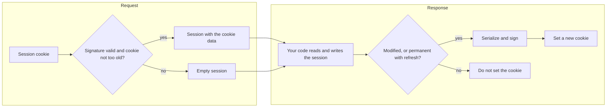
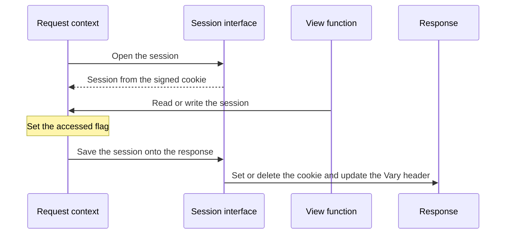
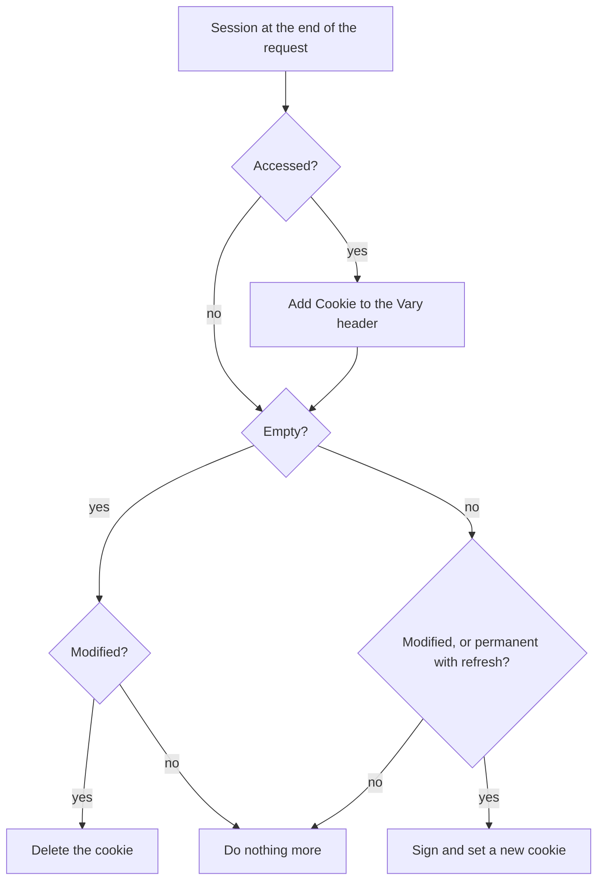

```mermaid
flowchart LR
    subgraph IN ["Request"]
        C1["Session cookie"] --> VER{"Signature valid and cookie not too old?"}
        VER -->|"yes"| LOAD["Session with the cookie data"]
        VER -->|"no"| EMPTY["Empty session"]
    end
    LOAD --> USE["Your code reads and writes the session"]
    EMPTY --> USE
    subgraph OUT ["Response"]
        USE --> CHG{"Modified, or permanent with refresh?"}
        CHG -->|"yes"| SIGN["Serialize and sign"]
        SIGN --> SET["Set a new cookie"]
        CHG -->|"no"| SKIP["Do not set the cookie"]
    end
```

## Abstract

A session lets an application keep a small quantity of data about a visitor between requests. Examples are the identity of a user after login and a short message for the next page. By default, Flask keeps no session data on the server. It puts the session data into a signed cookie in the browser of the visitor. The signature uses the secret key of the application, thus the browser can read the data but cannot change it. On each request, Flask verifies and loads the cookie, and it writes a new signed cookie when necessary.

## Introduction

HTTP is stateless, because each request has no memory of the previous request. Sessions give continuity across requests. Each framework must decide where to keep the session data. Storage on the server is one option, but it needs a shared store and cleanup. The default of Flask is the opposite: Flask keeps the data with the client and protects it with a signature.

The signature makes this design safe. Flask serializes the session data and signs it with a key that only the server knows. The browser sends the cookie back with each request. If someone changes the cookie, the signature becomes invalid. But the client can see the data, and a cookie has a size limit. Thus a session must hold identifiers and small flags, not secrets or large data.

All of this behavior is behind a session interface that you can replace. If an application needs storage on the server, it can use a different session interface. The view functions then use the session in the same way as before.

## Related Work

- Parent: [Flask](../README.md) — This paper gives the overview of the project.
- [The Context System](../the-context-system/README.md) — This paper describes the context, which opens the session and gives it to your code.
- [Application and Request Lifecycle](../application-and-request-lifecycle/README.md) — This paper shows when Flask opens the session and when it saves the session.
- [Configuration](../configuration/README.md) — This paper describes the settings for the secret key, the cookie, and the session lifetime.

## Description

**The session acts as a dictionary.** For your code, the session is a mapping. You read values from it and write values to it. The session has two flags. The modified flag becomes true when your code changes the session. The accessed flag becomes true when your code gets the session through the request context. These flags control the cookie and the cache headers of the response.

**Open the session.** Flask opens the session when it pushes the request context. This occurs before the route match, thus a custom URL converter can use the session. The session interface reads the session cookie from the request. Then it does these checks in this order:

1. If the application has no secret key, Flask uses a null session. A null session lets your code read, but it raises an error on each write.
2. If the request has no session cookie, Flask uses a new empty session.
3. If the signature is not valid, Flask uses a new empty session.
4. If the cookie is older than the session lifetime, Flask uses a new empty session.
5. Otherwise, Flask loads the cookie data into the session.

A bad cookie does not cause an error. The visitor only gets an empty session.

```mermaid
sequenceDiagram
    participant Ctx as Request context
    participant SI as Session interface
    participant View as View function
    participant Resp as Response
    Ctx->>SI: Open the session
    SI-->>Ctx: Session from the signed cookie
    View->>Ctx: Read or write the session
    Note over Ctx: Set the accessed flag
    Ctx->>SI: Save the session onto the response
    SI->>Resp: Set or delete the cookie and update the Vary header
```

**Save the session.** After the after-request hooks, Flask gives the session to the session interface. Flask does not save a null session. For other sessions, the save step does these checks:

- If your code accessed the session, Flask adds the cookie to the Vary header. Thus caches keep separate copies for different visitors.
- If the session is empty and your code modified it, Flask deletes the cookie.
- If the session has data, Flask sets a new cookie when the session was modified.
- If the session is permanent and the refresh setting is on, Flask also sets a new cookie. This setting is on by default.

```mermaid
flowchart TD
    START["Session at the end of the request"] --> A{"Accessed?"}
    A -->|"yes"| V["Add Cookie to the Vary header"]
    A -->|"no"| E
    V --> E{"Empty?"}
    E -->|"yes"| M{"Modified?"}
    M -->|"yes"| DEL["Delete the cookie"]
    M -->|"no"| DONE["Do nothing more"]
    E -->|"no"| S{"Modified, or permanent with refresh?"}
    S -->|"yes"| WRITE["Sign and set a new cookie"]
    S -->|"no"| DONE
```

**Cookie attributes.** The session interface takes all attributes of the cookie from the configuration. The table shows the attributes and their default values.

| Attribute | Default value |
|---|---|
| Name | "session" |
| Domain | Not set, thus the browser sends the cookie only to the same host |
| Path | The application root, which is "/" by default |
| HTTP only | On |
| Secure | Off |
| SameSite | Not set |
| Partitioned | Off |
| Expiration | The current time plus the session lifetime, for permanent sessions only |

**Change of the secret key.** You can give a list of fallback keys in the configuration. Flask always signs with the current secret key. When Flask verifies a cookie, it also accepts signatures from the fallback keys. Thus old sessions stay valid while you change the secret key.

**Serialization.** A signed cookie holds text, thus Flask must serialize the session data to text. Flask uses a tagged JSON serializer. This serializer keeps some Python values that plain JSON cannot keep. It adds a tag to each of these values, so that it can restore them exactly. The tagged types are tuples, byte strings, safe markup strings, UUIDs, and date-time values. Flask also tags a dictionary when its only key looks like a tag.

**Permanent sessions and lifetime.** A session can be permanent. The cookie of a permanent session has an expiration time, which is the current time plus the session lifetime. The cookie of a session that is not permanent ends when the browser closes. The age check on the way in always uses the session lifetime. The default session lifetime is 31 days.

**A replaceable interface.** The session interface has two main operations: open and save. The signed cookie interface is only the default. An application can set its own session interface, for example one with a store on the server. The view functions do not change, because the session still acts as a mapping. Many requests with the same session can run at the same time. Thus a custom session interface must control concurrent access to its store, if necessary.

## Conclusion

Sessions give a memory to stateless requests. By default, Flask signs the session data with the secret key and keeps it in a cookie of the visitor. The [request pipeline](../application-and-request-lifecycle/README.md) saves the session onto each response. [The context system](../the-context-system/README.md) opens the session and gives it to your code. The [configuration](../configuration/README.md) controls the secret key, the cookie, and the lifetime. Go back to the [project overview](../README.md) for the full map.
