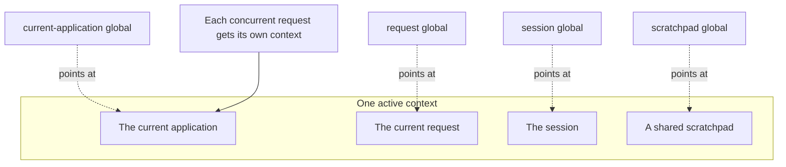
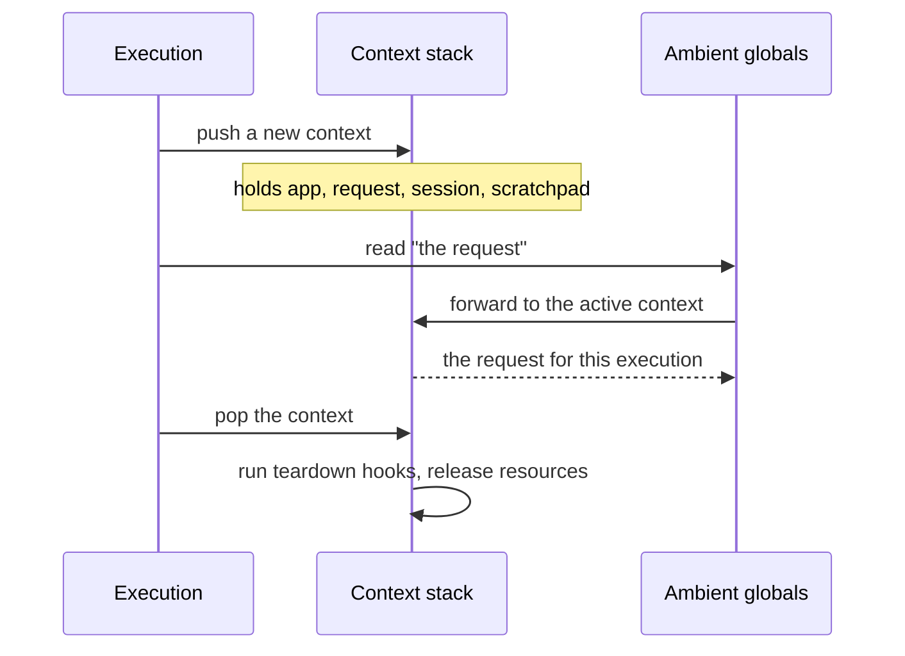
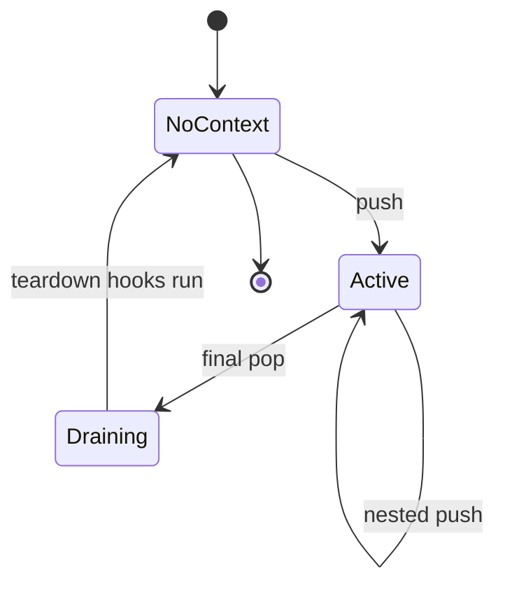

## Abstract

The context system is Flask's signature convenience. Rather than passing the current application, request, session, and shared data through every function call, Flask exposes them as *ambient globals* you can simply reach for. The trick is that these globals are not real global values — they are proxies that resolve, at the moment of use, to the context belonging to whichever request is currently being handled. A fresh context is pushed at the start of each request and command and popped at the end, so the same friendly names stay correct even when many requests run at once.

## Introduction

Convenience and concurrency usually pull in opposite directions. It would be lovely to write code that just refers to "the request" as if there were only one, but a real server juggles many requests at the same time, and a naive shared variable would let them stomp on each other. The context system resolves this tension.

Flask maintains a per-execution *context* that bundles together everything relevant to the work currently in progress: which application is running, the request being served if any, the session, and a scratchpad for data your own code wants to share across a request. The ambient globals are thin stand-ins that always forward to whatever context is active on the current line of execution. Because each concurrent request runs with its own context, the globals read like singletons while behaving like per-request values. This is the mechanism that makes the rest of Flask feel so lightweight.

## Related Work

- Parent: [Flask](../README.md) — the project overview.
- [Application and Request Lifecycle](../application-and-request-lifecycle/README.md) — a context is pushed and popped as the bookends of every request.
- [Sessions and Secure Cookies](../sessions-and-secure-cookies/README.md) — the session is one of the values a context carries.
- [Routing and URL Building](../routing-and-url-building/README.md) — building addresses reads the current context to find the active application.

## Description

**One context, two flavors.** A context represents an application at work. When it also carries request data it behaves as a *request context*; when it does not — as during a maintenance command or background job — it behaves as a plain *application context*. In modern Flask these are the same thing: a single combined context is pushed for every request and every command, and whether it happens to hold request data is simply a property you can check. This unification means the application and shared scratchpad are always available, while the request and session are available only when there genuinely is a request.

**Proxies, not values.** The globals your code imports are lookups in disguise. Each time you touch one, it finds the context currently active on this line of execution and forwards your access to the right object. If you reach for a request when no request context is active, you get a clear, actionable error rather than a confusing failure — the framework tells you a context is missing and how to establish one.

**Per-execution isolation.** The active context is stored in a place that is naturally isolated per line of execution, so two requests handled concurrently see two different contexts through the very same global names. Pushing a context stacks it as the new current one and popping restores the previous; the same context can even be nested and is only cleaned up once its original push is undone.

**The scratchpad.** Alongside the application and request, every context carries a general-purpose namespace for your own data. It is the right place to stash things that are computed once and reused throughout a single request — a database connection, the authenticated user, a cached lookup. It lives and dies with the context, so it never leaks between requests.

**Teardown and resource safety.** When a context is popped, Flask runs the teardown hooks registered against it before discarding it. This is the guaranteed moment to release whatever the request opened. Because the lifecycle promises a pop even when a request fails, teardown is a dependable place for cleanup.

**Carrying a context elsewhere.** Occasionally you want work started during a request — a background task, for instance — to still see the request's ambient globals. Flask lets you copy the active context and re-enter it inside another execution, with clear guidance about the hazards of doing so, since the original response may already be on its way out.

## Conclusion

The context system is what buys Flask its famous ergonomics: ambient globals that behave like singletons yet stay isolated per request, backed by a stack of contexts that are pushed and popped around every unit of work. It is tightly wound into the [request pipeline](../application-and-request-lifecycle/README.md), which owns the push and pop, and it supplies the [session](../sessions-and-secure-cookies/README.md) and application that other systems read. Return to the [project overview](../README.md) to place it among Flask's other capabilities.
