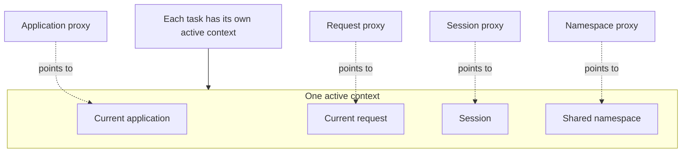
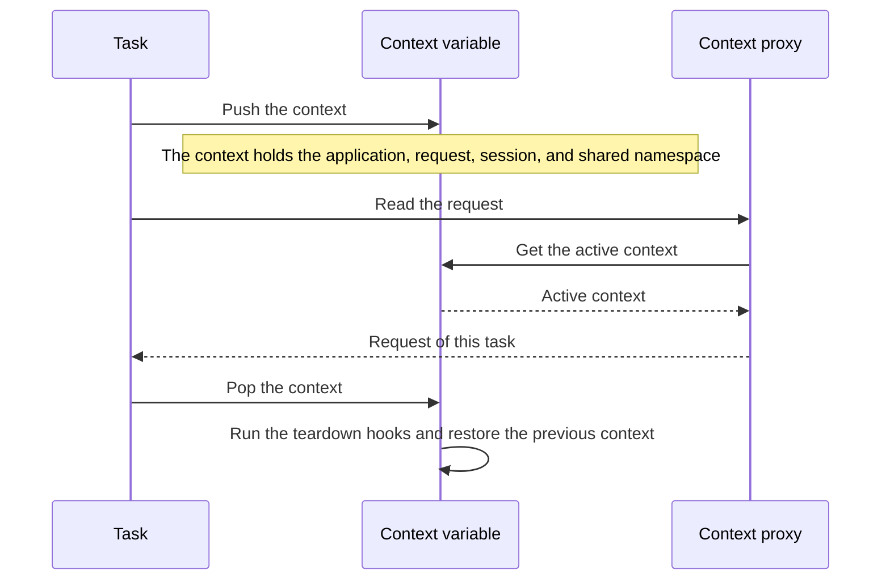
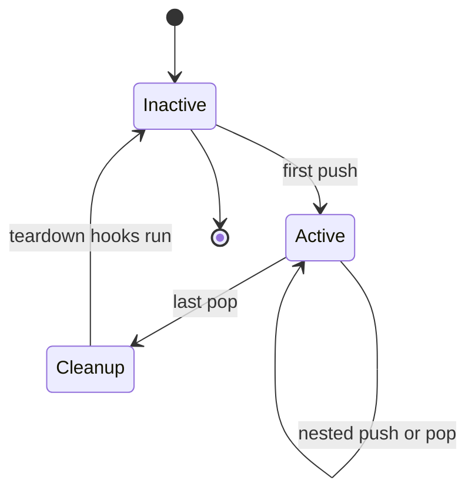

```mermaid
flowchart TD
    subgraph CTX ["One active context"]
        APP["Current application"]
        REQ["Current request"]
        SESS["Session"]
        G["Shared namespace"]
    end
    P1["Application proxy"] -. "points to" .-> APP
    P2["Request proxy"] -. "points to" .-> REQ
    P3["Session proxy"] -. "points to" .-> SESS
    P4["Namespace proxy"] -. "points to" .-> G
    TASK["Each task has its own active context"] --> CTX
```

## Abstract

The context system makes four objects available to your code: the current application, the current request, the session, and a shared namespace. Flask gives these objects through context proxies, which look like global values. But a context proxy is not a real global value. Each time your code uses a proxy, the proxy finds the active context of the current task. Flask pushes a new context at the start of each request and each command, and pops it at the end.

## Introduction

Convenience and concurrency often conflict. Code that refers to "the request" is easy to write. But a server handles many requests at the same time. A simple shared variable can let one request change the data of another request. The context system solves this problem.

Flask keeps one context for each unit of work. The context holds the application, the request if one exists, the session, and the shared namespace. A task is one line of execution, such as a thread or an asynchronous task. The context proxies always forward to the context that is active in the current task. Each concurrent request runs in its own task with its own context. Thus the context proxies look like single global values, but they act as values for each request.

## Related Work

- Parent: [Flask](../README.md) — This paper gives the overview of the project.
- [Application and Request Lifecycle](../application-and-request-lifecycle/README.md) — This paper shows the push and the pop at the two ends of each request.
- [Sessions and Secure Cookies](../sessions-and-secure-cookies/README.md) — This paper describes the session, which is one of the objects in the context.
- [Routing and URL Building](../routing-and-url-building/README.md) — This paper describes the route match that the context does when Flask pushes it.

## Description

**One context, two forms.** In current Flask, one context type holds both application data and request data. If the context has request data, Flask calls it a request context. If the context has no request data, Flask calls it an application context. A command or a background job uses an application context. Thus the application and the shared namespace are always available, but the request and the session are available only in a request.

Earlier versions of Flask had two separate context types. Flask now pushes one combined context for each request and each command. The old name of the request context still works, but it gives a deprecation warning.

```mermaid
sequenceDiagram
    participant Task
    participant Var as Context variable
    participant Proxy as Context proxy
    Task->>Var: Push the context
    Note over Var: The context holds the application, request, session, and shared namespace
    Task->>Proxy: Read the request
    Proxy->>Var: Get the active context
    Var-->>Proxy: Active context
    Proxy-->>Task: Request of this task
    Task->>Var: Pop the context
    Var->>Var: Run the teardown hooks and restore the previous context
```

**Proxies, not values.** The context proxies are lookups. Each time your code uses a proxy, the proxy gets the active context of the current task. Then the proxy forwards the access to the correct object in that context. If no context is active, the proxy raises a clear error. The error message for the application proxy tells you how to push an application context.

| Context proxy | Object | Available in |
|---|---|---|
| Application proxy | The application object | Application context and request context |
| Namespace proxy | The shared namespace | Application context and request context |
| Request proxy | The request object | Request context only |
| Session proxy | The session | Request context only |
| Context proxy | The active context | Application context and request context |

**Isolation for each task.** Flask keeps the active context in a context variable. Python keeps a separate value of a context variable for each thread and each asynchronous task. Thus two concurrent requests see two different contexts through the same context proxies. When Flask pushes a context, the context variable points to it. When Flask pops the context, the context variable gets its previous value back.

**Nested pushes.** In some cases, such as streaming or tests, Flask pushes the same context more than one time. The context counts these pushes. Only the first push sends the "context pushed" signal, opens the session, and matches the route. The cleanup runs only when the count goes back to zero. If code tries to pop a context that is not the active context, Flask raises an error.

**The session in the context.** The context opens the session when Flask pushes a request context. This occurs before the route match. The context sets the accessed flag of the session only when your code gets the session through the context. Later, this flag tells the session interface to add a header for caches.

**The shared namespace.** Each context has a general namespace for your own data. Use it for values that you calculate one time and use again in the same request. Examples are a database connection or the current user. The namespace exists only while its context exists. Thus data does not go from one request to the next request.

**Teardown.** When the last pop occurs, the context does the cleanup in this order:

1. If the context has a request, it runs the request teardown hooks.
2. If the context has a request, it closes the request.
3. It runs the application teardown hooks.
4. It restores the previous context.
5. It sends the "context popped" signal.

Flask collects the errors from these steps and raises them together after all steps run. Thus one failed teardown hook does not stop the other teardown hooks.

```mermaid
stateDiagram-v2
    [*] --> Inactive
    Inactive --> Active: first push
    Active --> Active: nested push or pop
    Active --> Cleanup: last pop
    Cleanup --> Inactive: teardown hooks run
    Inactive --> [*]
```

**Copy a context to another task.** Sometimes work that starts in a request must run in another task, such as a background job. Flask can copy the active context and push the copy in the new task. The copy uses the same request and the same session data. Often it is easier to give the necessary data to the new task directly. If you use a copied context, obey these rules:

1. Read the request body before the new task starts.
2. Read the session in the original request, so that Flask adds the cache header.
3. Do not change the session in the new task. Flask can write the session cookie before the new task runs.

## Conclusion

The context system gives Flask its simple programming model. The context proxies look like single global values, but each task sees its own context. Flask pushes a context at the start of each unit of work and pops it at the end. The [request pipeline](../application-and-request-lifecycle/README.md) controls this push and pop. The context also holds the [session](../sessions-and-secure-cookies/README.md) and the application that other features read. Go back to the [project overview](../README.md) to see the other features of Flask.
